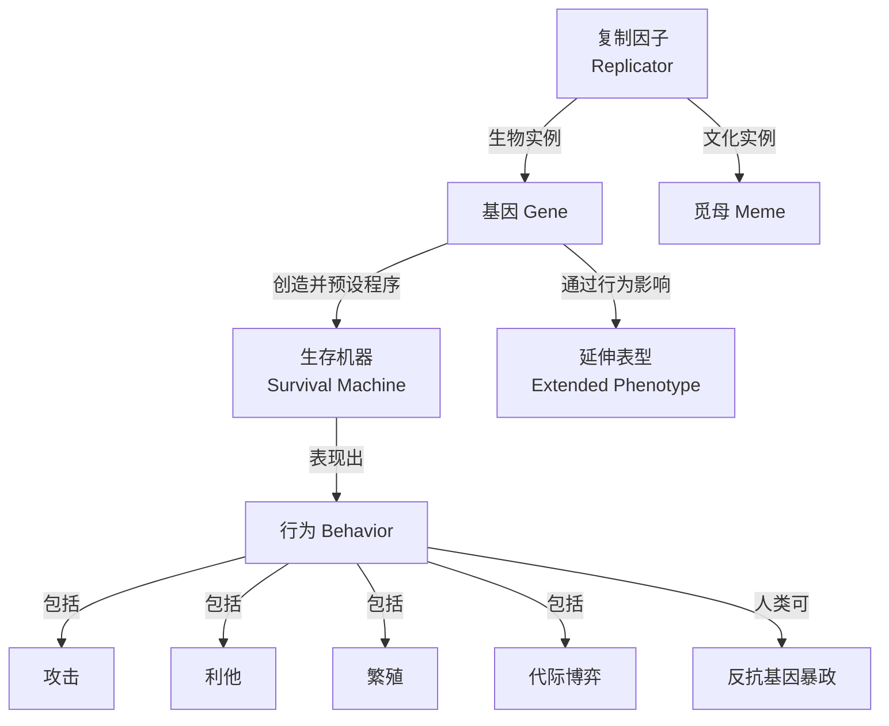

:::tip
要读懂"自私的基因"，先把它拆成五块基石——复制因子、生存机器、行为策略、觅母、延伸表型。每块都立住了，全书的论证才真正"立"起来。
:::

## 序章：所有故事，都从"复制"开始

**基因怎么会自私？自私不是人才有的概念吗？**

问题的答案就藏在书里面。

《自私的基因》——理查德·道金斯。

这本书从根子上重新解释：**我们到底是什么**。

***

## 一、这是一本怎样的书

它不是一本"读完会很激动"的书。
但它是一本"读完会改变你看世界方式"的书。

### 1.1 基本信息

| 项目    | 内容                                           |
| ----- | -------------------------------------------- |
| 书名    | 《自私的基因》（40 周年增订版）                            |
| 原书名   | The Selfish Gene / The Extended Selfish Gene |
| 作者    | \[英] 理查德·道金斯（Richard Dawkins）                |
| 译者    | 卢允中、张岱云、陈复加、罗小舟、叶盛                           |
| 出版社   | 中信出版社                                        |
| 首版时间  | 1976 年                                       |
| 中文增订版 | 2018 年 11 月（40 周年增订）                         |
| ISBN  | 978-7-5086-9449-8                            |
| 页数    | 496 页                                        |
| 定价    | 68.00 元                                      |
| 豆瓣评分  | 8.0 / 5064 人评价                               |

### 1.2 它的"独特之处"在哪里

市面上讲进化论的书很多，但绝大多数都把"个体"或"物种"当作自然选择的基本单位。道金斯 1976 年这本书最大的颠覆是——**他把基本单位往下推到"基因"这一层**。

这一个下推，让"利他行为""两性冲突""文化传承"这些原本暧昧不清的现象，全都被他用同一套冷到骨子里的语言解释通了。

| 视角      | 基本单位    | 解释"利他行为"          | 解释"亲代冲突"        |
| ------- | ------- | ----------------- | --------------- |
| 传统达尔文主义 | 个体 / 群体 | "动物为了种群延续牺牲自己"    | "父母爱孩子是天性"      |
| 基因中心论   | 基因      | "基因为了复制自身而'允许'利他" | "亲代与子代是基因投资的博弈" |

**40 年了，这本书还在被反复再版、反复讨论，原因就是这一记"视角倒转"在科学和哲学上都太狠了。**

### 1.3 章节地图（按"立论→展开→升华→回应"梳理）

| 模块   | 对应章节               | 篇幅占比  | 核心任务             |
| ---- | ------------------ | ----- | ---------------- |
| 基础立论 | 序言、前言、第 1-4 章      | 约 30% | 把"基因中心论"立起来      |
| 行为分析 | 第 5-10 章           | 约 40% | 用基因视角解释攻击、亲缘、繁殖等 |
| 理论升华 | 第 11-13 章          | 约 20% | 觅母、延伸表型、合作进化     |
| 争议回应 | 第 14-15 章（40 周年新增） | 约 10% | 回应"基因决定论"等误读     |

这一节先放框架，下面我们一块一块把五块基石拆开。

***

## 二、作者与诞生背景

### 2.1 道金斯其人

理查德·道金斯（Richard Dawkins，1941 年 3 月 26 日—），英国皇家科学院院士，牛津大学首席西蒙尼"公众理解科学教授"，演化生物学家、动物行为学家。

| 年份   | 关键事件                                    |
| ---- | --------------------------------------- |
| 1941 | 出生于肯尼亚内罗毕，童年在非洲马拉维湖畔度过                  |
| 1959 | 进入牛津大学贝利奥尔学院学习动物学，受教于诺贝尔奖得主廷伯根          |
| 1966 | 获牛津大学哲学博士学位，研究方向为动物行为与决策                |
| 1976 | 出版《自私的基因》，一举成名                          |
| 1995 | 被任命为牛津大学首席西蒙尼"公众理解科学教授"                 |
| 2005 | 被《前景》与《外交政策》联合评选为"全球 100 名最有影响力的公共知识分子" |

### 2.2 1976 年，世界在关心什么

把《自私的基因》放回出版那年——**1976 年**——世界正在发生这些事：

- 分子生物学领域：DNA 重组技术刚刚起步，人类离"基因工程"还有 10 年
- 心理学领域：斯金纳的行为主义正被认知心理学挑战
- 计算机领域：苹果公司刚成立不到一年，个人电脑还没影
- 神学领域：智能设计论正试图挑战达尔文

在这样的背景下，道金斯站出来说："**自然选择的基本单位不是个体，是基因。**"这一论断一出来，就像在所有这些领域同时投下了一颗深水炸弹。

### 2.3 40 周年增订版为什么又加了两章

40 周年增订版新增了第 14、15 章，专门回应学界和公众对前 13 章的集中质疑：

| 章节                  | 新增主题            | 回应什么误读            |
| ------------------- | --------------- | ----------------- |
| 第 14 章  基因决定论与基因选择论 | 澄清"基因决定论"的内涵和外延 | "道金斯认为人是被基因操控的木偶" |
| 第 15 章  对于完美化的制约    | 解释生物性状为何并非全部最优化 | "道金斯认为进化就是完美的"    |

:::note
"40 周年还在加章节回应误读"——这件事本身就说明：这本书的概念太容易被简化、被标签化，道金斯不得不亲自下场"维基百科式地"反复自我澄清。
:::

***

## 三、基石一：复制因子——所有故事的原点

这一节是全书的地基。地基不立，后面全塌。

### 3.1 什么是"复制因子"

**复制因子（Replicator）** 是道金斯在第 2 章引入的更广义概念：指**任何能够通过复制自身而在世界上存续的实体**。

基因是生物领域的复制因子。后面我们会看到，文化领域也有自己的复制因子——**觅母（Meme）**。

:::important
"复制因子"是一个**抽象概念**，基因只是它的"生物实例"。一旦你接受了"复制因子"这个抽象框架，后面的故事就顺理成章了。
:::

### 3.2 复制因子的三大特性

| 特性          | 通俗解释             | 进化意义          |
| ----------- | ---------------- | ------------- |
| **长寿性**     | 复制因子能存在很长时间      | 长得久的副本越多      |
| **复制精确性**   | 复制过程大部分是准确的，少量出错 | 准确的副本被自然选择保留  |
| **复制能产生变异** | 偶尔会出错，生成略有不同的副本  | 变异提供了自然选择的原材料 |

### 3.3 原始汤：第一个复制因子怎么出现

道金斯在第 2 章里构建了一个思想实验：

```text
时间线：

约 40 亿年前
    ↓
原始汤（富含简单有机分子的温暖海水）
    ↓
某个分子偶然获得了"自我复制"的能力
    ↓
分子之间开始争夺"原材料"（自然选择开始）
    ↓
复制更精确的分子占据优势
    ↓
复制分子开始"建造容器"保护自己（生存机器的雏形）
    ↓
DNA → 基因 → 染色体 → 细胞 → 多细胞生物
    ↓
约 40 亿年后的今天
```

**所有这一切的起点，只是某个分子"会复制"而已。**

没有蓝图，没有设计师，没有"目的"。只有"能复制的被留下来，不能复制的被淘汰"。

***

## 四、基石二：生存机器——基因造的"运载工具"

### 4.1 DNA、基因、染色体的层级关系

很多人搞混这几个概念，先把它们理清楚：

```text
DNA（脱氧核糖核酸）
  └─ 是遗传信息的"物理载体"
     └─ 一条超长双链分子
        └─ 基因（Gene）
           └─ DNA 上有功能的一段序列
              └─ 通常编码一个蛋白质
                 └─ 染色体（Chromosome）
                    └─ DNA + 蛋白质的"打包形态"
                       └─ 一条染色体上有成百上千个基因
                          └─ 人类有 23 对染色体，约 2 万-2.5 万个基因
```

:::note
道金斯写的"基因"是一个**功能性单位**——指"在染色体上占有一定位置、且足够小到能在若干世代中保持稳定的遗传单位"。它不一定是一个蛋白质编码序列，而是一个"能持续遗传下去的因子"。
:::

### 4.2 不朽的螺旋 vs 短暂的肉身

| 尺度   | 你的身体    | 你的基因           |
| ---- | ------- | -------------- |
| 寿命   | 几十年（个体） | 百万年、千万年（以代际计算） |
| 身份   | 独一无二    | 在你身上只是"一份拷贝"   |
| 终结方式 | 死亡      | 通过后代延续         |
| 演化目标 | 活过当下    | 尽可能多地复制自己      |

**道金斯有一句几乎封神的话：**

> "基因是不朽的，或者更确切地说，它们被描绘为接近于值得赋予不朽称号的遗传实体。我们作为个体生存机器，预期寿命不过几十年，但基因本身的寿命是以百万年计算的。"
> —— 第 3 章《不朽的螺旋圈》

### 4.3 生存机器的"出厂设置"

道金斯用了**程序员**这个比喻来解释基因如何控制行为：

> "基因是策略制定者，我们是执行者。基因控制生存机器的行为，不是直接用手指牵动木偶，而是像程序员一样，预先编好程序。" <cite>—— 第 4 章《基因机器》</cite>

```text
出厂设置 = 基因预设的行为倾向
运行时调整 = 个体一生的学习与经验
用户覆盖 = 文化、教育、理性对本能的反叛
```

**这一比喻的妙处在于：它把"基因影响"和"自由意志"同时容纳了。** 基因不能强迫你做什么，它只是给你预设了一个"默认行为集"。你可以在人生中通过学习、思考、选择去覆盖这些默认设置。

### 4.4 核心概念关系图



***

## 五、基石三：基因视角下的行为解读

这一节是全书最"冷"的部分。道金斯把"温暖"的生物学行为——攻击、利他、亲情、两性——全用冰冷的基因语言重新翻译了一遍。

### 5.1 攻击与稳定策略（ESS）

传统观点：动物之间会"打"是为了抢资源。

道金斯的解释：**打**不是目的，是策略。动物在演化中会"学会"采用哪种策略最划算。

| 策略          | 行为模式                          | 适用场景        |
| ----------- | ----------------------------- | ----------- |
| 鹰派策略        | 攻击到底，不退缩                      | 对手可能逃跑时     |
| 鸽派策略        | 摆出威胁姿态，对方不退就撤                 | 对手可能拼死一搏时   |
| 进化稳定策略（ESS） | 群体中采用此策略的比例稳定时，无人能通过单方面改变策略获益 | 自然界实际观察到的模式 |

**通俗比喻**：鹰派是"硬刚到底"，鸽派是"吓唬一下见好就收"。自然界里的真实动物，会根据"打赢了值多少、打输了亏多少"自动调整策略。

### 5.2 汉密尔顿法则与利他行为

这一节是全书最具颠覆性的论证：**利他行为本质上是自私的**。

道金斯用**汉密尔顿法则**解释了看似矛盾的"利他"现象：

```text
r × B > C

r = 亲缘系数（兄弟姐妹 0.5、叔侄 0.25）
B = 受益者获得的收益
C = 施惠者付出的成本
```

**通俗解释**：一个基因为了帮助存在于亲属体内的"自身拷贝"，会"鼓励"承载它的个体做出牺牲。

| 案例      | 表面行为     | 基因视角解读                           |
| ------- | -------- | -------------------------------- |
| 蜜蜂蜇人后死亡 | 牺牲自己保护蜂巢 | 蜂群基因高度共享（r ≈ 0.75），保护蜂巢 = 保护自身拷贝 |
| 鸟类报警鸣叫  | 暴露自己救群体  | 报警者亲属多（r 高），报警划算                 |
| 父母为子女付出 | 无私的爱     | 子女携带父母基因的一半（r = 0.5），投资子女 = 投资自己 |

:::caution
汉密尔顿法则不是"温情脉脉的亲族互助"，是**冷冰冰的基因算术**。一个基因是否"鼓励"利他行为，取决于算完 r × B > C 之后划不划算。
:::

### 5.3 亲代-子代冲突

道金斯指出，**即便是家庭这一看似温馨的单元，本质上也是基因利益冲突的战场**。

> "这是一种微妙的争斗，双方全力以赴，不受任何清规戒律的约束。幼儿利用一切机会进行欺骗。它会装成比实际更饥饿的样子……另一方面，做父母的必须对这种欺骗行为保持警觉。" <cite>—— 第 8 章《代际之战》</cite>

**通俗比喻**：婴儿的"哭闹"是进化预装的"心理讹诈"程序，目的是从父母那里争取更多资源。

| 冲突维度 | 父母立场         | 子女立场                     |
| ---- | ------------ | ------------------------ |
| 哺乳时长 | 准备"断奶"给下一个孩子 | 想要"无限期"地吃                |
| 投资分配 | 公平分配给所有子女    | 想要"独占"所有资源               |
| 风险承受 | 谨慎           | 冒险（被基因"允许"承担更多风险以争取更多资源） |

### 5.4 两性战争

配偶间的冲突源于**配子投资的不对称性**：

| 性别 | 配子投资   | 进化压力             |
| -- | ------ | ---------------- |
| 雌性 | 卵子：少而大 | 选择更挑剔，要求雄性提供更多资源 |
| 雄性 | 精子：多而小 | 倾向"广撒网"，寻求更多交配机会 |

**通俗比喻**：雌性是"地产投资"，每一份投入大，所以要精挑细选；雄性是"股票投资"，每份投入小，所以要多买几只。

:::note
道金斯的"两性战争"不是为"渣男"辩护，是在描述进化压力下雌雄双方各自的"理性算计"。这与《被讨厌的勇气》里"课题分离"的视角有一种奇妙的呼应——**看清对方在博弈什么，你才能不被博弈裹挟**。
:::

### 5.5 互惠利他与"好人终有好报"

第 12 章里，道金斯用**囚徒困境**解释了合作如何可能演化。

| 策略                    | 行为模式            | 长期表现        |
| --------------------- | --------------- | ----------- |
| 永远背叛                  | 每次都欺骗对方         | 没人愿意和你合作    |
| 永远合作                  | 每次都配合           | 容易被"背叛者"利用  |
| **以牙还牙（Tit for Tat）** | 第一次合作，之后模仿对方上一步 | 演化中最稳定的策略之一 |

**通俗解释**："好人终有好报"不是道德鸡汤，是**博弈论的均衡解**——在一个重复博弈的环境下，"先合作、后模仿"的策略比"永远背叛"长期来看更有优势。

***

## 六、基石四：觅母——文化领域的新复制因子

第 11 章是全书的"神来之笔"，也是道金斯被引用最多的一章。

### 6.1 什么是 Meme

**觅母（Meme）** 是道金斯在 1976 年原创的概念——**文化领域的新型复制因子**。

> "我认为就在我们这个星球上，最近出现了一种新型的复制因子。它就在我们眼前，不过它还在幼年期，还在它的原始汤里笨拙地漂流着……这种新汤就是人类文化的汤。"
> —— 第 11 章《觅母：新的复制因子》

:::important
道金斯把 Meme 定义为"能够从一个大脑传递到另一个大脑的实体"。它包括：观念、语言、习俗、时尚、艺术、宗教、意识形态……所有能"传染"的文化单元。
:::

### 6.2 觅母 vs 基因：4 个维度的对比

| 维度   | 基因（Gene）     | 觅母（Meme）               |
| ---- | ------------ | ---------------------- |
| 复制方式 | 通过生殖（DNA 复制） | 通过模仿（脑-脑传播）            |
| 传播速度 | 慢（以代际计）      | 快（可在几小时内传遍全球）          |
| 变异频率 | 低（复制保真度高）    | 高（每次模仿都可能走样）           |
| 选择机制 | 自然选择（适者生存）   | 文化选择（哪些观念更"上头"、更容易被复制） |

### 6.3 互联网时代，觅母正在"爆发"

道金斯 1976 年提出 Meme 时，互联网还不存在。但 50 年后的今天，**Meme 已经成为互联网文化的核心概念**：

| 互联网现象     | 觅母视角解读        |
| --------- | ------------- |
| 表情包       | 一段"高传染性"的视觉觅母 |
| 网络流行语     | 一段"易复制"的语言觅母  |
| 短视频病毒式传播  | 一段"易模仿"的表演觅母  |
| 模因梗（meme） | 上面三者的组合体      |

**"你今天刷的每一个梗图、每一条'鸡汤'，都是一个觅母在你脑子里寄宿。"**

:::note
Meme 概念的提出，**早于互联网 50 年**。这不得不让人佩服道金斯的远见——他在 1976 年就预见了"文化复制因子"的存在，只是当时还没有合适的宿主。
:::

***

## 七、基石五：延伸表型——基因影响超越个体边界

第 13 章是全书的"理论收官"，提出了一个**至今仍有争议**的概念：**延伸表型**。

### 7.1 什么是"延伸表型"

传统观点：基因影响个体的身体（表型）。

道金斯的扩展：**基因的影响不止于身体**。一个基因可以通过"操控"载体的行为，影响到环境中的其他事物。

### 7.2 三个有趣的例子

| 案例    | 基因影响       | 延伸表型            |
| ----- | ---------- | --------------- |
| 河狸筑坝  | 河狸基因影响筑坝行为 | 河狸坝（影响整个河段生态）   |
| 寄生的雕虫 | 雕虫基因影响宿主行为 | 宿主行为异常（被"远程操控"） |
| 鸟巢构造  | 鸟类基因影响筑巢方式 | 鸟巢（基因的"外部表达"）   |

**通俗比喻**：基因是"代码"，表型是"程序运行结果"。但代码不仅能影响程序本身，还能通过程序影响**程序之外的世界**——比如河狸的坝。

### 7.3 与"觅母"的边界辨析

| 概念       | 复制方式         | 影响范围          | 哲学含义       |
| -------- | ------------ | ------------- | ---------- |
| 基因中心论    | DNA 复制       | 生物领域          | 颠覆"个体中心"   |
| 觅母       | 文化模仿         | 人类文化          | 颠覆"基因决定论"  |
| **延伸表型** | 基因 → 行为 → 环境 | **跨越生物与环境边界** | 颠覆"生物个体边界" |

延伸表型这个概念，让"基因的势力范围"从身体内部延伸到了身体外部——**它和觅母一起，让道金斯的理论具有了跨学科的解释力**。

***

## 八、金句拾遗

| 主题    | 金句                                                            |
| ----- | ------------------------------------------------------------- |
| 基因中心论 | "我们以及其他一切动物都是各自基因创造的机器。"                                      |
| 基因中心论 | "自然选择的基本单位，因此也是自我利益的基本单位，不是物种，不是群体，甚至严格来说也不是个体——而是基因。"        |
| 复制与不朽 | "基因是不朽的……我们作为个体生存机器，预期寿命不过几十年，但基因本身的寿命是以百万年计算的。"              |
| 生存机器  | "我们都是生存机器——作为运载工具的机器人，其程序是盲目编制的，为的是永久保存所谓基因这种禀性自私的因子。"        |
| 利他真相  | "明显的利他行为实际上是伪装起来的自私行为。"                                       |
| 代际冲突  | "性配偶之间的关系是一种相互不信任和相互利用的关系。"                                   |
| 觅母    | "模因可以被定义为能够从一个大脑传递到另一个大脑的实体。"                                 |
| 觅母    | "盲信的模因通过阻止理性探究这一简单而无意识的手段，确保自身的存续。"                           |
| 延伸表型  | "行星上的智慧生物开始思索自身存在的道理时，才算真正成熟。"                                |
| 人类特殊性 | "在这个世界上，只有我们，我们人类，能够反抗自私的复制因子的暴政。"                            |
| 人类特殊性 | "让我们尝试教导慷慨和利他，因为我们生来自私；让我们理解自己自私的基因在做什么，这样我们才有机会颠覆它们的设计。"     |
| 进化本质  | "基因没有远见，它们不会规划未来。基因只是存在着，有些基因比其他基因更擅长存续——仅此而已。"               |
| 进化成功  | "在达尔文主义的世界里，成功并不是赢得金钱，而是获得后裔。"                                |
| 适应局限  | "我们今天看到的动物很有可能是'过时的'，影响其建立过程的基因是在某个更早的时期为了应对与今天不同的条件而被选择出来的。" |
| 哲学终局  | "个体是短暂的，染色体也会在洗牌后消失，就像发出去的扑克牌很快被收起，但牌本身会留存。牌就是基因。"            |

***

## 九、争议与回应

### 9.1 "社会达尔文主义"指控

**质疑**：道金斯是在"宣扬自私""为社会达尔文主义背书"。

**道金斯的回应**："我没有说人类应该按这套规则行事。恰恰相反，我是在告诉你自然界的真相，然后你有能力去推翻它。"

:::caution
"科学描述"≠"道德规范"。道金斯描述的是自然界"是什么"，不是人类"应该怎么做"。从"基因自私"推不出"人应该自私"——这种推论本身就是范畴误用。
:::

### 9.2 "基因决定论"误解

**质疑**：道金斯主张"基因决定一切"，人的行为完全由基因决定。

**道金斯的回应**：40 周年增订版第 14 章专门澄清了这一"伟大的基因决定论谬误"——**基因影响行为倾向，但绝非不可违抗的铁律，环境、教育、文化同样发挥重要作用**。

### 9.3 "为资本主义辩护"的批评

**质疑**：这本书把市场竞争逻辑投射到自然界，为资本主义提供了"科学"辩护。

**理性看待**：从"是什么"推不出"应该怎么做"。即便自然界存在"竞争"，也不意味着人类社会就应该丛林化。

:::important
客观看待争议的方法：**道金斯在描述一个模型，不是在颁布法律**。你可以不接受这个模型，但不能用"误读"来反驳他。
:::

***

## 十、阅读建议 & 适合谁

### 10.1 推荐人群

- 对进化生物学、基因科学感兴趣的读者
- 希望从科学角度理解人类行为本质的读者
- 哲学、社会学、心理学跨学科学习者
- 科普读物爱好者

### 10.2 慎读人群

- 寻求轻松娱乐阅读的读者（文风偏学术）
- 对生物学完全无基础的读者（需一定知识储备）
- 容易因"冰冷"科学视角感到不适的敏感读者

### 10.3 阅读路径：先读哪 3 章最有性价比

| 阅读顺序 | 章节                | 理由              |
| ---- | ----------------- | --------------- |
| 第 1  | 第 1 章 《为什么会有人呢？》  | 立论开篇，建立"生存机器"概念 |
| 第 2  | 第 2 章 《复制因子》      | 抓住"复制"这个核心机制    |
| 第 3  | 第 11 章《觅母：新的复制因子》 | 全书精华，预见了"文化基因"  |

**这 3 章读完后，你已经掌握了全书的 60% 核心**。其他章节可以按兴趣挑选阅读。

### 10.4 延伸阅读

| 书名          | 首版年份 | 关系                   |
| ----------- | ---- | -------------------- |
| 《延伸的表型》     | 1982 | 《自私的基因》续集，系统阐述延伸表型理论 |
| 《盲眼钟表匠》     | 1986 | 反驳智能设计论，进化论的科普经典     |
| 《祖先的故事》     | 2004 | 逆着时间回溯生命之树           |
| 《地球上最伟大的表演》 | 2009 | 进化论的当代证据汇编           |

***

## 尾声：把这五块基石拼起来

合上书的那一刻，让我们用一张图把五块基石重新拼起来：

```text
五块基石：

1. 复制因子（基础原理）
   └─ 任何能自我复制的实体，都能成为自然选择的基本单位

2. 生存机器（生物载体）
   └─ 基因造的"运载工具"，个体只是基因的临时载具

3. 行为策略（机制展开）
   └─ 攻击、利他、亲代冲突、两性战争——都是基因视角下的"算计"

4. 觅母（文化升华）
   └─ 文化的"复制因子"，解释了文化如何独立于基因进化

5. 延伸表型（边界扩展）
   └─ 基因的影响不止于身体，跨越生物与环境边界
```

**这五块基石拼起来，就是道金斯 1976 年那个石破天惊的宣言——"我们都是基因造的生存机器"。**

但他更想告诉你的是后半句——

> "在这个世界上，只有我们，我们人类，能够反抗自私的复制因子的暴政。"

读这本书，最大的收获不是"基因是自私的"，而是\*\*"我们终于知道自己被什么操控了"\*\*。知道，才能反抗；反抗，才是人类之所以为人类的地方。

:::warning
本书是"视角"，不是"答案"——请带着批判读。基因视角能解释很多现象，但**绝不能用来为任何形式的歧视、剥削、冷漠辩护**。这一点，请务必放在心上。
:::

***

*更多书评与读书笔记，欢迎访问* *[我的书架](../../bookshelf/)*。
