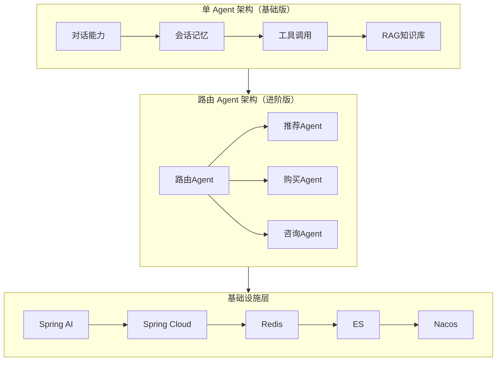
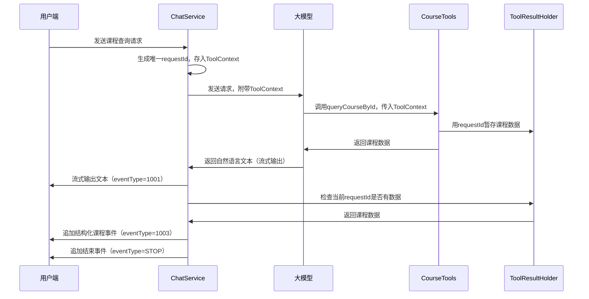
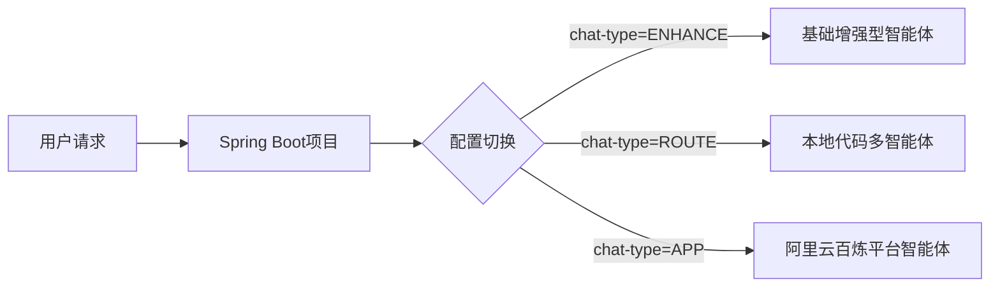
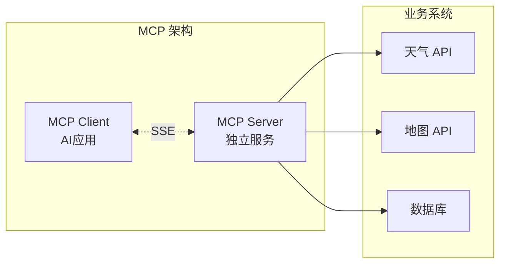
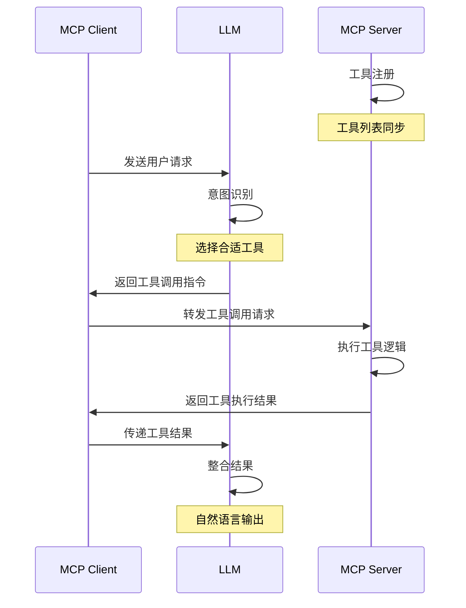
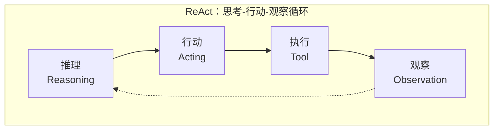
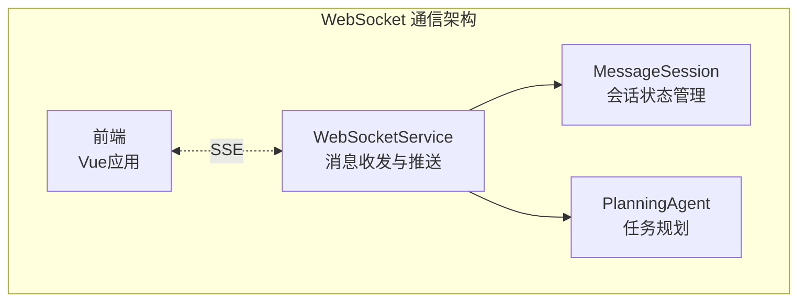

:::tip 
AI天机学堂——从单体 AI 助手到多智能体系统，再到 MCP 协议生态以及MyManus智能体。跟着这个项目，将学习到如何基于 Spring AI 构建企业级 AI 应用，掌握从基础对话到通用智能体的完整技术链路。完整具体的示例代码以及相应文档讲解，参考黑马官方文档，本文章仅做个人学习分享。
:::

## 一、项目背景与行业变革

### 1.1 AI 时代 Java 工程师的能力重构

2026 年的今天，软件开发行业正在经历一场前所未有的范式革命。Vibe Coding（氛围编程）已经从概念走向现实，AI 工具链正在成为开发者必备的核心技能，而非曾经的「加分项」。在这场变革中，Java 工程师面临着前所未有的挑战与机遇。

**行业背景分析：**

| 核心趋势            | 关键解读                                              |
| --------------- | ------------------------------------------------- |
| 软件开发模式变革        | 传统开发向 Vibe Coding 演进，AI 接管 80% 模板代码，编码效率提升 3-10 倍 |
| 企业 AI 能力加速落地    | AI 正渗透到客服、代码生成、数据分析等企业全场景，急需能融合 AI 与业务系统的复合型人才    |
| 传统 Java 开发者升级压力 | 仅掌握 Spring/MyBatis 等传统技术栈已不足以应对未来挑战               |
| 核心竞争力重构         | 未来的技术专家是能驾驭 AI、将大模型与业务逻辑无缝结合的「AI + 业务」复合型人才       |

**角色跃迁：从三类旧角色到三类新角色**

如果你还在做 CRUD 搬运工，是时候思考转型了。AI 正在替代「做什么」的执行，而人类需要主导「为什么做、怎么做系统、如何控风险」的决策。

| 旧角色（被弱化）    | 新角色（核心价值） | 核心变化                     |
| ----------- | --------- | ------------------------ |
| 代码搬运工（CRUD） | 智能系统架构师   | 从「写接口」到「设计 AI + 微服务架构」   |
| 框架使用者       | AI 业务编排师  | 从「调 API」到「用 AI 能力驱动业务闭环」 |
| 技术执行者       | 业务解决方案专家  | 从「实现需求」到「定义 AI 时代的业务方案」  |

**能力矩阵：Java 底盘 + AI 新能力**

核心公式：`Java 深度（不可替代）+ AI 工程化（新增壁垒）+ 行业业务（最高护城河）= 2026 年 Java 工程师核心竞争力`

| 能力层次    | 具体内容                            | 重要性     |
| ------- | ------------------------------- | ------- |
| Java 底盘 | JVM 调优、并发与分布式、代码质量与安全           | 不可替代的基石 |
| AI 工程化  | Spring AI、RAG、Tool Calling、多智能体 | 新增壁垒    |
| 云原生融合   | 容器化、AI 网关设计、弹性伸缩                | AI 应用必须 |
| 业务深度    | 行业知识、需求建模、价值判断                  | 最高护城河   |

:::note
AI 替代不了复杂系统的稳定性、性能与治理，Java 核心必须更扎实。但同样，只懂 Java 传统技能也已经不够，必须叠加 AI 工程化能力才能形成真正的竞争壁垒。
:::

### 1.2 天机学堂项目概述

天机学堂是基于 Spring Cloud 构建的成熟微服务系统，具备完善的后端架构与服务治理能力。这个项目的核心目标是：**在已有微服务基础上，新增天机 AI 助手智能体模块，为系统赋予理解、推理和内容生成的智能化能力**。

**项目解决的四大核心痛点：**

| 痛点          | 问题描述                                       | 解决方案                   |
| ----------- | ------------------------------------------ | ---------------------- |
| AI 接入困难     | 大模型（OpenAI/私有化/本地模型）接入现有 Java 微服务体系技术选型复杂  | Spring AI 统一封装，简化集成    |
| 工具调用落地难     | 设计可靠的函数调用机制，让 AI 安全调用后端 API，实现订单/支付等复杂业务闭环 | @Tool 注解 + Feign 微服务调用 |
| RAG 理解与落地困难 | 掌握知识库与向量检索系统构建方法，解决检索效果差、回答不准确的问题          | ES 向量库 + 离线 ETL + 实时检索 |
| 多智能体架构复杂    | 学习智能体分工协作设计方法，解决复杂业务流程下的任务编排与流程控制难题        | Router + Worker 分层架构   |

**学习目标：**

将主流 AI 大模型 API 安全、平滑、高性能地集成到现有微服务架构中。这不是纸上谈兵，而是真刀真枪的企业级实战。

### 1.3 技术架构概览



整个架构分为两大层次：

**基础层（单 Agent 架构）：** 提供 AI 助手的核心能力，包括流式对话、会话记忆、工具调用和知识库检索。这是构建任何 AI 助手都必须掌握的基础能力。

**进阶层（路由 Agent 架构）：** 在基础能力之上，通过路由智能体实现意图识别和多 Agent 协作，适合处理多业务分支的复杂场景。

:::important
建议的学习顺序是：先掌握基础层（第二至五章），再学习进阶层（第六至八章）。因为进阶层是对基础能力的组合应用，没有扎实的基础，进阶就是空中楼阁。
:::

***

## 二、基础对话能力实现

### 2.1 Spring AI 环境搭建

Spring AI 是 Spring 生态推出的 AI 开发框架，提供统一 API 封装，简化大模型、向量数据库、工具调用等 AI 组件的集成，让 Java 开发者能快速构建企业级 AI 应用。

#### 2.1.1 Maven 依赖配置

项目通过 Maven 的 `dependencyManagement` 统一管理依赖版本，避免冲突：

```xml
<dependencyManagement>
    <dependencies>
        <!-- Spring AI BOM -->
        <dependency>
            <groupId>org.springframework.ai</groupId>
            <artifactId>spring-ai-bom</artifactId>
            <version>${spring-ai.version}</version>
            <type>pom</type>
            <scope>import</scope>
        </dependency>
        <!-- 阿里云 AI BOM -->
        <dependency>
            <groupId>com.alibaba.cloud.ai</groupId>
            <artifactId>spring-ai-alibaba-bom</artifactId>
            <version>1.0.0.2</version>
            <type>pom</type>
            <scope>import</scope>
        </dependency>
    </dependencies>
</dependencyManagement>
```

BOM（Bill of Materials）的作用是统一管理依赖版本。子项目引入相关依赖时无需指定版本，`import` scope 仅用于版本管理，不会实际引入依赖，这是 Maven 的最佳实践。

#### 2.1.2 多环境配置设计

每个微服务提供四套配置文件，适配不同运行环境：

| 配置文件                  | 作用说明                            | 使用场景  |
| --------------------- | ------------------------------- | ----- |
| application.yml       | 主配置文件，定义服务端口、服务名称、Swagger 等通用信息 | 所有环境  |
| application-local.yml | 本地开发环境配置，包含 Nacos 注册/配置中心地址     | 本地开发  |
| application-dev.yml   | 虚拟机/开发环境配置，对应线上开发环境             | 开发服务器 |
| application-test.yml  | 测试环境配置                          | 测试部署  |

核心设计思想：通过 Spring Boot 的多环境 Profile 机制，实现一套代码适配不同环境，避免硬编码配置。

#### 2.1.3 网关路由配置

天机学堂采用 Spring Cloud Gateway 作为统一入口，为 AI 服务添加路由规则：

```yaml
routes:
  - id: ais
    uri: lb://aigc-service
    predicates:
      - Path=/ais/**
```

| 配置项                          | 说明                                    |
| ---------------------------- | ------------------------------------- |
| id: ais                      | 路由唯一标识                                |
| uri: lb://aigc-service       | 通过 Nacos 服务发现，负载均衡转发到 aigc-service 服务 |
| predicates: - Path=/ais/\*\* | 匹配请求路径为 /ais/\*\* 的请求                 |

配置完成后，AI 服务即可通过网关被外部访问，同时集成了网关的限流、鉴权、监控能力。

:::note
网关路由配置通常配合 StripPrefix 过滤器去除路径前缀，保证服务内部接口路径正确。这是在微服务架构中处理路径映射的标准做法。
:::

### 2.2 SSE 流式响应原理与实现

SSE（Server-Sent Events）是一种基于 HTTP 的服务器推送技术，是实现 AI 流式输出的核心技术。理解其原理对后续开发至关重要。

#### 2.2.1 为什么 SSE 数据要用 JSON 格式化？

SSE 的消息是按「块」推送的，每条 `data` 消息都是一个独立的传输单元。JSON 格式化能完美适配 SSE 的流式传输特性，同时解决复杂业务场景下的数据传递问题：

| 元信息类型   | 示例                              | 作用             |
| ------- | ------------------------------- | -------------- |
| 事件类型    | event\_type: "message" / "done" | 区分消息类型，执行不同逻辑  |
| 会话标识    | conversation\_id / session\_id  | 关联对话上下文，保证会话隔离 |
| 状态/错误信息 | code: 200 / error\_msg          | 客户端处理异常情况      |
| 业务数据    | tool\_call / rag\_result        | 传递工具调用、知识库检索结果 |

**JSON 格式化的核心优势：**

1. **结构化传递多维度信息**：除内容本身外，还能携带事件类型、会话标识、状态信息等元数据
2. **保证消息的独立性与完整性**：每个消息块都是完整 JSON 对象，即使传输中断也能正确解析
3. **跨端跨语言解析通用性**：JavaScript 原生支持 JSON.parse()，Java 后端有 Jackson/FastJSON
4. **便于调试与问题排查**：浏览器开发者工具可直接查看结构，快速定位问题

#### 2.2.2 核心代码实现

```java
@Override
public Flux<ChatEventVO> chat(String question, String sessionId) {
    return this.chatClient.prompt()
            .system(promptSystem -> promptSystem
                    .text(this.systemPromptConfig.getChatSystemMessage().get())
                    .param("now", DateUtil.now())
            )
            .user(question)
            .stream()
            .chatResponse()
            // 流启动时：标记会话为「正在生成」
            .doFirst(() -> GENERATE_STATUS.put(sessionId, true))
            // 流异常时：移除状态标记
            .doOnError(throwable -> GENERATE_STATUS.remove(sessionId))
            // 流正常完成时：移除状态标记
            .doOnComplete(() -> GENERATE_STATUS.remove(sessionId))
            // 核心控制：每次发送数据前检查状态，false 则终止流
            .takeWhile(response -> GENERATE_STATUS.getOrDefault(sessionId, false))
            // 封装响应为 SSE 事件格式
            .map(chatResponse -> {
                String text = chatResponse.getResult().getOutput().getText();
                return ChatEventVO.builder()
                        .eventData(text)
                        .eventType(ChatEventTypeEnum.DATA.getValue())
                        .build();
            })
            // 流结束时，发送结束标记
            .concatWith(Flux.just(ChatEventVO.builder()
                    .eventType(ChatEventTypeEnum.STOP.getValue())
                    .build()));
}
```

:::tip
Spring 的 `Flux` 是响应式编程的核心类型。通过 `.takeWhile()` 操作符，我们可以在每次发送数据前检查会话状态，实现流的中断控制。这是实现「停止生成」功能的关键。
:::

### 2.3 System Prompt 动态配置

AI 助手的 System Prompt 包含了 AI 的角色定义、业务规则、限制条件（如课程咨询范围、回答规范），这些内容通常需要运营根据业务调整。硬编码或本地文件存储存在以下问题：

| 问题      | 说明          |
| ------- | ----------- |
| 修改流程繁琐  | 需要改代码、打包、部署 |
| 影响线上业务  | 修改后必须重启服务   |
| 多环境管理困难 | 配置分散，难以统一管理 |

因此，将提示词存储到 Nacos 配置中心，实现动态读取、热更新，是生产环境的最佳解决方案。

#### 2.3.1 Nacos 配置中心集成

在 Nacos 中新建配置，存储系统提示词：

| 配置项     | 配置值                     | 说明                         |
| ------- | ----------------------- | -------------------------- |
| Data ID | system-chat-message.txt | 配置文件标识，唯一不可重复              |
| Group   | DEFAULT\_GROUP          | 配置分组，默认分组即可                |
| 配置格式    | TEXT                    | 选择纯文本格式，避免 JSON/YAML 的转义问题 |
| 配置内容    | 系统提示词文本                 | 包含 AI 角色定义、业务技能、限制规则       |

#### 2.3.2 配置元信息绑定

通过 `@ConfigurationProperties` 注解绑定 Nacos 配置的元信息：

```java
@Data
@Configuration
@ConfigurationProperties(prefix = "tj.ai.prompt")
public class AIProperties {
    private System system;

    @Data
    public static class System {
        private Chat chat;

        @Data
        public static class Chat {
            private String dataId;
            private String group = "DEFAULT_GROUP";
            private long timeoutMs = 20000;
        }
    }
}
```

对应 application.yml 配置：

```yaml
tj:
  ai:
    prompt:
      system:
        chat:
          data-id: system-chat-message.txt
          group: DEFAULT_GROUP
          timeout-ms: 20000
```

#### 2.3.3 热更新实现

```java
@Component
public class SystemPromptConfig {
    private final AtomicReference<String> chatSystemMessage = new AtomicReference<>();
    private final AIProperties aiProperties;
    private final NacosConfigManager nacosConfigManager;

    @PostConstruct
    public void init() {
        loadConfig(aiProperties.getSystem().getChat(), chatSystemMessage);
    }

    private void loadConfig(AIProperties.System.Chat chatConfig, AtomicReference<String> target) {
        try {
            String dataId = chatConfig.getDataId();
            String group = chatConfig.getGroup();
            long timeoutMs = chatConfig.getTimeoutMs();
            String config = nacosConfigManager.getConfigService()
                    .getConfig(dataId, group, timeoutMs);
            target.set(config);
            log.info("读取{}成功", dataId);
            // 添加配置监听器，实现热更新
            nacosConfigManager.getConfigService().addListener(dataId, group, new Listener() {
                @Override
                public Executor getExecutor() {
                    return null;
                }

                @Override
                public void receiveConfigInfo(String info) {
                    target.set(info); // 配置变更时自动更新
                    log.info("更新{}成功", dataId);
                }
            });
        } catch (Exception e) {
            log.error("加载配置失败", e);
        }
    }
}
```

**关键技术点：**

| 技术点             | 作用                                     |
| --------------- | -------------------------------------- |
| AtomicReference | 保证多线程下配置的原子性和线程安全，比 synchronized 更轻量高效 |
| @PostConstruct  | 项目启动时自动从 Nacos 读取配置                    |
| addListener     | Nacos 配置修改后，服务会实时收到变更通知，自动更新           |

#### 2.3.4 方案核心优势

| 优势      | 说明                           |
| ------- | ---------------------------- |
| 配置化管理   | 运营直接在 Nacos 配置中心编辑提交，无需代码变更  |
| 无感知热更新  | 配置修改后实时生效，无需重启服务             |
| 多环境统一管理 | 支持 dev/test/prod 通过命名空间/分组隔离 |
| 版本可追溯   | Nacos 自动保存配置历史版本，支持一键回滚      |

:::caution
SSE 的 `data` 消息中，JSON 字符串不能包含换行符（因为 `\n\n` 是 SSE 消息的结束符）。通常会将 JSON 压缩成单行字符串发送，避免破坏 SSE 的消息格式。这是新手很容易踩的坑。
:::

***

## 三、会话管理功能实现

### 3.1「停止生成」功能

「停止生成」功能允许用户打断大模型的流式输出，立即终止对话。

#### 3.1.1 核心原理

首先需要明确一个关键限制：**后端无法主动终止大模型的 API 调用**。大模型 API 的流式请求一旦发起，模型会持续生成 token，后端无法主动中断，即使前端断开连接，模型仍会继续生成并产生计费。

因此，「停止生成」的本质是**控制后端向客户端输出的 Flux 流，终止数据发送，让前端断开连接，实现「看起来停止了」的交互效果**。

实现的核心依赖 Spring 的 `Flux` 流控制：通过一个会话级的生成状态标记，控制 `Flux` 是否继续向下游发送数据。

#### 3.1.2 本地内存版实现

```java
private static final Map<String, Boolean> GENERATE_STATUS = new ConcurrentHashMap<>();

@PostMapping("/chat/stop")
public void stopChat(@RequestParam String sessionId) {
    GENERATE_STATUS.put(sessionId, false);
}
```

当用户点击停止按钮时，将对应会话的状态设为 false，`takeWhile` 操作符会检测到状态变化，立即终止 Flux 流。

#### 3.1.3 Redis 分布式版实现

:::warning
单实例部署用本地内存版即可，但多实例/集群部署必须用 Redis 版。否则 stop 请求可能打到不同实例，导致状态不同步，用户点击停止后毫无反应。
:::

```java
private static final String CHAT_GENERATE_STATUS_KEY = "chat:generate:status:";
private static final Duration STATUS_EXPIRE_TIME = Duration.ofMinutes(30);

@Override
public Flux<ChatEventVO> chat(String question, String sessionId) {
    String redisKey = CHAT_GENERATE_STATUS_KEY + sessionId;
    return this.chatClient.prompt()
            // ...省略流式响应代码...
            .doFirst(() -> redisTemplate.opsForValue()
                    .set(redisKey, true, STATUS_EXPIRE_TIME))
            .takeWhile(response -> Boolean.TRUE
                    .equals(redisTemplate.opsForValue().get(redisKey)))
            // ...省略后续代码...
}

@PostMapping("/chat/stop")
public void stopChat(@RequestParam String sessionId) {
    String redisKey = CHAT_GENERATE_STATUS_KEY + sessionId;
    redisTemplate.opsForValue().set(redisKey, false);
}
```

#### 3.1.4 两版方案对比

| 方案         | 适用场景     | 优点             | 缺点            |
| ---------- | -------- | -------------- | ------------- |
| 本地内存版      | 单实例部署    | 实现简单、无额外依赖     | 多实例部署状态不同步    |
| Redis 分布式版 | 多实例/集群部署 | 支持分布式场景，状态全局一致 | 需要引入 Redis 依赖 |

:::caution
无论哪种方案，都只是终止了向后端的输出流，大模型的生成过程仍在继续，会正常产生 API 调用费用。
:::

### 3.2 会话记忆 Redis 实现

Spring AI 默认的会话记忆实现是基于内存的，存在以下问题：

| 问题     | 说明           |
| ------ | ------------ |
| 服务重启丢失 | 内存数据全部丢失     |
| 多实例不共享 | 集群部署时会话上下文断裂 |
| 内存无限增长 | 可能导致 OOM     |

#### 3.2.1 ChatMemoryRepository 接口扩展

Spring AI 通过 `ChatMemoryRepository` 接口提供会话记忆的 SPI 扩展点：

```java
public interface ChatMemoryRepository {
    List<String> findConversationIds();
    List<Message> findByConversationId(String conversationId);
    void saveAll(String conversationId, List<Message> messages);
    void deleteByConversationId(String conversationId);
}
```

实现该接口即可自定义存储方案。

#### 3.2.2 消息序列化问题解决

:::important
Spring 的 Message 接口（如 UserMessage/AssistantMessage）没有提供标准的 get/set 方法，直接序列化会丢失 textContent 等核心字段。必须自定义序列化方案。
:::

```java
@Data
public class MyMessage {
    private String messageType;
    private Map<String, Object> metadata = Map.of();
    private List<Media> media = List.of();
    private List<AssistantMessage.ToolCall> toolCalls = List.of();
    private String textContent;
    private List<ToolResponseMessage.ToolResponse> toolResponses = List.of();
    private Map<String, Object> params = Map.of();
}
```

序列化工具类实现 Message 与 JSON 字符串的互转：

```java
public static String toJson(Message message) {
    MyMessage myMessage = BeanUtil.toBean(message, MyMessage.class);
    myMessage.setTextContent(message.getText());
    if (message instanceof AssistantMessage assistantMessage) {
        myMessage.setToolCalls(assistantMessage.getToolCalls());
    }
    if (message instanceof ToolResponseMessage toolResponseMessage) {
        myMessage.setToolResponses(toolResponseMessage.getResponses());
    }
    return JSONUtil.toJsonStr(myMessage);
}
```

#### 3.2.3 Redis 会话记忆 Repository 实现

```java
@Component
public class RedisChatMemoryRepository implements ChatMemoryRepository {
    public static final String DEFAULT_PREFIX = "CHAT:";
    public static final int EXPIRE_TIME = 1800;

    private final StringRedisTemplate stringRedisTemplate;

    @Override
    public void saveAll(String conversationId, List<Message> messages) {
        String redisKey = DEFAULT_PREFIX + conversationId;
        BoundListOperations<String, String> listOps = stringRedisTemplate.boundListOps(redisKey);
        deleteByConversationId(conversationId);
        messages.forEach(message -> listOps.rightPush(MessageUtil.toJson(message)));
        stringRedisTemplate.expire(redisKey, EXPIRE_TIME, TimeUnit.SECONDS);
    }

    @Override
    public List<Message> findByConversationId(String conversationId) {
        String redisKey = DEFAULT_PREFIX + conversationId;
        List<String> messageJsons = stringRedisTemplate.opsForList().range(redisKey, 0, -1);
        if (CollUtil.isEmpty(messageJsons)) {
            return List.of();
        }
        return messageJsons.stream()
                .map(MessageUtil::toMessage)
                .collect(Collectors.toList());
    }
}
```

**Redis List 的优势：** 天然支持按顺序存储聊天记录，可通过 LRANGE 获取历史消息，RPUSH 追加新消息，性能极高。

#### 3.2.4 配置 Spring AI 会话记忆

```java
@Bean
public ChatClient chatClient(ChatClient.Builder chatClientBuilder,
                             MessageChatMemoryAdvisor messageChatMemoryAdvisor,
                             SimpleLoggerAdvisor loggerAdvisor) {
    return chatClientBuilder
            .defaultAdvisors(loggerAdvisor, messageChatMemoryAdvisor)
            .build();
}

@Bean
public ChatMemoryRepository redisChatMemoryRepository(StringRedisTemplate stringRedisTemplate) {
    return new RedisChatMemoryRepository(stringRedisTemplate);
}

@Bean
public ChatMemory chatMemory(ChatMemoryRepository chatMemoryRepository) {
    return MessageWindowChatMemory.builder()
            .chatMemoryRepository(chatMemoryRepository)
            .maxMessages(100)
            .build();
}
```

#### 3.2.5 关键问题与解决方案

| 问题         | 根因                | 解决方案                      |
| ---------- | ----------------- | ------------------------- |
| 会话 ID 冲突   | 多用户使用相同 sessionId | 会话 ID 设计为「用户 ID\_会话 ID」格式 |
| Redis 内存增长 | 未设置过期时间           | 在 saveAll 中设置 key 过期时间    |
| 上下文过长      | 消息数量超出 token 限制   | 通过 maxMessages 限制保留消息数    |

:::note
MessageWindowChatMemory 的 maxMessages 参数用于控制保留的消息数量，超出后自动删除旧消息。这是避免 token 溢出的有效手段。
:::

### 3.3 历史对话与多存储方案

Spring AI 的 `MessageWindowChatMemory` 支持多种存储后端，通过实现 `ChatMemoryRepository` 接口即可灵活切换。

#### 存储方案对比

| 方案      | 适用场景            | 优势           | 劣势                      |
| ------- | --------------- | ------------ | ----------------------- |
| Redis   | 高性能、低延迟、会话生命周期短 | 读写速度极快（内存操作） | 依赖 RDB/AOF 持久化，存在数据丢失风险 |
| MySQL   | 持久化存储、会话审计      | 数据可靠、支持复杂查询  | 读写速度较慢（磁盘操作）            |
| MongoDB | 大并发写入、灵活扩展      | 原生支持文档结构、性能高 | 需要额外运维                  |

#### MySQL 存储实现

**数据库表设计：**

```sql
CREATE TABLE chat_record (
    id BIGINT PRIMARY KEY AUTO_INCREMENT COMMENT '主键ID',
    conversation_id VARCHAR(100) NOT NULL COMMENT '会话ID',
    data TEXT NOT NULL COMMENT '序列化后的消息数据（JSON格式）',
    create_time DATETIME NOT NULL COMMENT '创建时间',
    update_time DATETIME NOT NULL COMMENT '更新时间'
) COMMENT='对话记录';
```

**Repository 实现：**

```java
public class JdbcChatMemoryRepository implements ChatMemoryRepository {
    @Resource
    private ChatRecordService chatRecordService;

    @Override
    public List<Message> findByConversationId(String conversationId) {
        List<ChatRecord> chatRecordList = chatRecordService.lambdaQuery()
                .eq(ChatRecord::getConversationId, conversationId)
                .orderByAsc(ChatRecord::getCreateTime)
                .list();
        return CollStreamUtil.toList(chatRecordList, 
                record -> MessageUtil.toMessage(record.getData()));
    }

    @Override
    public void saveAll(String conversationId, List<Message> messages) {
        deleteByConversationId(conversationId);
        List<ChatRecord> chatRecordList = CollStreamUtil.toList(messages, message -> 
                ChatRecord.builder()
                        .conversationId(conversationId)
                        .data(MessageUtil.toJson(message))
                        .createTime(LocalDateTime.now())
                        .updateTime(LocalDateTime.now())
                        .build()
        );
        chatRecordService.saveBatch(chatRecordList);
    }
}
```

#### MongoDB 存储实现

**实体类映射：**

```java
@Data
@Builder
@Document("chat_record")  // 指定MongoDB集合名
public class ChatRecord {
    @Id
    private ObjectId id;
    
    @Indexed  // 创建索引提升查询性能
    private String conversationId;
    
    private List<String> messages;  // 存储序列化后的JSON
}
```

**Repository 实现：**

```java
public class MongoDBChatMemoryRepository implements ChatMemoryRepository {
    @Resource
    private MongoTemplate mongoTemplate;

    @Override
    public List<Message> findByConversationId(String conversationId) {
        Query query = Query.query(Criteria.where("conversationId").is(conversationId));
        ChatRecord chatRecord = mongoTemplate.findOne(query, ChatRecord.class);
        if (chatRecord == null) return List.of();
        return CollStreamUtil.toList(chatRecord.getMessages(), MessageUtil::toMessage);
    }

    @Override
    public void saveAll(String conversationId, List<Message> messages) {
        deleteByConversationId(conversationId);
        ChatRecord chatRecord = ChatRecord.builder()
                .conversationId(conversationId)
                .messages(CollStreamUtil.toList(messages, MessageUtil::toJson))
                .build();
        mongoTemplate.save(chatRecord);
    }
}
```

#### 动态存储切换机制

通过 `@ConditionalOnProperty` 实现配置驱动的多数据源切换：

```java
@Configuration
public class SpringAIConfig {
    @Value("${tj.ai.memory.max:100}")
    private Integer maxMessages;

    @Bean
    @ConditionalOnProperty(prefix = "tj.ai.memory", value = "type", havingValue = "Redis", matchIfMissing = true)
    public ChatMemoryRepository redisChatMemoryRepository() {
        return new RedisChatMemoryRepository();
    }

    @Bean
    @ConditionalOnProperty(prefix = "tj.ai.memory", value = "type", havingValue = "MYSQL")
    public ChatMemoryRepository jdbcChatMemoryRepository() {
        return new JdbcChatMemoryRepository();
    }

    @Bean
    @ConditionalOnProperty(prefix = "tj.ai.memory", value = "type", havingValue = "MONGODB")
    public ChatMemoryRepository mongoDBChatMemoryRepository() {
        return new MongoDBChatMemoryRepository();
    }

    @Bean
    public ChatMemory chatMemory(ChatMemoryRepository chatMemoryRepository) {
        return MessageWindowChatMemory.builder()
                .chatMemoryRepository(chatMemoryRepository)
                .maxMessages(maxMessages)
                .build();
    }
}
```

**配置文件示例：**

```yaml
tj:
  ai:
    memory:
      max: 100
      type: MONGODB  # 切换为MongoDB存储
```

:::tip
核心优势在于业务代码零修改，仅通过配置文件即可切换存储方式。这种 SPI 扩展 + 条件 Bean 注入的方式，完全遵循 Spring AI 规范，无缝适配现有对话流程。
:::

### 3.4「停止生成」与「会话记忆」组合 Bug 修复

这是一个典型的 Spring AI 会话记忆与 Flux 流中断冲突问题。

#### Bug 现象

当同时使用「停止生成」和「会话记忆」功能时：

1. 用户提问后，`saveAll` 方法正常执行，用户消息成功存入 Redis
2. AI 开始流式输出，前端调用 `/ais/chat/stop` 接口停止生成
3. 流中断后，**仅存在用户消息，AI 的回复内容未被保存**
4. 后续查询会话记录时，看不到被中断的 AI 回复

#### 根因分析

| 流程   | 触发机制                  | 结果                             |
| ---- | --------------------- | ------------------------------ |
| 正常流程 | 流正常结束，触发 `onComplete` | Spring AI 自动保存完整对话             |
| 停止生成 | `takeWhile` 中断 Flux 流 | `onComplete` 未执行，`add()` 方法不触发 |

核心问题：**Spring AI 的会话记忆 Advisor 仅在流正常完成时触发保存逻辑**。

#### 修复方案

利用 Flux 的 `doOnCancel` 钩子，在流被取消时手动收集已输出的 AI 内容：

```java
@Override
public Flux<ChatEventVO> chat(String question, String sessionId) {
    String conversationId = ChatService.getConversationId(sessionId);
    StringBuilder outputBuilder = new StringBuilder();  // 缓存流式输出

    return this.chatClient.prompt()
            .system(promptSystem -> promptSystem
                    .text(this.systemPromptConfig.getChatSystemMessage().get())
                    .param("now", DateUtil.now())
            )
            .advisors(advisor -> advisor.param(
                    AbstractChatMemoryAdvisor.CHAT_MEMORY_CONVERSATION_ID_KEY, 
                    conversationId
            ))
            .user(question)
            .stream()
            .chatResponse()
            .doFirst(() -> GENERATE_STATUS.put(sessionId, true))           // 流开始标记
            .doOnComplete(() -> GENERATE_STATUS.remove(sessionId))          // 流正常完成
            .doOnError(throwable -> GENERATE_STATUS.remove(sessionId))      // 流异常处理
            .doOnCancel(() -> saveStopHistoryRecord(conversationId,          // 关键：流被取消时保存
                    outputBuilder.toString()))
            .takeWhile(response -> Optional.ofNullable(GENERATE_STATUS.get(sessionId)).orElse(false))
            .map(chatResponse -> {
                String text = chatResponse.getResult().getOutput().getText();
                outputBuilder.append(text);  // 收集输出内容
                return ChatEventVO.builder()
                        .eventData(text)
                        .eventType(ChatEventTypeEnum.DATA.getValue())
                        .build();
            })
            .concatWith(Flux.just(ChatEventVO.builder()
                    .eventType(ChatEventTypeEnum.STOP.getValue())
                    .build()));
}

private void saveStopHistoryRecord(String conversationId, String content) {
    if (StrUtil.isNotBlank(content)) {
        this.chatMemory.add(conversationId, new AssistantMessage(content));
    }
}
```

#### 关键注意事项

| 注意点             | 说明                                  |
| --------------- | ----------------------------------- |
| `doOnCancel` 位置 | 必须放在 `takeWhile` **之前**，否则会被流中断逻辑覆盖 |
| 内容缓存            | 使用 `StringBuilder` 避免字符串拼接创建新对象     |
| 空值判断            | 保存前判断内容是否为空，避免存入空消息                 |
| 异常场景            | 可在 `doOnError` 中补充保存逻辑              |

#### 修复后验证

1. 调用对话接口，AI 开始流式输出
2. 中途调用 `/ais/chat/stop` 接口停止生成
3. 查看 Redis 中的会话记录：用户消息已保存，已输出的 AI 内容已作为 `ASSISTANT` 消息存入
4. 调用 `/ais/session/{sessionId}` 查询历史对话，可看到完整记录

:::important
这个 Bug 的核心是 Spring AI 的会话记忆仅在流正常完成时触发，流中断时不会自动保存。通过 `doOnCancel` 钩子手动捕获中断事件，保证会话记录的完整性。
:::

***

## 四、Tool Calling 工具调用

### 4.1 工具调用核心原理

Tool Calling（工具调用）是让 AI 能够执行实际操作的核心能力。通过工具调用，大模型可以调用后端 API、查询数据库、操作外部系统，实现真正的业务闭环。

```
用户提问 → 大模型识别意图 → 生成工具调用指令 → 后端执行工具 → 返回结果 → 大模型生成回复
```

### 4.2 @Tool 注解与工具注册

Spring AI 通过 `@Tool` 注解标记方法为可调用的工具：

```java
@Component
@RequiredArgsConstructor
public class CourseTools {
    private final CourseClient courseClient;

    @Tool(description = "根据课程id查询课程详细信息")
    public CourseInfo queryCourseById(
            @ToolParam(description = "课程id") Long courseId) {
        return Optional.ofNullable(courseId)
                .map(id -> CourseInfo.of(this.courseClient.baseInfo(id, true)))
                .orElse(null);
    }
}
```

**注解说明：**

| 注解         | 作用                                |
| ---------- | --------------------------------- |
| @Component | 将工具类注册为 Spring Bean               |
| @Tool      | 标记该方法为 MCP 工具，description 会给大模型读取 |
| @ToolParam | 标记方法参数，description 帮助大模型正确传参      |

注册工具到 ChatClient：

```java
@Bean
public ChatClient chatClient(ChatClient.Builder chatClientBuilder,
                             CourseTools courseTools) {
    return chatClientBuilder
            .defaultAdvisors(loggerAdvisor, messageChatMemoryAdvisor)
            .defaultTools(courseTools)
            .build();
}
```

### 4.3 Optional 空安全处理

:::tip
Optional 不是银弹，适合处理外部接口返回值、数据库查询结果这种可能为 null 的场景。局部变量直接用 if 判断更高效。
:::

```java
courseInfo.setPrice(Optional.ofNullable(courseBaseInfoDTO.getPrice())
        .map(num -> num.doubleValue() / 100d) // 分转元
        .map(num -> NumberUtil.round(num, 2).doubleValue()) // 保留两位小数
        .orElse(0.0d)); // 为空时默认 0.0 元
```

**Optional 核心 API 速查：**

| 方法           | 作用                            | 使用场景           |
| ------------ | ----------------------------- | -------------- |
| ofNullable() | 创建 Optional，支持 null           | 处理可能为 null 的变量 |
| map()        | 非空时执行转换                       | 链式处理数据转换       |
| flatMap()    | 和 map 类似，但 mapper 返回 Optional | 处理嵌套 Optional  |
| filter()     | 非空时判断是否满足条件                   | 过滤不符合条件的值      |
| orElse()     | 空时返回默认值                       | 给变量设置默认值       |
| orElseGet()  | 空时执行 supplier 生成默认值           | 默认值生成逻辑复杂时     |

### 4.4 课程卡片功能：流式输出结构化数据

#### 4.4.1 核心问题

用户在 AI 助手中查询课程时，前端需要同时展示两类信息：

- 大模型返回的**自然语言文本**（如"这门课适合 Java 开发者"）
- 结构化的**课程卡片数据**（课程名称、价格、图片、跳转链接）

然而 Spring AI 的工具调用流程存在两个问题：

| 问题    | 说明                   |
| ----- | -------------------- |
| 数据丢失  | 工具结果被揉进自然语言，前端无法解析   |
| 流式不兼容 | 工具结果不会自动透传到 Flux 输出流 |

#### 4.4.2 RequestId + ToolResultHolder 方案

**核心思路：**

1. **请求隔离**：每次请求生成唯一 `requestId`，解决并发场景下的数据覆盖问题
2. **结果暂存**：用线程安全的全局容器暂存工具执行结果
3. **流尾追加**：在 Flux 流式输出的末尾，追加约定格式的事件给前端

**流程时序：**



#### 4.4.3 完整代码实现

**Step 1：生成并传递 requestId**

```java
public interface Constant {
    String REQUEST_ID = "requestId";
}

public Flux<ChatEventVO> chat(String question, String sessionId) {
    String conversationId = ChatService.getConversationId(sessionId);
    // 生成唯一请求ID（避免sessionId并发问题）
    var requestId = IdUtil.fastSimpleUUID();

    return this.chatClient.prompt()
            .advisors(advisor -> advisor
                .param(AbstractChatMemoryAdvisor.CHAT_MEMORY_CONVERSATION_ID_KEY, conversationId)
                // 通过ToolContext传递requestId给工具
                .toolContext(Map.of(Constant.REQUEST_ID, requestId))
            )
            .user(question)
            .stream()
            .chatResponse()
            // ... 流式输出文本逻辑
            ;
}
```

**Step 2：工具执行时暂存结果**

```java
@Tool(description = "根据课程id查询课程详细信息")
public CourseInfo queryCourseById(
        @ToolParam(description = "课程id") Long courseId,
        ToolContext toolContext  // 接收上下文参数
) {
    return Optional.ofNullable(courseId)
            .map(id -> CourseInfo.of(this.courseClient.baseInfo(id, true)))
            .map(courseInfo -> {
                // 1. 生成字段名（避免多工具结果冲突）
                String field = StrUtil.format("{}_{}",
                        StrUtil.lowerFirst(CourseInfo.class.getSimpleName()),
                        courseInfo.getId());
                // 2. 从ToolContext中获取requestId
                var requestId = Convert.toStr(toolContext.getContext().get(Constant.REQUEST_ID));
                // 3. 将课程数据存入全局容器
                ToolResultHolder.put(requestId, field, courseInfo);
                return courseInfo;
            })
            .orElse(null);
}
```

**Step 3：流尾追加结构化数据**

```java
private static final ChatEventVO STOP_EVENT = ChatEventVO.builder()
        .eventType(ChatEventTypeEnum.STOP.getValue()).build();

public Flux<ChatEventVO> chat(String question, String sessionId) {
    // ... 生成requestId、流式输出文本逻辑

    return 文本流.concatWith(Flux.defer(() -> {
        // 1. 检查当前requestId是否有工具结果
        var map = ToolResultHolder.get(requestId);
        if (CollUtil.isNotEmpty(map)) {
            // 2. 遍历结果，构建前端约定的结构化事件（eventType=1003）
            return Flux.fromIterable(map.entrySet().stream()
                    .map(entry -> ChatEventVO.builder()
                            .eventType(ChatEventTypeEnum.PARAM.getValue())
                            .eventData(JSONUtil.toJsonStr(Map.of(
                                    "courseInfo", Map.of(
                                            "id": ((CourseInfo) entry.getValue()).getId(),
                                            "name": ((CourseInfo) entry.getValue()).getName(),
                                            "price": ((CourseInfo) entry.getValue()).getPrice()
                                    )
                            )))
                            .build())
                    .toList())
                    .concatWith(Flux.just(STOP_EVENT));
        }
        return Flux.just(STOP_EVENT);
    }));
}
```

**ToolResultHolder 实现：**

```java
public class ToolResultHolder {
    // 外层key: requestId，内层key: 工具结果字段名
    private static final Map<String, Map<String, Object>> HANDLER_MAP = new ConcurrentHashMap<>();

    public static void put(String key, String field, Object result) {
        Assert.notNull(key, "key is not null!");
        Assert.notNull(field, "field is not null!");
        HANDLER_MAP.computeIfAbsent(key, k -> new HashMap<>()).put(field, result);
    }

    public static Map<String, Object> get(String key) {
        return key == null ? null : HANDLER_MAP.get(key);
    }

    public static void remove(String key) {
        HANDLER_MAP.remove(key);
    }
}
```

#### 4.4.4 关键知识点

| 知识点         | 说明                                              |
| ----------- | ----------------------------------------------- |
| ToolContext | Spring AI 提供的工具调用上下文，可传递请求级参数到工具方法              |
| 并发数据隔离      | 使用 `requestId` 替代 `sessionId`，解决同一用户多请求并发时的数据覆盖 |
| Flux 流操作    | 利用 `concatWith` 和 `Flux.defer`，在文本流结束后追加结构化数据   |
| 事件类型约定      | `eventType=1001` 渲染文本，`eventType=1003` 渲染卡片     |

:::tip
扩展建议：在 `doOnComplete`/`doOnError` 时主动调用 `remove(requestId)`，避免内存泄漏。
:::

### 4.5 预下单功能：业务流程闭环

#### 4.5.1 需求场景

用户在 AI 助手中发送"下单购买，课程 id 为：xxx"的请求时，AI 返回：

- 自然语言文本：订单优惠信息、支付提示
- 结构化订单卡片：包含课程信息、原价、优惠金额、实付金额，前端渲染「立即下单」按钮

#### 4.5.2 与课程查询的核心差异

| 维度   | 课程查询      | 预下单              |
| ---- | --------- | ---------------- |
| 依赖身份 | 无需用户身份    | 必须传递用户 ID        |
| 业务逻辑 | 仅查询课程基础信息 | 需处理优惠券、金额计算、订单生成 |
| 前端渲染 | 课程卡片（仅展示） | 订单卡片（含支付跳转按钮）    |
| 数据透传 | 课程信息      | 订单信息+支付参数        |

#### 4.5.3 订单结果类 PrePlaceOrder

```java
@Data
@Builder
public class PrePlaceOrder {
    @JsonPropertyDescription("课程数量")
    private int count;
    @JsonPropertyDescription("订单总金额")
    private double totalAmount;
    @JsonPropertyDescription("最大优惠金额")
    private double discountAmount;
    @JsonPropertyDescription("优惠券名称")
    private String couponName;
    @JsonPropertyDescription("实付金额")
    private double payAmount;
    @JsonPropertyDescription("课程id列表")
    private List<Long> courseIds;
    @JsonPropertyDescription("订单id")
    private Long orderId;
    @JsonPropertyDescription("优惠券id")
    private Long couponId;

    public static PrePlaceOrder of(OrderConfirmVO orderConfirmVO) {
        // 1. 处理订单总金额（分转元，保留两位小数）
        double totalAmount = Optional.ofNullable(orderConfirmVO.getTotalAmount())
                .map(num -> num.doubleValue() / 100d)
                .map(num -> NumberUtil.round(num, 2).doubleValue())
                .orElse(0.0d);

        // 2. 处理优惠金额与优惠券名称
        double discountAmount = Optional.ofNullable(CollUtil.getFirst(orderConfirmVO.getDiscounts()))
                .map(CouponDiscountDTO::getDiscountAmount)
                .map(num -> num.doubleValue() / 100d)
                .map(num -> NumberUtil.round(num, 2).doubleValue())
                .orElse(0.0d);

        String couponName = Optional.ofNullable(CollUtil.getFirst(orderConfirmVO.getDiscounts()))
                .map(couponDiscountDTO -> {
                    List<String> rules = couponDiscountDTO.getRules();
                    int size = CollUtil.size(rules);
                    return size >= 2
                            ? StrUtil.format("叠加{}券：【优惠{}元】", size, discountAmount)
                            : StrUtil.format("单券：【{}】", CollUtil.getFirst(rules));
                })
                .orElse("");

        // 3. 计算实付金额
        double payAmount = NumberUtil.round(totalAmount - discountAmount, 2).doubleValue();

        return PrePlaceOrder.builder()
                .count(CollUtil.size(orderConfirmVO.getCourses()))
                .totalAmount(totalAmount)
                .discountAmount(discountAmount)
                .couponName(couponName)
                .payAmount(payAmount)
                .courseIds(CollStreamUtil.toList(orderConfirmVO.getCourses(), OrderCourseDTO::getId))
                .orderId(orderConfirmVO.getOrderId())
                .couponId(Optional.ofNullable(CollUtil.getFirst(orderConfirmVO.getDiscounts()))
                        .map(CouponDiscountDTO::getId)
                        .orElse(null))
                .build();
    }
}
```

#### 4.5.4 预下单工具实现

```java
@Component
@RequiredArgsConstructor
public class OrderTools {
    private final TradeClient tradeClient;

    @Tool(description = "购买课程预下单操作")
    public PrePlaceOrder prePlaceOrder(
            @ToolParam(description = "课程id列表") List<Number> ids,
            ToolContext toolContext
    ) {
        // 1. 从ToolContext中获取用户ID和请求ID
        var userId = Convert.toLong(toolContext.getContext().get(Constant.USER_ID));
        var requestId = Convert.toStr(toolContext.getContext().get(Constant.REQUEST_ID));

        // 2. 调用订单微服务预下单接口
        return Optional.ofNullable(ids)
                .map(list -> CollStreamUtil.toList(list, Number::longValue))
                .map(courseIds -> tradeClient.prePlaceOrder(courseIds))
                .map(PrePlaceOrder::of)
                .map(prePlaceOrder -> {
                    // 3. 将订单结果存入ToolResultHolder
                    String field = StrUtil.lowerFirst(PrePlaceOrder.class.getSimpleName());
                    ToolResultHolder.put(requestId, field, prePlaceOrder);
                    return prePlaceOrder;
                })
                .orElse(null);
    }
}
```

#### 4.5.5 上下文传递与工具注册

```java
public interface Constant {
    String REQUEST_ID = "requestId";
    String USER_ID = "userId";
}

@Configuration
public class SpringAIConfig {
    @Bean
    public ChatClient chatClient(ChatClient.Builder builder, Advisor loggerAdvisor,
            CourseTools courseTools, OrderTools orderTools) {
        return builder
                .defaultAdvisors(loggerAdvisor, messageChatMemoryAdvisor)
                .defaultTools(courseTools, orderTools)  // 同时注册多个工具
                .build();
    }
}

@Override
public Flux<ChatEventVO> chat(String question, String sessionId) {
    var userId = UserContext.getUser();  // 获取当前登录用户
    var requestId = IdUtil.fastSimpleUUID();

    return this.chatClient.prompt()
            .advisors(advisor -> advisor
                    .param(AbstractChatMemoryAdvisor.CHAT_MEMORY_CONVERSATION_ID_KEY, conversationId)
                    .toolContext(Map.of(
                            Constant.REQUEST_ID, requestId,
                            Constant.USER_ID, userId  // 传递用户ID到工具
                    ))
            )
            .user(question)
            .stream()
            .chatResponse()
            // 流尾追加结构化订单数据（与课程查询逻辑一致）
            .concatWith(Flux.defer(() -> {
                var map = ToolResultHolder.get(requestId);
                if (CollUtil.isNotEmpty(map)) {
                    return Flux.fromIterable(map.entrySet().stream()
                            .map(entry -> ChatEventVO.builder()
                                    .eventType(ChatEventTypeEnum.PARAM.getValue())
                                    .eventData(JSONUtil.toJsonStr(entry.getValue()))
                                    .build())
                            .toList())
                            .concatWith(Flux.just(STOP_EVENT));
                }
                return Flux.just(STOP_EVENT);
            }));
}
```

:::note
预下单功能完全复用了课程查询的技术方案，只需定义工具类、注册到 `ChatClient`，无需修改流式输出逻辑。
:::

### 4.6 结构化数据丢失问题修复

#### 4.6.1 问题现象

前端收到的流式数据中，`eventType=1003` 的结构化订单/课程数据**仅在当前请求生效**。Redis 中存储的聊天记录里，`params` 字段为空，历史对话重新加载时无法渲染卡片。

#### 4.6.2 根因分析

| 问题        | 根因分析                                            |
| --------- | ----------------------------------------------- |
| 数据未进入存储流程 | 结构化数据仅暂存在 ToolResultHolder，未集成到 ChatMemory 存储链路 |
| 消息对象无扩展字段 | Spring AI 的 AssistantMessage 没有 params 字段       |
| 序列化逻辑未处理  | RedisChatMemoryRepository 仅序列化了文本内容             |

#### 4.6.3 解决方案

复用 `ToolResultHolder`，通过「消息 ID 关联请求 ID」的方式，将结构化数据写入 Redis：

1. **扩展消息对象**：自定义 `MyAssistantMessage` 继承原生 `AssistantMessage`，新增 `params` 字段
2. **建立消息与请求的关联**：在消息结束时，将 `messageId` 与 `requestId` 存入 `ToolResultHolder`
3. **序列化时注入数据**：在消息写入 Redis 前，通过 `messageId` 取出 `params` 数据
4. **反序列化恢复数据**：从 Redis 读取消息时，解析 `params` 字段

#### 4.6.4 完整代码实现

**Step 1：建立消息 ID 与请求 ID 的关联**

```java
@Override
public Flux<ChatEventVO> chat(String question, String sessionId) {
    return this.chatClient.prompt()
            // ...
            .stream()
            .chatResponse()
            .doOnNext(chatResponse -> {
                // 当消息结束时，将messageId与requestId存入ToolResultHolder
                String finishReason = chatResponse.getMetadata().getFinishReason();
                if (StrUtil.equals(Constant.STOP, finishReason)) {
                    String messageId = chatResponse.getMetadata().getId();
                    ToolResultHolder.put(messageId, Constant.REQUEST_ID, requestId);
                }
            })
            // ... 文本输出、流尾追加params数据逻辑
}
```

**Step 2：扩展消息对象**

```java
@Getter
@Setter
public class MyAssistantMessage extends AssistantMessage {
    private Map<String, Object> params;

    public MyAssistantMessage(String content, Map<String, Object> properties,
            List<ToolCall> toolCalls, List<Media> media, Map<String, Object> params) {
        super(content, properties, toolCalls, media);
        this.params = params;
    }
}
```

**Step 3：序列化时注入数据**

```java
public static String toJson(Message message) {
    RedisMessage redisMessage = BeanUtil.toBean(message, RedisMessage.class);
    redisMessage.setTextContent(message.getText());

    if (message instanceof AssistantMessage assistantMessage) {
        redisMessage.setToolCalls(assistantMessage.getToolCalls());

        // 通过messageId获取requestId，再从ToolResultHolder取出params
        String messageId = Convert.toStr(assistantMessage.getMetadata().get(Constant.ID));
        String requestId = Convert.toStr(ToolResultHolder.get(messageId, Constant.REQUEST_ID));
        Map<String, Object> params = ToolResultHolder.get(requestId);

        if (ObjectUtil.isNotEmpty(params)) {
            redisMessage.setParams(params);
        }
        // 清理临时数据，避免内存泄漏
        ToolResultHolder.remove(messageId);
    }
    return JSONUtil.toJsonStr(redisMessage);
}
```

**Step 4：反序列化恢复数据**

```java
public static Message toMessage(String json) {
    RedisMessage myMessage = JSONUtil.toBean(json, RedisMessage.class);

    return switch (MessageType.valueOf(myMessage.getMessageType())) {
        case ASSISTANT -> new MyAssistantMessage(
                myMessage.getTextContent(),
                myMessage.getMetadata(),
                myMessage.getToolCalls(),
                myMessage.getMedia(),
                myMessage.getParams()  // 还原params数据
        );
        default -> throw new RuntimeException("Message data conversion failed.");
    };
}
```

**Step 5：历史对话查询返回 params 数据**

```java
@Override
public List<MessageVO> queryBySessionId(String sessionId) {
    String conversationId = ChatService.getConversationId(sessionId);
    List<Message> messageList = this.chatMemory.get(conversationId, HISTORY_MESSAGE_COUNT);

    return messageList.stream()
            .filter(message -> message.getMessageType() == MessageType.ASSISTANT
                    || message.getMessageType() == MessageType.USER)
            .map(message -> {
                MessageVO.MessageVOBuilder builder = MessageVO.builder()
                        .content(message.getText())
                        .messageTypeEnum(MessageTypeEnum.valueOf(message.getMessageType().name()));
                // 处理扩展的params数据
                if (message instanceof MyAssistantMessage myAssistantMessage) {
                    builder.params(myAssistantMessage.getParams());
                }
                return builder.build();
            })
            .toList();
}
```

#### 4.6.5 关键技术点总结

| 技术点                 | 说明                                                     |
| ------------------- | ------------------------------------------------------ |
| ToolResultHolder 复用 | 从「工具结果暂存容器」扩展为「请求级上下文容器」，通过 `messageId` 关联 `requestId` |
| 消息对象扩展              | 继承 `AssistantMessage` 新增 `params` 字段，不修改原生框架代码         |
| 数据清理机制              | 序列化完成后调用 `remove(messageId)`，避免内存泄漏                    |
| 前后端数据闭环             | 历史对话查询接口返回 `params` 数据，前端可直接复用卡片渲染逻辑                   |

:::important
修复后历史对话重新加载时，卡片数据可以完整恢复，实现前后端数据闭环。
:::

***

## 五、RAG 知识库构建

### 5.1 RAG 核心原理

RAG（Retrieval Augmented Generation，检索增强生成）是解决大模型「幻觉」问题的核心技术。通过将私有知识库的相关信息检索后注入大模型，提升回答的准确性和专业性。

```
┌─────────────────────────────────────────────────────────────────────┐
│                           RAG 完整流程                              │
├─────────────────────────────────────────────────────────────────────┤
│                                                                     │
│  ┌─────────────┐     ┌─────────────┐     ┌─────────────┐           │
│  │   文档分块   │ ──▶ │   向量化     │ ──▶ │   向量存储   │           │
│  │ (Chunking)  │     │(Embedding)  │     │(ES/Redis)  │           │
│  └─────────────┘     └─────────────┘     └─────────────┘           │
│                                              │                       │
│  ┌─────────────┐     ┌─────────────┐        │                       │
│  │  增强Prompt │ ◀── │  相似度检索  │ ◀─────┘                       │
│  │   (Augment) │     │(Retrieval)  │                                │
│  └─────────────┘     └─────────────┘                                │
│          │                                                         │
│          ▼                                                         │
│  ┌─────────────┐                                                   │
│  │  大模型生成  │                                                   │
│  │ (Generate)  │                                                   │
│  └─────────────┘                                                   │
│                                                                     │
└─────────────────────────────────────────────────────────────────────┘
```

RAG 分为两个阶段：

| 阶段           | 说明                 | 核心任务                          |
| ------------ | ------------------ | ----------------------------- |
| 离线 ETL（文档摄取） | 将非结构化文档转化为可检索的向量数据 | Reader → Transformer → Writer |
| 实时 RAG（检索生成） | 响应用户提问并生成精准回答      | 检索 → 增强 → 生成                  |

### 5.2 Elasticsearch 向量库集成

Elasticsearch 是生产环境最常用的向量库选择，支持持久化、高性能检索、Kibana 可视化。

#### 5.2.1 Maven 依赖配置

```xml
<dependency>
    <groupId>org.springframework.ai</groupId>
    <artifactId>spring-ai-advisors-vector-store</artifactId>
</dependency>

<dependency>
    <groupId>org.springframework.ai</groupId>
    <artifactId>spring-ai-starter-vector-store-elasticsearch</artifactId>
    <exclusions>
        <exclusion>
            <groupId>co.elastic.clients</groupId>
            <artifactId>elasticsearch-java</artifactId>
        </exclusion>
    </exclusions>
</dependency>

<dependency>
    <groupId>co.elastic.clients</groupId>
    <artifactId>elasticsearch-java</artifactId>
    <version>8.15.5</version>
</dependency>
```

手动指定 Elasticsearch 客户端版本，避免与 ES 服务端版本不兼容。

#### 5.2.2 Nacos 配置

```yaml
spring:
  elasticsearch:
    uris: http://192.168.150.101:19200
  ai:
    dashscope:
      api-key: ${tj.ai.dashscope.key}
    embedding:
      enabled: true
      options:
        model: text-embedding-v3
        dimensions: 1024
    vectorstore:
      elasticsearch:
        initialize-schema: true
        dimensions: 1024
```

:::caution
向量维度必须一致！Embedding 模型输出的维度（如 text-embedding-v3 的 1024 维）必须与 ES 向量库配置的 dimensions 一致，否则写入失败。这是配置 RAG 时最常踩的坑。
:::

#### 5.2.3 Kibana 验证索引

部署 Kibana 用于验证 ES 中是否创建了课程向量索引：

```bash
docker run -d --name kibana2 -e ELASTICSEARCH_HOSTS=http://192.168.150.101:19200 -p 15601:5601 docker.elastic.co/kibana/kibana:8.13.4
```

访问 Dev Tools 验证索引：

```http
GET /spring-ai-document-index
```

成功返回中会包含 `dense_vector` 类型的 mapping，维度为 1024，相似度算法为 `cosine`。

### 5.3 Spring AI RAG 完整代码实现

#### 5.3.1 离线 ETL：文档摄取

```java
@Service
@RequiredArgsConstructor
public class CourseDocumentLoader {
    private final CourseService courseService;

    public List<Document> loadCourseDocuments() {
        List<Course> courses = courseService.listAll();
        return courses.stream()
                .map(course -> Document.builder()
                        .text(formatCourseText(course))
                        .metadata(Map.of(
                                "courseId", course.getId(),
                                "courseName", course.getName(),
                                "category", course.getCategory()
                        ))
                        .build())
                .collect(Collectors.toList());
    }

    private String formatCourseText(Course course) {
        return String.format("课程名称：%s%n价格：%.2f元%n有效期：%d个月%n适用人群：%s%n详细介绍：%s",
                course.getName(), course.getPrice() / 100.0,
                course.getValidDuration(), course.getUsePeople(),
                course.getDetail());
    }
}
```

#### 5.3.2 实时 RAG：检索增强生成

```java
@Service
@RequiredArgsConstructor
public class RagService {
    private final VectorStore vectorStore;
    private final ChatClient chatClient;
    private final SystemPromptConfig systemPromptConfig;

    public Flux<String> chatWithRag(String question, String sessionId) {
        // 1. 从向量库检索相关文档
        List<Document> documents = vectorStore.similaritySearch(
                SearchRequest.builder()
                        .query(question)
                        .topK(5)
                        .build()
        );

        // 2. 构建增强 Prompt
        String context = documents.stream()
                .map(Document::getText)
                .collect(Collectors.joining("\n\n"));

        String enhancedPrompt = """
                基于以下知识库内容回答用户问题。如果知识库中没有相关信息，请告知用户。

                知识库内容：
                %s

                用户问题：%s
                """.formatted(context, question);

        // 3. 调用大模型生成回答
        return chatClient.prompt()
                .system(this.systemPromptConfig.getChatSystemMessage().get())
                .user(enhancedPrompt)
                .stream()
                .content();
    }
}
```

### 5.4 Redis Stack 向量库 RAG 方案

Redis Stack 也可以作为向量库使用，适合已有 Redis 基础设施的场景：

| 对比维度 | Elasticsearch | Redis Stack |
| ---- | ------------- | ----------- |
| 适用场景 | 大规模向量检索       | 轻量级、小规模数据   |
| 查询性能 | 更强            | 一般          |
| 生态   | Kibana 可视化    | Redis 原生管理  |
| 运维成本 | 需要额外部署 ES     | 复用现有 Redis  |

:::note
如果你的项目已有 Redis 基础设施且数据量不大（万级以内），Redis Stack 是更轻量的选择。如果追求极致检索性能或有百万级向量需求，建议使用 Elasticsearch。
:::

***

## 六、多智能体架构实战

### 6.1 智能体架构设计

多智能体架构将复杂任务拆解为多个专项智能体，通过路由、协作等机制分工完成，适合处理业务流程复杂、需求多样的企业级场景。

#### 6.1.1 Agent 接口定义

```java
public interface Agent {
    String solveTask(String task);
    ChatModel chatModel();
    AgentTypeEnum getAgentType();
}
```

#### 6.1.2 BaseAgent 抽象基类

```java
@Slf4j
@Getter
public abstract class BaseAgent implements Agent {
    private volatile boolean solving;

    @Override
    public synchronized String solveTask(String task) {
        try {
            this.solving = true;
            return this.solve(task);
        } catch (Exception e) {
            log.error("error in agent solve", e);
            return StrUtil.format("[{}]: {}", name(), e.getMessage());
        } finally {
            this.solving = false;
        }
    }

    protected abstract String solve(String task);
}
```

**核心设计亮点：**

| 设计           | 作用                       |
| ------------ | ------------------------ |
| synchronized | 保证单个 Agent 同一时间只能处理一个任务  |
| volatile     | 保证多线程环境下的状态可见性           |
| finally      | 确保无论成功失败，都会重置 solving 状态 |

:::note
抽象父类 + 多业务子类的场景下，推荐使用 @Resource 字段注入而非 @RequiredArgsConstructor 构造器注入。这样子类无需处理父类依赖，大幅减少模板代码。
:::

### 6.2 六大架构模式

:::important
理解六种架构模式是设计多智能体系统的基础，不同场景需要选择不同的架构模式。
:::

#### 6.2.1 增强型智能体（基础模式）

**核心逻辑**：线性的 `输入→LLM→输出` 流程，以 LLM 为核心，协调\*\*检索（Retrieval）、工具（Tools）、记忆（Memory）\*\*三个增强模块完成任务。

**关键特点**：

- 结构最简单，开发成本低，响应延迟最低
- LLM 作为"中央处理器"，直接调用增强模块处理信息

**适用场景**：业务逻辑简单的场景，如简单问答、内容润色、基础工具调用。

#### 6.2.2 链式工作流智能体

**核心逻辑**：将任务拆解为**固定顺序的步骤链**，每个 LLM 调用处理上一步的输出，通过线性流程推进任务，可插入 `Gate` 节点做中间检查。

**关键特点**：

- 步骤固定，上下文通过链式传递
- `Gate` 节点可实现中间验证，阻断错误向下传播

**适用场景**：流程固定的复杂任务，如写文章（大纲生成→校验→内容编写→内容校验→输出）。

#### 6.2.3 路由工作流智能体（天机学堂采用）

**核心逻辑**：通过 `LLM Call Router` 节点识别用户意图/输入特征，**动态选择下游对应的 LLM 处理路径**，最终汇总输出结果。

**关键特点**：

- 集中式决策，Router 节点控制路径选择，降低业务模块间的耦合度
- 可灵活扩展分支，支持独立业务模块的快速接入

**适用场景**：多业务分支、逻辑独立的场景，如客服系统（推荐课程、查询课程、购买课程分流处理）。

#### 6.2.4 并行工作流智能体

**核心逻辑**：单个输入同时分发到**多个 LLM 节点并行执行**，再通过 `Aggregator` 模块汇总结果输出。

**关键特点**：

- 任务并发拆分，大幅提升处理效率
- 多模型冗余执行，提升结果的可靠性
- 模块间无直接依赖，降低单点故障风险

**适用场景**：

- 多维度校验任务：如内容审核（攻击性言论检测、数据准确性校验）
- 高可靠性场景：如医疗诊断辅助、金融风险评估（多模型交叉验证）

#### 6.2.5 协调器工作流智能体

**核心逻辑**：由 `Orchestrator LLM` 作为调度中心，**动态生成子任务列表并分配给不同 LLM**，最终由 `Synthesizer` 模块整合结果输出。

**关键特点**：

- 动态任务分解：根据输入和进度实时调整子任务，而非预定义流程
- 异构模型协同：为不同子任务匹配最适合的模型执行
- 结果智能融合：消除多模型输出的矛盾，保证一致性

**适用场景**：复杂且细节不确定的任务，如商业研究报告生成（数据收集→竞品分析→风险预测）。

#### 6.2.6 评估优化工作流智能体

**核心逻辑**：`生成→评估→反馈` 的闭环循环，`Generator` 生成初始方案，`Evaluator` 验证质量，不通过则反馈修正，直到通过后输出。

**关键特点**：

- 多轮迭代优化，持续修正结果缺陷
- 可自定义评估规则，针对性提升输出质量

**适用场景**：质量敏感的场景，如法律文件生成、学术摘要撰写。

#### 6.2.7 架构对比与选型建议

| 模式名称       | 控制方式      | 延迟  | 可靠性 | 典型场景            | 开发复杂度 |
| ---------- | --------- | --- | --- | --------------- | ----- |
| 增强型智能体     | 直接输出      | 最低  | 低   | 简单问答、内容润色       | 简单    |
| 链式工作流智能体   | 线性顺序执行    | 中等  | 中高  | 分阶段任务（大纲→内容→格式） | 中等    |
| 路由工作流智能体   | 条件分支选择    | 低-中 | 中   | 多领域处理（如客服分流）    | 中等    |
| 并行工作流智能体   | 多模型并发执行   | 中等  | 高   | 可靠性敏感任务（医疗诊断）   | 较高    |
| 协调器工作流智能体  | 动态任务分解+调度 | 高   | 最高  | 复杂业务（商业智能分析）    | 极高    |
| 评估优化工作流智能体 | 迭代优化+反馈修正 | 最高  | 极高  | 质量敏感场景（法律文件生成）  | 高     |

**选型建议**：

- **简单任务**：优先选择增强型智能体或链式工作流智能体，开发成本低且效率高
- **多分支处理**：路由模式是最优解，适合业务模块独立、需要分流处理的场景
- **高实时性需求**：优先考虑并行化模式（前提是任务可拆分），通过并发执行提升效率
- **超复杂任务**：协调器工作流智能体更合适，动态调度适配不确定的任务流程
- **超高可靠性要求**：评估优化工作流智能体，通过多轮迭代保证输出质量

:::tip
天机学堂采用路由工作流模式，因为课程推荐、查询、购买、咨询等业务逻辑相互独立，需要分流处理。
:::

### 6.3 路由智能体实现

#### 6.3.1 整体流程总览

路由智能体的核心工作流程：

1. **动态加载提示词**：从 Nacos 配置中心读取意图识别提示词，支持热更新
2. **意图识别**：接收用户输入，调用 LLM 根据提示词识别业务场景，返回标识（如 `RECOMMEND`/`BUY`）
3. **业务分发**：根据识别结果，将请求转发到课程推荐、购买、咨询等具体业务智能体

```
用户输入
    │
    ▼
路由智能体 RouteAgent
    │
    ├──▶ 读取 Nacos 配置的意图识别提示词
    │
    ▼
调用父类 AbstractAgent.process
    │
    ▼
ChatClient 发送请求给 LLM
    │
    ▼
LLM 返回业务标识
    │
    ▼
分发到对应业务智能体
    │
    ▼
调用 Tools 处理请求
    │
    ▼
返回结果给用户
```

#### 6.3.2 配置读取设计

**配置绑定类** **`AIProperties`：**

```java
@Data
@Configuration
@ConfigurationProperties(prefix = "tj.ai.prompt")
public class AIProperties {
    private System system;

    @Data
    public static class System {
        private Chat chat;           // 普通对话提示词配置
        private Chat routeAgent;      // 路由智能体提示词配置
        private Chat recommendAgent;  // 推荐智能体提示词配置
        private Chat buyAgent;        // 购买智能体提示词配置
        private Chat consultAgent;    // 咨询智能体提示词配置
    }

    @Data
    public static class Chat {
        private String dataId;           // Nacos Data ID
        private String group = "DEFAULT_GROUP";
        private long timeoutMs = 20000L;
    }
}
```

**配置加载类** **`SystemPromptConfig`：**

```java
public class SystemPromptConfig {
    // 使用AtomicReference保证多线程下提示词读取/更新的线程安全
    private final AtomicReference<String> chatSystemMessage = new AtomicReference<>();
    private final AtomicReference<String> routeAgentSystemMessage = new AtomicReference<>();

    @PostConstruct
    public void init() {
        loadConfig(aiProperties.getSystem().getChat(), chatSystemMessage);
        loadConfig(aiProperties.getSystem().getRouteAgent(), routeAgentSystemMessage);
    }

    private void loadConfig(Chat config, AtomicReference<String> holder) {
        // 从Nacos读取配置并更新到AtomicReference
    }
}
```

**核心设计亮点：**

| 设计              | 作用                             |
| --------------- | ------------------------------ |
| AtomicReference | 线程安全容器，支持配置动态刷新时的原子更新          |
| @PostConstruct  | 服务启动时自动加载 Nacos 配置到内存          |
| 复用加载逻辑          | 通过 `loadConfig` 方法复用，支持多个提示词加载 |

#### 6.3.3 路由智能体实现

```java
@Component
@RequiredArgsConstructor
public class RouteAgent extends AbstractAgent {
    private final SystemPromptConfig systemPromptConfig;

    @Override
    public String systemMessage() {
        return this.systemPromptConfig.getRouteAgentSystemMessage().get();
    }

    @Override
    public AgentTypeEnum getAgentType() {
        return AgentTypeEnum.ROUTE;
    }
}
```

**关键设计解析：**

| 设计                       | 说明                                      |
| ------------------------ | --------------------------------------- |
| 继承 AbstractAgent         | 复用父类的 `process`/`processStream` 等通用对话方法 |
| @RequiredArgsConstructor | 具体业务类使用构造器注入，依赖清晰，利于单元测试                |
| 开闭原则                     | 新增业务场景仅需修改 Nacos 提示词，无需修改核心代码           |

#### 6.3.4 多智能体协调服务

```java
@Service
@RequiredArgsConstructor
@ConditionalOnProperty(prefix = "tj.ai", name = "chat-type", havingValue = "ROUTE")
public class AgentServiceImpl implements ChatService {
    // 缓存所有智能体的 Map，启动时一次性构建
    private Map<AgentTypeEnum, Agent> agentMap;

    @PostConstruct
    public void initAgentMap() {
        Map<String, Agent> beans = SpringUtil.getBeansOfType(Agent.class);
        agentMap = beans.values().stream()
                .collect(Collectors.toMap(Agent::getAgentType, Function.identity()));
    }

    @Override
    public Flux<ChatEventVO> chat(String question, String sessionId) {
        // 1. 调用路由智能体识别用户意图
        AgentTypeEnum type = identifyIntent(question);
        // 2. 根据类型找到对应智能体
        Agent agent = findAgentByType(type);
        // 3. 调用目标智能体执行业务逻辑
        return agent.processStream(question, sessionId);
    }

    private Agent findAgentByType(AgentTypeEnum agentTypeEnum) {
        return agentMap.get(agentTypeEnum);
    }
}
```

**性能优化说明：**

| 对比    | 每次遍历        | Map 缓存         |
| ----- | ----------- | -------------- |
| 时间复杂度 | O(n) 每次请求遍历 | O(1) 直接命中      |
| 开销分布  | 运行时重复开销     | 启动时一次构建，终身复用   |
| 并发表现  | 高并发下 CPU 浪费 | Map 只读无锁，无额外开销 |

### 6.4 专项智能体实现

#### 6.4.1 智能体类型枚举

```java
@Getter
@AllArgsConstructor
public enum AgentTypeEnum {
    ROUTE("ROUTE", "路由智能体"),
    RECOMMEND("RECOMMEND", "推荐智能体"),
    BUY("BUY", "购买智能体"),
    CONSULT("CONSULT", "咨询智能体"),
    KNOWLEDGE("KNOWLEDGE", "知识讲解智能体");

    private final String agentName;
    private final String agentDesc;

    public static AgentTypeEnum agentNameOf(String text) {
        return Arrays.stream(values())
                .filter(e -> Objects.equals(e.agentName, text))
                .findFirst()
                .orElse(null);
    }
}
```

#### 6.4.2 专项智能体对比

| 智能体        | 核心能力       | 依赖                       | 提示词约束重点              |
| ---------- | ---------- | ------------------------ | -------------------- |
| 推荐 Agent   | 根据用户需求推荐课程 | VectorStore, CourseTools | 强制采集三项核心数据（年龄/学历/基础） |
| 购买 Agent   | 引导用户完成课程购买 | OrderTools               | 支持引导推荐、批量购买          |
| 咨询 Agent   | 回答课程相关问题   | VectorStore, CourseTools | 有效期计算、边缘场景处理         |
| 知识讲解 Agent | 深入讲解课程知识点  | 无额外依赖                    | 仅回答 IT 相关问题，边界过滤     |

#### 6.4.3 推荐智能体实现

```java
@Component
@RequiredArgsConstructor
public class RecommendAgent extends AbstractAgent {
    private final SystemPromptConfig systemPromptConfig;
    private final VectorStore vectorStore;     // 向量库，用于课程召回
    private final CourseTools courseTools;     // 课程工具

    @Override
    public String systemMessage() {
        return this.systemPromptConfig.getRecommendAgentSystemMessage().get();
    }

    @Override
    public AgentTypeEnum getAgentType() {
        return AgentTypeEnum.RECOMMEND;
    }

    @Override
    public Advisor[] advisors() {
        return new Advisor[]{
            new QuestionAnswerAdvisor(vectorStore, "请根据课程知识库回答", 0.6d, 6)
        };
    }

    @Override
    public Object[] tools() {
        return new Object[]{courseTools};
    }
}
```

**核心能力解析：**

| 能力     | 说明                                            |
| ------ | --------------------------------------------- |
| 向量库增强  | `QuestionAnswerAdvisor` 召回 Top6 相似度≥0.6 的课程数据 |
| 工具调用约束 | 提示词强制要求必须调用工具查询课程后再输出                         |
| 上下文传递  | `toolContext()` 传递 userId，实现个性化推荐             |

#### 6.4.4 购买智能体实现

```java
@Component
@RequiredArgsConstructor
public class BuyAgent extends AbstractAgent {
    private final SystemPromptConfig systemPromptConfig;
    private final OrderTools orderTools;  // 订单工具

    @Override
    public String systemMessage() {
        return this.systemPromptConfig.getBuyAgentSystemMessage().get();
    }

    @Override
    public AgentTypeEnum getAgentType() {
        return AgentTypeEnum.BUY;
    }

    @Override
    public Object[] tools() {
        return new Object[]{orderTools};
    }
}
```

**业务流程闭环：**

```
用户表达购买意向 → 确认课程信息 → 调用 prePlaceOrder 预下单
       ↓
返回订单卡片（含原价/优惠/实付金额） → 用户确认支付
       ↓
支持引导推荐流程（用户无明确课程时）
```

#### 6.4.5 咨询与知识讲解智能体

咨询智能体与推荐智能体类似，依赖向量库和课程工具，支持有效期计算和全场景回复。

知识讲解智能体是最轻量的实现，无需额外依赖，核心逻辑完全由 LLM 通用知识生成：

```java
@Component
@RequiredArgsConstructor
public class KnowledgeAgent extends AbstractAgent {
    private final SystemPromptConfig systemPromptConfig;

    @Override
    public String systemMessage() {
        return this.systemPromptConfig.getKnowledgeAgentSystemMessage().get();
    }

    @Override
    public AgentTypeEnum getAgentType() {
        return AgentTypeEnum.KNOWLEDGE;
    }
}
```

:::tip
统一架构优势：所有业务智能体都继承 `AbstractAgent`，配置、实现、调用方式完全统一，降低了系统维护成本和学习成本。
:::

### 6.5 多智能体协调问题解决

#### 6.5.1 脏记录问题

:::caution
多智能体路由模式下，Spring AI 的 `ChatMemoryAdvisor` 会将每一次 `ChatClient` 调用的输入和输出都存入对话历史，包括路由智能体返回的意图标识（如 `RECOMMEND`），导致用户看到不该暴露的内部标识。
:::

**问题流程：**

1. 用户请求 → 路由智能体识别意图
2. LLM 返回意图标识（如 `RECOMMEND`），自动存入 Redis
3. 后续分发到业务智能体时，用户看到历史记录中多了内部交互的脏数据

**解决方案：自定义 Advisor 清理脏记录**

```java
public class RecordOptimizationAdvisor implements BaseAdvisor {
    private final MyChatMemoryRepository myChatMemoryRepository;

    @Override
    public ChatClientResponse after(ChatClientResponse chatClientResponse, AdvisorChain advisorChain) {
        String responseText = chatClientResponse.chatResponse()
                .getResult().getOutput().getText();

        // 判断是否为智能体类型标识
        AgentTypeEnum agentType = AgentTypeEnum.agentNameOf(responseText);
        if (agentType != null) {
            String conversationId = MapUtil.getStr(
                    chatClientResponse.context(),
                    ChatMemory.CONVERSATION_ID
            );
            // 清理最近2条对话记录（用户请求 + 路由回复）
            myChatMemoryRepository.optimization(conversationId);
        }
        return chatClientResponse;
    }

    @Override
    public int getOrder() {
        // 优先级高于MessageChatMemoryAdvisor
        return Advisor.DEFAULT_CHAT_MEMORY_PRECEDENCE_ORDER - 100;
    }
}
```

**关键细节：**

| 细节   | 说明                                                  |
| ---- | --------------------------------------------------- |
| 执行顺序 | `after` 方法优先级低于 MessageChatMemoryAdvisor，确保记录先写入再删除 |
| 删除数量 | 删除最近 2 条记录（用户请求 + 路由回复）                             |
| 识别精准 | 通过 `agentNameOf()` 匹配，避免误删用户正常对话                    |

#### 6.5.2 多 ChatModel 冲突问题

不同 Agent 可能使用不同的大模型，需要统一 ChatModel 注册中心：

```java
@Configuration
public class ModelConfig {
    public static final String PLAN_AGENT = "deepseek-r1";
    public static final String CHAT_AGENT = "deepseek-v3";

    @Bean(name = PLAN_AGENT)
    public ChatModel planChatModel() {
        return OpenAiChatModel.builder()
                .apiKey(System.getenv("VOLCES_API_KEY"))
                .baseUrl("https://ark.cn-beijing.volces.com/api/v3")
                .modelId("deepseek-r1")
                .build();
    }
}
```

### 6.6 阿里云百炼平台部署

#### 6.6.1 混合架构设计

通过 `chat-type` 配置实现三种模式的切换：



#### 6.6.2 模式对比

| 对比维度 | 本地代码多智能体         | 阿里云百炼平台智能体    |
| ---- | ---------------- | ------------- |
| 开发效率 | 低，需要手动实现向量库、工具调用 | 高，可视化配置，开箱即用  |
| 迭代速度 | 慢，修改提示词/工具需要重启服务 | 快，平台配置实时生效    |
| 灵活性  | 极高，可实现任意复杂的业务逻辑  | 中等，受平台能力限制    |
| 运维成本 | 高，需要自己维护         | 低，平台托管        |
| 数据安全 | 高，所有数据都在本地       | 中等，课程数据会上传到平台 |
| 适用场景 | 复杂业务逻辑、高数据安全要求   | 快速原型验证、简单业务场景 |

#### 6.6.3 平台模式实现

```java
@Service
@RequiredArgsConstructor
@ConditionalOnProperty(prefix = "tj.ai", name = "chat-type", havingValue = "APP")
public class AppAgentChatService implements ChatService {
    private final DashScopeProperties dashScopeProperties;
    private static final Map<String, Boolean> GENERATE_STATUS = new ConcurrentHashMap<>();

    @Override
    public Flux<ChatEventVO> chat(String question, String sessionId) {
        var param = ApplicationParam.builder()
                .apiKey(dashScopeProperties.getKey())
                .appId(dashScopeProperties.getAppAgent().getId())
                .prompt(question)
                .incrementalOutput(true)
                .bizParams(JsonUtils.toJsonObject(bizParams))
                .sessionId(conversationId)
                .build();

        var result = new Application().streamCall(param);
        return Flux.from(result)
                .doFirst(() -> GENERATE_STATUS.put(sessionId, true))
                .takeWhile(s -> GENERATE_STATUS.getOrDefault(sessionId, false))
                .map(r -> ChatEventVO.builder()
                        .eventData(r.getOutput().getText())
                        .eventType(ChatEventTypeEnum.DATA.getValue())
                        .build())
                .concatWith(Flux.just(STOP_EVENT));
    }
}
```

:::important
平台模式优势：提示词、知识库、工具调用都可以在平台可视化配置，无需修改代码重启服务。同时平台内置向量库、插件管理、多模型切换等能力，无需重复开发。
:::

***

## 七、MCP 协议完整实战

### 7.1 MCP 核心概念

MCP（Model Context Protocol）是 Anthropic 在 2024 年 11 月推出的开放标准化协议，旨在统一大型语言模型与外部数据源和工具之间的通信方式。

**核心价值：** 解决 AI 模型「数据孤岛」问题，让 AI 应用能够安全、统一地访问和操作本地及远程数据，为 AI 提供「连接万物」的标准接口。

#### 7.1.1 MCP vs Tool Calling

| 维度    | MCP          | Tool Calling   |
| ----- | ------------ | -------------- |
| 性质    | 通用协议标准       | 特定模型功能         |
| 范围    | 多数据源、多功能通用   | 单一数据源/功能特定     |
| 开发复杂度 | 低：一次开发，多模型兼容 | 高：为每个任务/模型单独开发 |
| 复用性   | 高：跨语言、跨项目复用  | 低：通常为特定项目设计    |

MCP 本质上是基于 Tool Calling 实现的，但它是一个标准化的协议，而非特定模型的功能。

#### 7.1.2 Spring AI MCP 架构

MCP 采用经典的 **Client-Server 架构**，实现 AI 应用与外部工具/数据源的安全连接：



**核心组件说明：**

| 组件         | 说明                 | 示例          |
| ---------- | ------------------ | ----------- |
| MCP Client | AI 应用端，负责管理连接和工具调用 | 天机学堂 AI 助手  |
| MCP Server | 独立服务，封装外部能力为统一协议   | 天气服务、地图服务   |
| 业务系统       | 实际的工具或数据来源         | 第三方 API、数据库 |

**传输方式对比：**

| 传输方式        | 通信方式          | 适用场景                         | 性能 |
| ----------- | ------------- | ---------------------------- | -- |
| stdio       | 标准输入输出流       | 本地进程间通信，AI 应用直接启动 MCP Server | 最高 |
| SSE         | HTTP 长连接，单向推送 | 基于 HTTP 的跨网络通信，生产环境推荐        | 中高 |
| WebFlux SSE | 响应式 SSE       | 响应式编程场景，支持高并发                | 高  |
| WebMVC SSE  | 同步 SSE        | 传统 Spring MVC 项目             | 中  |

#### 7.1.3 MCP 核心原理

**工作流程：**



**关键概念：**

| 概念              | 说明                         |
| --------------- | -------------------------- |
| Tool            | 具体可调用的功能单元，如查询天气、搜索地图      |
| Resource        | MCP Server 提供的数据资源，如文档、配置  |
| Prompt Template | 预定义的提示词模板，封装常用场景           |
| Sampling        | MCP Server 反向调用 LLM，实现复杂推理 |

### 7.2 在线 MCP 服务集成

#### 7.2.1 在线 MCP 服务概述

在线 MCP 服务是未来的主流部署方式，由第三方厂商托管运行，无需本地维护服务进程。

**核心优势：**

| 优势   | 说明              |
| ---- | --------------- |
| 零运维  | 无需安装和运行服务进程     |
| 即插即用 | 通过 API Key 即可接入 |
| 自动更新 | 厂商负责功能迭代        |
| 高可用  | 提供 SLA 保障       |

#### 7.2.2 高德地图在线 MCP 集成

**步骤 1：获取高德地图 API Key**

1. 访问高德开放平台：<https://lbs.amap.com/>
2. 注册账号并创建应用
3. 申请 **Web 服务类型** 的 API Key

**步骤 2：代码方式集成（必须通过代码注册）**

:::note
在线 SSE 服务**不能通过配置文件方式集成**，必须通过 Java 代码手动注册。
:::

```java
@Configuration
public class McpConfig {

    @Bean
    public List<NamedClientMcpTransport> amapMcpClientTransport() {
        // 构建 HTTP SSE 传输层
        McpClientTransport transport = HttpClientSseClientTransport
                .builder("https://mcp.amap.com")           // 高德地图 MCP 服务地址
                .sseEndpoint("/sse?key=你的高德地图Web服务API Key")
                .objectMapper(new ObjectMapper())
                .build();

        return List.of(new NamedClientMcpTransport("amap", transport));
    }
}
```

**步骤 3：配置文件**

```yaml
spring:
  ai:
    mcp:
      client:
        enabled: true
        toolcallback:
          enabled: true
          sse:
            type: ASYNC          # 必须与 Server 端类型一致
```

**高德地图 MCP 提供的工具：**

| 工具名称                                 | 功能描述         |
| ------------------------------------ | ------------ |
| maps\_direction\_bicycling           | 骑行路线规划       |
| maps\_direction\_driving             | 驾车路线规划       |
| maps\_direction\_transit\_integrated | 公交地铁换乘       |
| maps\_direction\_walking             | 步行路线规划       |
| maps\_ip\_location                   | IP 地址定位      |
| maps\_geocode                        | 地址转坐标（地理编码）  |
| maps\_regeocode                      | 坐标转地址（逆地理编码） |

**功能测试示例：**

```json
{
  "question": "驾车路线导航，从北京天安门到颐和园",
  "sessionId": "64"
}
```

### 7.3 自定义 MCP Server 开发

#### 7.3.1 项目整体流程

开发自定义 MCP Server 的完整流程：

```
1. 创建 Spring Boot MCP Server 项目
2. 导入 MCP Server 依赖
3. 编写业务工具类
4. 配置 MCP Server 并注册工具
5. 启动并测试 MCP Server
6. 在 MCP Client 中集成自定义服务
7. 验证大模型调用能力
```

#### 7.3.2 项目创建与依赖配置

**多模块项目结构：**

```
my-spring-ai-mcp
├── my-spring-ai-mcp-server    # MCP Server 模块
└── my-spring-ai-mcp-client    # MCP Client 模块
```

**MCP Server 依赖：**

```xml
<dependencies>
    <!-- Spring AI MCP Server WebFlux 启动器 -->
    <dependency>
        <groupId>org.springframework.ai</groupId>
        <artifactId>spring-ai-starter-mcp-server-webflux</artifactId>
    </dependency>

    <!-- HTTP 请求工具 -->
    <dependency>
        <groupId>cn.hutool</groupId>
        <artifactId>hutool-all</artifactId>
        <version>5.8.29</version>
    </dependency>
</dependencies>
```

**应用配置：**

```yaml
server:
  port: 8101                   # MCP Server 端口
  tomcat:
    uri-encoding: UTF-8

spring:
  application:
    name: my-spring-ai-mcp-server
  ai:
    mcp:
      server:
        enabled: true           # 启用 MCP Server
        name: ${spring.application.name}
        version: 1.0.0
        type: ASYNC             # 服务类型：SYNC(同步) 或 ASYNC(异步)
```

#### 7.3.3 天气查询工具实现

**天气数据 DTO：**

```java
@Data
@Builder
@NoArgsConstructor
@AllArgsConstructor
public class WeatherDTO {

    @JsonPropertyDescription("城市ID")
    private String cityId;

    @JsonPropertyDescription("城市名称")
    private String city;

    @JsonPropertyDescription("当前温度（单位：℃）")
    private String temperature;

    @JsonPropertyDescription("低温（单位：℃）")
    private String lowTemperature;

    @JsonPropertyDescription("高温（单位：℃）")
    private String highTemperature;

    @JsonPropertyDescription("数据日期（格式：YYYYMMDD）")
    private String date;

    @JsonPropertyDescription("空气质量")
    private String quality;

    @JsonPropertyDescription("PM2.5浓度（单位：微克/立方米）")
    private double pm25;
}
```

**工具注解说明：**

| 注解                         | 作用     | 说明                               |
| -------------------------- | ------ | -------------------------------- |
| `@Tool`                    | 标记工具方法 | `description` 字段会被大模型读取，用于理解工具用途 |
| `@ToolParameter`           | 标记工具参数 | `description` 说明参数含义，帮助大模型正确传参   |
| `@JsonPropertyDescription` | 字段语义说明 | 帮助模型正确理解返回结果的每个字段                |

**天气查询服务：**

```java
@Service
public class WeatherService {

    @Tool(description = "根据城市id查询天气信息")
    public WeatherDTO getWeather(
            @ToolParameter(description = "城市id") String cityId) {

        // 调用第三方天气 API
        String url = "http://www.weather.itboy.net/api/weather/city/" + cityId;
        String data = HttpUtil.get(url, 5000);
        JSONObject jsonObject = new JSONObject(data);

        // 解析并封装天气数据
        return WeatherDTO.builder()
                .cityId(jsonObject.getByPath("cityInfo.cityKey", String.class))
                .city(jsonObject.getByPath("cityInfo.city", String.class))
                .date(jsonObject.getByPath("date", String.class))
                .temperature(jsonObject.getByPath("data.wendu", String.class))
                .lowTemperature(jsonObject.getByPath("data.forecast[0].low", String.class))
                .highTemperature(jsonObject.getByPath("data.forecast[0].high", String.class))
                .quality(jsonObject.getByPath("data.quality", String.class))
                .pm25(jsonObject.getByPath("data.pm25", Double.class))
                .build();
    }
}
```

**工具自动注册：**

```java
@Configuration
public class McpConfig {

    @Bean
    public List<ToolCallback> weatherTools(WeatherService weatherService) {
        // ToolCallbacks.from() 自动扫描 @Tool 注解的方法
        return ToolCallbacks.from(weatherService);
    }
}
```

**原理**：`ToolCallbacks.from()` 方法会自动扫描 `WeatherService` 中所有标记了 `@Tool` 注解的方法，将其转换为符合 MCP 协议的 `ToolCallback` 对象。

#### 7.3.4 常用城市 ID 列表

| 城市 | 城市 ID     |
| -- | --------- |
| 北京 | 101010100 |
| 上海 | 101020100 |
| 广州 | 101280101 |
| 深圳 | 101280601 |
| 杭州 | 101210101 |
| 成都 | 101270101 |
| 西安 | 101110101 |
| 武汉 | 101200101 |

### 7.4 两种部署方式对比

#### 7.4.1 SSE 协议服务（在线部署）

SSE 服务通过 HTTP 协议对外提供，适合部署在服务器上供多个客户端调用。

**项目结构：**

```
itcast-mcp-server
├── itcast-mcp-server-service  # 核心业务逻辑
├── itcast-mcp-server-sse      # SSE 协议服务
└── itcast-mcp-server-stdio    # stdio 协议服务
```

**核心配置：**

```yaml
server:
  port: 8201

spring:
  ai:
    mcp:
      server:
        enabled: true
        name: ${spring.application.name}
        version: 1.0.0
        type: ASYNC              # SSE 必须使用异步模式
```

#### 7.4.2 stdio 协议服务（进程部署）

stdio 服务通过标准输入输出流通信，适合本地部署，由客户端进程启动和管理。

**核心配置：**

```yaml
spring:
  main:
    web-application-type: none   # 禁用 Web 容器
    banner-mode: off            # 关闭 Banner
  ai:
    mcp:
      server:
        enabled: true
        name: ${spring.application.name}
        version: 1.0.0
        type: SYNC                # stdio 必须使用同步模式

logging:
  pattern:
    console: ""                  # 关闭控制台日志，避免干扰 stdio 通信
```

**mcp-servers.json 配置：**

```json
{
  "mcpServers": {
    "my-mcp-server": {
      "command": "C:\\jdk17\\bin\\java.exe",
      "args": [
        "-Dfile.encoding=utf-8",
        "-jar",
        "F:\\code\\my-mcp-server\\target\\my-mcp-server-1.0.jar"
      ]
    }
  }
}
```

:::caution
stdio 部署注意事项：

1. 必须指定 JDK 的完整路径
2. 必须添加 `-Dfile.encoding=utf-8` 参数，否则中文乱码
3. jar 包路径必须使用绝对路径
   :::

#### 7.4.3 两种方式对比

| 维度   | SSE 协议服务    | stdio 协议服务  |
| ---- | ----------- | ----------- |
| 通信方式 | HTTP 长连接    | 标准输入输出流     |
| 部署方式 | 独立部署在服务器    | 由客户端进程启动    |
| 适用场景 | 多客户端共享、生产环境 | 本地开发、单客户端使用 |
| 性能   | 较高，支持并发     | 较低，单进程      |
| 维护成本 | 较高，需要运维     | 较低，随客户端启停   |
| 网络要求 | 需要网络连通      | 本地进程，无需网络   |
| 安全性  | 高，支持鉴权      | 低，本地进程      |

### 7.5 在线部署与生产级指南

:::warning
MCP Server 的生产部署需要考虑安全性、高可用和性能优化。
:::

#### 7.5.1 生产环境考量

| 考量维度 | 建议                          |
| ---- | --------------------------- |
| 安全性  | 添加 API Key 认证，保护 MCP Server |
| 高可用  | 部署多实例，使用 Nginx 负载均衡         |
| 性能优化 | 高频工具使用连接池和缓存                |
| 监控告警 | 监控工具调用成功率、响应时间              |

#### 7.5.2 MCP 服务生态

目前已经涌现出大量的 MCP 服务提供商，形成了繁荣的生态：

| 类型    | 示例                            |
| ----- | ----------------------------- |
| 官方服务  | 高德地图、百度地图、OpenAI、Anthropic    |
| 第三方平台 | MCP.so（最大的 MCP 服务聚合平台）        |
| 开源服务  | Redis、PostgreSQL、GitHub、Slack |
| 企业自定义 | 企业内部业务系统封装的 MCP 服务            |

:::tip
未来 MCP 将成为 AI 应用连接外部世界的标准接口，就像今天的 REST API 一样普及。通过自定义 MCP Server，你可以将企业知识资产封装成 AI 可调用的工具，实现企业知识资产的 AI 赋能。
:::

***

## 八、MyManus 开源智能体实战

MyManus 是模仿 Monica 发布的通用 Agent 的开源实现，基于 ReAct 架构实现了「思考-行动-观察」的闭环执行模式，能够自主控制浏览器完成复杂任务并生成可视化结果。

### 8.1 ReAct 架构核心

:::important
ReAct（Reasoning and Acting）是实现通用智能体的核心技术框架，让大模型能够自主规划、执行、观察，循环往复直到任务完成。
:::



| 环节 | 作用           | 示例                   |
| -- | ------------ | -------------------- |
| 推理 | 分析当前状态，规划下一步 | "用户需要天气数据，应该先调用搜索工具" |
| 行动 | 调用外部工具执行     | 调用 BrowserAgent 搜索天气 |
| 观察 | 获取结果，更新理解    | "已获取天气数据：20-28℃，晴"   |

**ReAct 相比纯大模型的优势：**

| 优势     | 说明              |
| ------ | --------------- |
| 减少幻觉   | 通过真实工具获取信息，而非编造 |
| 增强可解释性 | 每一步都有推理过程可追溯    |
| 动态适应性  | 可根据反馈实时调整策略     |
| 支持复杂任务 | 多轮工具调用完成复杂目标    |

### 8.2 MyManus 智能体架构

MyManus 采用**面向接口编程 + 模板方法模式**，将所有 Agent 的公共逻辑抽取到抽象基类中，子类只需要实现具体的业务逻辑。

#### 8.2.1 核心设计优势

| 设计模式   | 优势   | 说明                                       |
| ------ | ---- | ---------------------------------------- |
| 模板方法模式 | 代码复用 | 所有 Agent 共享相同的异常处理、状态管理和日志记录逻辑           |
| 接口统一规范 | 统一规范 | 强制所有 Agent 遵循相同的接口和执行流程                  |
| 开闭原则   | 易于扩展 | 新增 Agent 只需继承 BaseAgent 并实现 `solve()` 方法 |
| 工厂模式   | 便于管理 | 通过 `Agent` 接口统一管理所有类型的智能体                |

#### 8.2.2 Agent 接口定义

```java
public interface Agent {
    /**
     * 处理任务的入口方法
     * @param task 自然语言描述的任务
     * @return 任务处理结果
     */
    String solveTask(String task);

    /**
     * 获取该 Agent 使用的大模型实例
     * @return ChatModel 实例
     */
    ChatModel chatModel();

    /**
     * 获取 Agent 名称（默认返回类名）
     */
    default String name() {
        return this.getClass().getSimpleName();
    }
}
```

#### 8.2.3 BaseAgent 抽象基类实现

```java
@Slf4j
@Getter
public abstract class BaseAgent implements Agent {

    /**
     * volatile 保证多线程环境下的可见性
     */
    private volatile boolean solving;

    /**
     * 模板方法：定义所有 Agent 的统一执行流程
     * synchronized 保证单个 Agent 同一时间只能处理一个任务
     */
    @Override
    public synchronized String solveTask(String task) {
        try {
            this.solving = true;
            return this.solve(task);
        } catch (Exception e) {
            log.error("error in agent solve", e);
            return StrUtil.format("[{}]: {}", name(), e.getMessage());
        } finally {
            this.solving = false;
        }
    }

    /**
     * 抽象方法：由子类实现具体的任务处理逻辑
     */
    protected abstract String solve(String task);
}
```

**核心设计亮点：**

| 设计           | 作用                       |
| ------------ | ------------------------ |
| synchronized | 保证单个 Agent 同一时间只能处理一个任务  |
| volatile     | 保证多线程环境下的状态可见性           |
| finally      | 确保无论成功失败，都会重置 solving 状态 |

#### 8.2.4 智能体分工

| 智能体                | 核心职责                 | 关键技术                     |
| ------------------ | -------------------- | ------------------------ |
| ReActPlanningAgent | 接收请求，分解任务，调度其他 Agent | ReAct 循环、子任务链管理          |
| ReActBrowserAgent  | 控制浏览器，执行网页导航、元素操作    | Playwright、页面标注          |
| ChartAgent         | 生成图表、表格、导航路线等可视化内容   | ECharts、HTML 模板          |
| TableAgent         | 将数据生成可交互 HTML 表格     | Bootstrap Table、导出 Excel |
| HtmlDocAgent       | 生成通用 HTML 文档         | Flexmark、CDN 引用          |
| AMAPAgent          | 地图导航与地理信息服务          | 高德 API、SSE 短连接           |

#### 8.2.5 ReActPlanningAgent 完整实现

```java
@Slf4j
public class ReActPlanningAgent extends ReActBaseAgent {

    private final CopyOnWriteArrayList<SubTaskNode> subTaskChain = new CopyOnWriteArrayList<>();

    @Override
    public String reactSolve(String task) {
        this.subTaskChain.clear();
        return super.reactSolve(task);
    }

    @Override
    protected String getCurrentStatus() {
        var chainStr = subTaskChain.stream()
                .map(SubTaskNode::strInStatus)
                .reduce((x, y) -> x + "->" + y)
                .orElse("[Empty]");

        var latestStr = subTaskChain.stream()
                .reduce((x, y) -> y)
                .map(SubTaskNode::getResult)
                .orElse("[Empty]");

        var params = Map.of(
                "stepData", StrUtil.format("{}/{}", super.currentStep, super.reActConfig.getMaxStep()),
                "dateTime", DateUtil.now(),
                "subTaskChain", chainStr,
                "latestResult", latestStr
        );
        return StrUtil.format(this.promptManagement.getPrompt(Constant.Prompts.PLANNING_STATUS), params);
    }

    @Override
    protected boolean isStatusSignificantChanged() {
        return true;
    }

    @Tool(description = "规划下一个子任务节点")
    public String generateNext(
            @ToolParam(description = "agent名称") String agent,
            @ToolParam(description = "子任务内容") String subTask,
            @ToolParam(description = "最大步数") int maxStep) {
        SubTaskNode node = SubTaskNode.builder()
                .agent(agent)
                .subTask(subTask)
                .maxStep(maxStep)
                .build();
        this.subTaskChain.add(node);
        return "成功规划下一个子任务节点:" + subTask;
    }

    @Data
    @Builder
    public static class SubTaskNode {
        private String agent;
        private String subTask;
        private int maxStep;
        private String result;
        private int resultStep = -1;

        public String strInStatus() {
            return StrUtil.format("[{},Task:{},Result:{},resultStep:{}]",
                    agent,
                    StrUtil.truncateUtf8(subTask, 20),
                    StrUtil.truncateUtf8(result, 20),
                    resultStep);
        }
    }
}
```

#### 8.2.6 工具自动合并机制

MyManus 巧妙解决了「代码定义的工具」和「JSON 文件定义的工具」无法共存的问题：

```java
private void mergeByToolCallbackProvider(ToolCallbackProvider provider) {
    JSONObject jsonObject = JSONUtil.parseObj(this.toolSchema);
    String expression = "inputSchema.properties.action.items.properties";
    JSONObject actionEntry = jsonObject.getByPath(expression, JSONObject.class);

    for (ToolCallback tool : provider.getToolCallbacks()) {
        var def = tool.getToolDefinition();
        actionEntry.set(def.name(), JSONUtil.parseObj(def.inputSchema()));
        actionRegistry.put(def.name(), mp -> tool.call(JSONUtil.toJsonStr(mp)));
    }

    jsonObject.putByPath(expression, actionEntry);
    this.toolSchema = jsonObject.toString();
    this.refreshToolDefinition();
}
```

:::note
这个设计非常巧妙：先解析 JSON Schema，再将代码中定义的工具动态合并进去，最后刷新工具定义。解决了两个定义源无法共存的问题。
:::

### 8.3 WebSocket 通信与会话管理

#### 8.3.1 核心组件架构



#### 8.3.2 消息接收与存储

```java
@MessageMapping("/chat")
public void handleMessage(String message, SimpMessageHeaderAccessor accessor) {
    JSONObject json = JSONUtil.parseObj(message);
    String task = json.getStr("task");
    String sessionId = json.getStr("sessionId");

    MessageSession session = sessionManager.getOrCreateSession(sessionId);
    session.addMessage(task);
    planningAgent.submitTask(task, sessionId);
}
```

#### 8.3.3 实时推送机制

```java
public void pushLog(String sessionId, String log) {
    this.template.convertAndSend("/topic/logs/" + sessionId,
        JSONUtil.toJsonStr(Map.of("type", "log", "content", log)));
}

public void pushResult(String sessionId, String result) {
    this.template.convertAndSend("/topic/result/" + sessionId,
        JSONUtil.toJsonStr(Map.of("type", "result", "content", result)));
}
```

#### 8.3.4 完整智能体协作流程

```
用户请求 → WebSocket 接收 → 异步提交任务 → ReActPlanningAgent
    │
    ▼
规划 Agent 生成子任务 → 调用 ReActBrowserAgent
    │
    ▼
BrowserAgent 打开网页、搜索、标注页面、提取结果
    │
    ▼
结果返回规划 Agent → 规划 Agent 继续生成下一个子任务
    │
    ▼
循环直到所有子任务完成 → 生成最终结果
    │
    ▼
实时推送执行日志和结果给前端
```

### 8.4 Playwright 浏览器控制

:::caution
理解浏览器控制与页面标注是实现 MyManus 的关键。页面标注可以大幅降低 Token 消耗并提高模型识别准确率。
:::

#### 8.4.1 Playwright 简介

| 特性     | 说明                      |
| ------ | ----------------------- |
| 多浏览器支持 | Chromium、Firefox、WebKit |
| 部署模式   | 无头模式（生产）/ 有头模式（调试）      |
| 元素定位   | CSS、XPath、文本等多种方式       |
| 跨平台    | Windows/Linux/macOS     |

#### 8.4.2 基础浏览器控制

```java
@Test
public void testBrowserControl() {
    try (Playwright playwright = Playwright.create()) {
        BrowserType chromium = playwright.chromium();
        Browser browser = chromium.launch(
                new BrowserType.LaunchOptions().setHeadless(false));
        Page page = browser.newPage();
        page.setDefaultTimeout(60_000);

        page.navigate("https://www.baidu.com/");
        page.locator("#kw").fill("天气");
        page.locator("#su").click();

        page.close();
        browser.close();
    }
}
```

#### 8.4.3 页面标注技术

**为什么需要页面标注？**

| 问题         | 原因                        |
| ---------- | ------------------------- |
| Token 消耗巨大 | 完整 HTML 包含大量无关样式、脚本、不可见元素 |
| 模型识别困难     | 无关元素干扰大模型判断，无法识别可交互元素     |

**核心目标：过滤无关元素，只保留对模型有用的内容，并给每个元素打上唯一标识。**

```javascript
// buildDomTree.js 核心逻辑
function buildDomTree() {
    // 遍历 DOM 树，过滤不可见元素
    // 对保留元素进行编号
    // 添加 data-testid 属性作为唯一标识
    // 返回精简的 DOM 结构 JSON
}
```

**页面标注结果字段：**

| 字段             | 说明                            |
| -------------- | ----------------------------- |
| highlightIndex | 元素编号，模型通过编号指定操作               |
| type           | 元素类型（TEXT\_NODE、INPUT、BUTTON） |
| isVisible      | 是否可见                          |
| text           | 元素文本内容                        |
| tagName        | 标签名                           |
| attributes     | 元素属性（class、id、href）           |

#### 8.4.4 PageSession 核心实现

```java
public class PageSession {
    private BrowserContext browserContext;
    private String buildDomJs;
    private Map<Integer, JSONObject> allElement = new HashMap<>();
    private int pageIndex;

    private void reAnalyze() {
        this.refreshPageListInfo();
        var page = currentPage();
        var result = page.evaluate(buildDomJs);
        JSONObject jsonResult = JSONUtil.parseObj(result);
        String rootId = jsonResult.getStr("rootId");
        JSONObject map = jsonResult.getJSONObject("map");
        this.rootId = rootId;
        map.forEach((k, v) -> {
            JSONObject element = (JSONObject) v;
            this.allElement.put(element.getInt("highlightIndex"), element);
        });
    }

    @Tool(description = "点击指定编号的元素")
    public String clickElement(@ToolParam(description = "元素编号") int index) {
        Page page = currentPage();
        JSONObject element = this.allElement.get(index);
        String testId = element.getStr("data-testid");
        Locator locator = page.locator("[data-testid='" + testId + "']");
        locator.click();
        return "Element clicked: " + element.getStr("text");
    }

    @Tool(description = "在输入框中输入文本")
    public String inputText(@ToolParam(description = "元素编号") int index,
                           @ToolParam(description = "输入内容") String text) {
        Page page = currentPage();
        JSONObject element = this.allElement.get(index);
        String testId = element.getStr("data-testid");
        page.locator("[data-testid='" + testId + "']").fill(text);
        return "Input text: " + text;
    }

    @Tool(description = "导航到指定 URL")
    public String navigateToUrl(@ToolParam(description = "目标 URL") String url) {
        currentPage().navigate(url);
        this.reAnalyze();
        return "Navigated to: " + url;
    }
}
```

#### 8.4.5 ReActBrowserAgent 完整实现

```java
@Slf4j
public class ReActBrowserAgent extends ReActBaseAgent {
    private PageSession pageSession;

    public ReActBrowserAgent(BrowserContext browserContext, PromptManagement promptManagement) {
        super(null);
        this.pageSession = new PageSession(browserContext, promptManagement);
    }

    @Override
    protected String getCurrentStatus() {
        return this.pageSession.getCurrentPageStatus(this.goal, this.currentStep, this.maxStep);
    }

    @Override
    protected List<ToolCallbackProvider> toolCallbackProvider() {
        return List.of(() -> ToolCallbacks.from(this.pageSession));
    }

    @Override
    public String reactSolve(String task) {
        return this.playwrightManagement.browserContextOperation(ctx ->
            this.runWithContext(task, ctx)
        );
    }

    private String runWithContext(String task, BrowserContext ctx) {
        try {
            this.pageSession = playwrightComponentFactory.pageSession(ctx);
            String result = super.reactSolve(task);
            this.pageSession.cleanUp();
            return result;
        } catch (Exception e) {
            return ExceptionUtil.getMessage(e);
        }
    }
}
```

#### 8.4.6 页面内容提取服务

```java
public interface PageContentExtractService {
    String extractContent(String originalContent, String pageInStatus, String goal);
}

@Service
public class PageContentExtractServiceImpl implements PageContentExtractService {
    @Override
    public String extractContent(String originalContent, String pageInStatus, String goal) {
        StringBuilder result = new StringBuilder();

        Stream.of(
                Jsoup.parse(originalContent).body().html(),
                FlexmarkHtmlConverter.builder().build().convert(originalContent),
                Jsoup.parse(originalContent).body().text(),
                pageInStatus
        )
        .filter(s -> tokenCountEstimator.estimate(s) < maxToken)
        .findFirst()
        .ifPresent(targetContent -> {
            String extracted = this.textExtraction(goal, targetContent);
            result.append("文本提取结果如下:\n").append(extracted);
        });

        return result.toString();
    }
}
```

### 8.5 文件存储管理

#### 8.5.1 统一文件存储架构

```
┌─────────────────────────────────────────────────────────────────┐
│                      文件存储服务架构                              │
├─────────────────────────────────────────────────────────────────┤
│                                                                  │
│  ┌──────────┐      ┌──────────────────┐      ┌──────────────┐   │
│  │  Agent   │───▶  │ FileStorageService│───▶ │   本地存储    │   │
│  │ 生成文件  │      │   统一存储接口    │      │  /tmp/目录    │   │
│  └──────────┘      └──────────────────┘      └──────────────┘   │
│                           │                                       │
│                           ▼                                       │
│                    ┌──────────────┐                               │
│                    │ContentController│                            │
│                    │  下载/预览接口  │                             │
│                    └──────────────┘                               │
└─────────────────────────────────────────────────────────────────┘
```

#### 8.5.2 FileStorageService 接口定义

```java
public interface FileStorageService {
    String saveFile(byte[] data);
    String generateDownloadUrl(String name, String uuid);
    String generateOpenUrl(String uuid);
    DownloadTableContent generateDownloadableContent(String uuid);

    record DownloadTableContent(MediaType type, InputStream src) {}
}
```

#### 8.5.3 FileStorageService 实现

```java
@Service
public class FileStorageServiceImpl implements FileStorageService {
    @Value("${file.base:/tmp/}")
    private String baseFolder;

    @Value("${file.domain:http://localhost:18081}")
    private String domain;

    private final Tika tika = new Tika();

    @Override
    public String saveFile(byte[] data) {
        String uuid = IdUtil.fastSimpleUUID();
        FileUtil.writeBytes(data, this.getFilePath(uuid));
        return uuid;
    }

    @Override
    public String generateDownloadUrl(String name, String uuid) {
        return StrUtil.format("{}{}?name={}", domain, DOWNLOAD_PATH, name);
    }

    @Override
    public DownloadTableContent generateDownloadableContent(String uuid) {
        InputStream is = FileUtil.getInputStream(this.getFilePath(uuid));
        try {
            String mimeType = tika.detect(is);
            return new DownloadTableContent(MediaType.valueOf(mimeType), is);
        } catch (Exception e) {
            return new DownloadTableContent(MediaType.APPLICATION_OCTET_STREAM, is);
        }
    }
}
```

#### 8.5.4 多格式导出 Agent

| Agent        | 核心功能               | 生成方式                   |
| ------------ | ------------------ | ---------------------- |
| TableAgent   | HTML 表格，支持导出 Excel | Bootstrap Table、CDN 引用 |
| ChartAgent   | 折线图、柱状图等可视化        | ECharts、JavaScript     |
| HtmlDocAgent | 通用 HTML 文档         | Flexmark、二维码转换         |
| AMAPAgent    | 地图导航路线             | 高德 API                 |

**TableAgent 实现：**

```java
public class TableAgent extends BaseAgent {
    @Override
    protected String solve(String task) {
        String prompt = StrUtil.format(promptManagement.getPrompt(Constant.Prompts.TABLE),
            Map.of(Constant.TASK, task));
        String html = this.chatModel.call(prompt);

        String uuid = this.fileStorageService.saveFile(StrUtil.utf8Bytes(html));
        String url = this.fileStorageService.generateDownloadUrl("table.html", uuid);

        this.messageSession.sendMessage(DialogMessageDTO.builder()
                .text("[TableAgent] 文件生成")
                .fileUrl(url)
                .build());

        String openUrl = this.fileStorageService.generateOpenUrl(uuid);
        return StrUtil.format("[TableAgent] 预览地址:{} 下载地址:{}", openUrl, url);
    }
}
```

**ChartAgent 实现：**

```java
public class ChartAgent extends BaseAgent {
    @Override
    protected String solve(String task) {
        String prompt = StrUtil.format(promptManagement.getPrompt(Constant.Prompts.CHART),
            Map.of(Constant.TASK, task));
        String html = this.chatModel.call(prompt);

        String uuid = this.fileStorageService.saveFile(StrUtil.utf8Bytes(html));
        String url = this.fileStorageService.generateDownloadUrl("chart.html", uuid);

        this.messageSession.sendMessage(DialogMessageDTO.builder()
                .text("[ChartAgent] 文件生成")
                .fileUrl(url)
                .build());

        String openUrl = this.fileStorageService.generateOpenUrl(uuid);
        return StrUtil.format("[ChartAgent] 预览地址:{} 下载地址:{}", openUrl, url);
    }
}
```

#### 8.5.5 Agent 工厂与注册机制

```java
@Configuration
public class AgentFactory {
    public static final Map<AgentTypeEnum, Function<MessageSession, Agent>> AGENT_FUNC_MAP = new HashMap<>();

    @PostConstruct
    public void init() {
        AGENT_FUNC_MAP.put(AgentTypeEnum.RE_ACT_PLANNING_AGENT, this::reActPlanningAgent);
        AGENT_FUNC_MAP.put(AgentTypeEnum.BROWSER_AGENT, this::reActBrowserAgent);
        AGENT_FUNC_MAP.put(AgentTypeEnum.TABLE_AGENT, this::tableAgent);
        AGENT_FUNC_MAP.put(AgentTypeEnum.CHART_AGENT, this::chartAgent);
        AGENT_FUNC_MAP.put(AgentTypeEnum.HTML_DOC_AGENT, this::htmlDocAgent);
        AGENT_FUNC_MAP.put(AgentTypeEnum.AMAP_AGENT, this::amapAgent);
    }

    public static Function<MessageSession, Agent> getAgent(AgentTypeEnum agentTypeEnum) {
        Function<MessageSession, Agent> fun = AGENT_FUNC_MAP.get(agentTypeEnum);
        if (fun == null) {
            throw new IllegalArgumentException("找不到对应的智能体：" + agentTypeEnum);
        }
        return fun;
    }
}
```

:::tip
通过 AgentFactory 工厂模式，实现了智能体的统一注册和动态分发。新增智能体只需在 `init()` 方法中注册，无需修改调用方代码。
:::

***

## 九、总结与展望

:::tip
从单体 AI 助手到通用智能体，这条技术演进之路，见证了 AI 工程化的完整成长轨迹。回顾这段历程，不仅是技术的沉淀，更是对未来 AI 应用开发的一次深度思考。
:::

### 9.1 核心技术收获

| 阶段          | 核心技术                     | 解决的问题                  | 能力提升       |
| ----------- | ------------------------ | ---------------------- | ---------- |
| **基础对话**    | Spring AI + SSE + Nacos  | 大模型接入复杂、提示词硬编码         | AI 微服务搭建能力 |
| **会话管理**    | Redis 会话记忆 + 停止生成        | 服务重启丢失、多实例不共享、流中断丢失    | 分布式状态管理能力  |
| **工具调用**    | @Tool + Feign + Optional | 工具调用落地难、参数传递复杂、结构化数据丢失 | 微服务集成能力    |
| **RAG 知识库** | ES 向量库 + 检索增强            | 大模型幻觉、回答不专业、私有知识无法利用   | 知识库构建能力    |
| **多智能体**    | Router + Worker 架构       | 业务分支复杂、意图识别困难、脏记录污染    | 系统架构设计能力   |
| **MCP 协议**  | Client + Server 实战       | 工具生态封闭、跨系统调用复杂、协议标准不统一 | 协议标准化能力    |
| **MyManus** | ReAct + Playwright       | 复杂任务执行、浏览器自动化、结果可视化    | 通用智能体能力    |

:::important
技术的迭代速度远超想象，但核心能力——系统设计、问题解决、工程实现的功底——是穿越技术周期的硬通货。在学习新框架的同时，需要持续夯实 Java 基础和架构设计能力。
:::

:::caution
AI 工具正在重塑软件开发行业，但核心的架构思维、系统设计能力、业务理解能力仍是不可替代的。不要被工具的变化所迷惑，持续提升底层能力才是王道。
:::

:::warning
本文内容基于黑马天机学堂教程和个人学习实践整理，技术细节以官方文档为准。部分代码和架构设计经过简化处理，生产环境使用请参考官方最佳实践。
:::

***

*从单体 AI 助手到通用智能体，这条路没有终点。只有持续学习、不断实践，才能在 AI 时代保持竞争力。*
