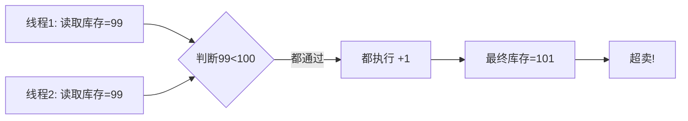

:::tip
这篇文章是我对天机学堂项目的深度复盘，也是对微服务架构知识的一次系统性复习。如果说你正在学习微服务，或者正准备面试相关岗位，这篇文章或许能帮你理清一些模糊的概念。

说实话，这个项目做下来，我对"分布式"三个字有了全新的理解——以前觉得就是多部署几个服务，现在才明白，分布式带来的复杂度是指数级增长的。但别担心，我会把我踩过的坑、总结的经验都分享出来，让你少走弯路。
:::

## 项目背景与技术架构

### 天机学堂是什么

天机学堂是一个面向成年人的职业技能在线教育平台，基于 **Spring Cloud Alibaba 微服务架构** 构建，整合了**电商交易、在线学习、社交互动** 三大高频业务场景。说白了，就是把一个正经互联网公司会遇到的业务模块，都塞进了这个项目里。

我记得刚接触这个项目的时候，看到这么多服务，心里其实是有点发怵的——这么多服务怎么串起来？数据怎么保证一致性？万一某个服务挂了怎么办？这些问题在我脑子里转了好几圈。

后来做下来才发现，这些问题虽然复杂，但都是有套路的。只要把基本功打扎实，再大的系统也能一点点拆解清楚。

这个项目的价值不在于"做了一个在线课程网站"，而在于它用微服务架构把这些看似独立的模块串了起来：用户要买课（电商）、买了课要看视频学习（在线教育）、学完了还能讨论问答发积分（社交互动）。三个场景交织在一起，才真正考验架构能力。

### 企业级开发环境搭建

:::note
在做这个项目之前，我一直觉得写完代码能跑通就行了。直到真正接触企业级开发流程，才发现"能跑通"和"能上线"之间差了十万八千里。这套开发环境虽然搭起来麻烦，但确实是真实生产环境的缩影。
:::

在正式编码之前，项目先搭建了一套完整的企业级开发环境。这不是简单的本地启动，而是模拟真实公司的开发流程：

| 工具          | 角色    | 作用                         |
| ----------- | ----- | -------------------------- |
| **Gogs**    | 代码仓库  | 轻量级 Git 服务，替代 GitLab，资源占用低 |
| **Jenkins** | CI 引擎 | 自动化构建、测试、打包                |
| **Docker**  | 容器化部署 | 保证环境一致性，避免"本地能跑，线上报错"      |
| **YAPI**    | 接口管理  | 前后端接口文档与 Mock 数据           |
| **GrayLog** | 日志收集  | 分布式日志统一查看                  |

:::tip
这里有个小经验分享给大家：很多新手（包括我）喜欢跳过环境搭建这一步，觉得"又不是不能用"。但我后来发现，真正影响开发效率的，恰恰是这些基础设施。好的工具能让你事半功倍，反之则会在某个深夜把你逼疯。
:::

### 接口设计规范（QUERY/DTO/VO/PO）

项目严格遵循分层接口设计规范，每层的数据对象职责清晰。我记得刚学 Java Web 开发的时候，所有的查询参数、返回结果全塞在一个类里，结果代码越写越乱，最后连自己都看不懂了。这套分层规范虽然看起来麻烦，但绝对是长期受益的设计。

| 对象类型      | 全称                   | 使用场景    | 说明              |
| --------- | -------------------- | ------- | --------------- |
| **QUERY** | Query Object         | 查询参数封装  | 接收前端查询条件，如分页、筛选 |
| **DTO**   | Data Transfer Object | 服务间数据传输 | 微服务之间传递的数据结构    |
| **VO**    | View Object          | 返回给前端   | 最终渲染需要的数据格式     |
| **PO**    | Persistent Object    | 数据库映射   | 与数据库表结构一一对应     |

```java
// QUERY：接收前端查询参数
// 说白了，这就是前端给后端递的一张"需求清单"
@Data
public class CourseQueryDTO {
    private String name;           // 课程名称模糊查询
    private Long categoryId;       // 分类筛选
    private LocalDateTime beginTime; // 开始时间
    private LocalDateTime endTime;   // 结束时间
}

// PO：数据库实体
// 这是和数据表一一对应的"档案"，每个字段都对应数据库里的一列
@Data
@TableName("tj_course")
public class Course {
    @TableId(type = IdType.AUTO)
    private Long id;
    private String name;
    private Long categoryId;
    private Integer price;
    private Integer status;
    private Integer deleted;
    private LocalDateTime createTime;
    private LocalDateTime updateTime;
}

// VO：返回给前端的视图对象
// 这是前端真正需要的数据格式，可能从多个PO组装而来
@Data
public class CourseVO {
    private Long id;
    private String name;
    private String categoryName;   // 关联查询后的分类名称
    private String priceFormatted; // 格式化后的价格（如 99.00）
    private Integer learningCount; // 学习人数
}
```

### 整体技术架构（含技术栈表格+比喻）

先上一张全景图镇楼：

<div style="background: linear-gradient(135deg, #f5f7fa 0%, #e4e8ec 100%); border-radius: 16px; padding: 20px; margin: 16px 0; font-family: system-ui, sans-serif;">

<!-- 展现层 -->

<div style="background: linear-gradient(135deg, #667eea 0%, #764ba2 100%); color: white; padding: 16px; border-radius: 10px; text-align: center; margin-bottom: 12px; box-shadow: 0 4px 12px rgba(102, 126, 234, 0.3);">
    <div style="font-size: 16px; font-weight: bold; margin-bottom: 8px;">📱 展现层</div>
    <div style="display: flex; justify-content: center; gap: 8px; flex-wrap: wrap;">
        <div style="background: rgba(255,255,255,0.25); padding: 8px 16px; border-radius: 5px; font-size: 12px;">Vue 3</div>
        <div style="background: rgba(255,255,255,0.25); padding: 8px 16px; border-radius: 5px; font-size: 12px;">Vue-Router</div>
        <div style="background: rgba(255,255,255,0.25); padding: 8px 16px; border-radius: 5px; font-size: 12px;">Pinia</div>
        <div style="background: rgba(255,255,255,0.25); padding: 8px 16px; border-radius: 5px; font-size: 12px;">Axios</div>
        <div style="background: rgba(255,255,255,0.25); padding: 8px 16px; border-radius: 5px; font-size: 12px;">Element-UI</div>
    </div>
</div>

<!-- 接入层 -->

<div style="background: linear-gradient(135deg, #f093fb 0%, #f5576c 100%); color: white; padding: 16px; border-radius: 10px; text-align: center; margin-bottom: 12px; box-shadow: 0 4px 12px rgba(240, 147, 251, 0.3);">
    <div style="font-size: 16px; font-weight: bold; margin-bottom: 8px;">🚪 接入层</div>
    <div style="display: flex; justify-content: center; gap: 8px; flex-wrap: wrap;">
        <div style="background: rgba(255,255,255,0.25); padding: 8px 16px; border-radius: 5px; font-size: 12px;">Nginx</div>
        <div style="background: rgba(255,255,255,0.25); padding: 8px 16px; border-radius: 5px; font-size: 12px;">CDN</div>
        <div style="background: rgba(255,255,255,0.25); padding: 8px 16px; border-radius: 5px; font-size: 12px;">Spring Cloud Gateway</div>
        <div style="background: rgba(255,255,255,0.25); padding: 8px 16px; border-radius: 5px; font-size: 12px;">身份认证</div>
        <div style="background: rgba(255,255,255,0.25); padding: 8px 16px; border-radius: 5px; font-size: 12px;">负载均衡</div>
    </div>
</div>

<!-- 服务层：微服务 + 分布式组件 -->

<div style="display: grid; grid-template-columns: 3fr 2fr; gap: 12px; margin-bottom: 12px;">
    <div style="background: linear-gradient(135deg, #4facfe 0%, #00f2fe 100%); color: white; padding: 16px; border-radius: 10px; text-align: center; box-shadow: 0 4px 12px rgba(79, 172, 254, 0.3);">
        <div style="font-size: 16px; font-weight: bold; margin-bottom: 8px;">⚙️ 微服务</div>
        <div style="display: flex; justify-content: center; gap: 6px; flex-wrap: wrap; margin-bottom: 8px;">
            <div style="background: rgba(255,255,255,0.25); padding: 6px 12px; border-radius: 4px; font-size: 11px;">用户服务</div>
            <div style="background: rgba(255,255,255,0.25); padding: 6px 12px; border-radius: 4px; font-size: 11px;">课程服务</div>
            <div style="background: rgba(255,255,255,0.25); padding: 6px 12px; border-radius: 4px; font-size: 11px;">交易服务</div>
            <div style="background: rgba(255,255,255,0.25); padding: 6px 12px; border-radius: 4px; font-size: 11px;">学习服务</div>
            <div style="background: rgba(255,255,255,0.25); padding: 6px 12px; border-radius: 4px; font-size: 11px;">搜索服务</div>
            <div style="background: rgba(255,255,255,0.25); padding: 6px 12px; border-radius: 4px; font-size: 11px;">优惠券服务</div>
        </div>
        <div style="display: flex; justify-content: center; gap: 6px; flex-wrap: wrap;">
            <div style="background: rgba(255,255,255,0.15); padding: 5px 10px; border-radius: 4px; font-size: 10px;">OpenFeign</div>
            <div style="background: rgba(255,255,255,0.15); padding: 5px 10px; border-radius: 4px; font-size: 10px;">Dubbo</div>
            <div style="background: rgba(255,255,255,0.15); padding: 5px 10px; border-radius: 4px; font-size: 10px;">LoadBalancer</div>
            <div style="background: rgba(255,255,255,0.15); padding: 5px 10px; border-radius: 4px; font-size: 10px;">Sentinel</div>
        </div>
    </div>
    <div style="background: linear-gradient(135deg, #fa709a 0%, #fee140 100%); color: #333; padding: 16px; border-radius: 10px; text-align: center; box-shadow: 0 4px 12px rgba(250, 112, 154, 0.3);">
        <div style="font-size: 16px; font-weight: bold; margin-bottom: 8px;">🔧 分布式组件</div>
        <div style="display: grid; grid-template-columns: 1fr 1fr; gap: 6px;">
            <div style="background: rgba(255,255,255,0.5); padding: 8px; border-radius: 5px; font-size: 11px; font-weight: 600;">Nacos</div>
            <div style="background: rgba(255,255,255,0.5); padding: 8px; border-radius: 5px; font-size: 11px; font-weight: 600;">Seata</div>
            <div style="background: rgba(255,255,255,0.5); padding: 8px; border-radius: 5px; font-size: 11px; font-weight: 600;">XXL-JOB</div>
            <div style="background: rgba(255,255,255,0.5); padding: 8px; border-radius: 5px; font-size: 11px; font-weight: 600;">Redisson</div>
            <div style="background: rgba(255,255,255,0.5); padding: 8px; border-radius: 5px; font-size: 11px; font-weight: 600;">RabbitMQ</div>
            <div style="background: rgba(255,255,255,0.5); padding: 8px; border-radius: 5px; font-size: 11px; font-weight: 600;">Gateway</div>
        </div>
    </div>
</div>

<!-- 数据层 -->

<div style="background: linear-gradient(135deg, #30cfd0 0%, #330867 100%); color: white; padding: 16px; border-radius: 10px; text-align: center; margin-bottom: 12px; box-shadow: 0 4px 12px rgba(48, 207, 208, 0.3);">
    <div style="font-size: 16px; font-weight: bold; margin-bottom: 8px;">💾 数据层</div>
    <div style="display: flex; justify-content: center; gap: 8px; flex-wrap: wrap;">
        <div style="background: rgba(255,255,255,0.25); padding: 8px 16px; border-radius: 5px; font-size: 12px;">MySQL</div>
        <div style="background: rgba(255,255,255,0.25); padding: 8px 16px; border-radius: 5px; font-size: 12px;">Redis</div>
        <div style="background: rgba(255,255,255,0.25); padding: 8px 16px; border-radius: 5px; font-size: 12px;">Elasticsearch</div>
        <div style="background: rgba(255,255,255,0.25); padding: 8px 16px; border-radius: 5px; font-size: 12px;">MongoDB</div>
    </div>
</div>

<!-- DevOps + 第三方 -->

<div style="display: grid; grid-template-columns: 2fr 1fr; gap: 12px;">
    <div style="background: linear-gradient(135deg, #a8edea 0%, #fed6e3 100%); color: #333; padding: 16px; border-radius: 10px; text-align: center; box-shadow: 0 4px 12px rgba(168, 237, 234, 0.3);">
        <div style="font-size: 16px; font-weight: bold; margin-bottom: 8px;">🚀 DevOps</div>
        <div style="display: flex; justify-content: center; gap: 6px; flex-wrap: wrap;">
            <div style="background: rgba(255,255,255,0.6); padding: 6px 12px; border-radius: 4px; font-size: 11px; font-weight: 600;">Gogs</div>
            <div style="background: rgba(255,255,255,0.6); padding: 6px 12px; border-radius: 4px; font-size: 11px; font-weight: 600;">Jenkins</div>
            <div style="background: rgba(255,255,255,0.6); padding: 6px 12px; border-radius: 4px; font-size: 11px; font-weight: 600;">Docker</div>
            <div style="background: rgba(255,255,255,0.6); padding: 6px 12px; border-radius: 4px; font-size: 11px; font-weight: 600;">YAPI</div>
            <div style="background: rgba(255,255,255,0.6); padding: 6px 12px; border-radius: 4px; font-size: 11px; font-weight: 600;">GrayLog</div>
        </div>
    </div>
    <div style="background: linear-gradient(135deg, #ffecd2 0%, #fcb69f 100%); color: #333; padding: 16px; border-radius: 10px; text-align: center; box-shadow: 0 4px 12px rgba(255, 236, 210, 0.3);">
        <div style="font-size: 16px; font-weight: bold; margin-bottom: 8px;">☁️ 第三方</div>
        <div style="display: flex; justify-content: center; gap: 6px; flex-wrap: wrap;">
            <div style="background: rgba(255,255,255,0.6); padding: 6px 12px; border-radius: 4px; font-size: 11px; font-weight: 600;">阿里云</div>
            <div style="background: rgba(255,255,255,0.6); padding: 6px 12px; border-radius: 4px; font-size: 11px; font-weight: 600;">腾讯云</div>
        </div>
    </div>
</div>

</div>

**📍 调用链路**：`用户 → Vue SPA → Nginx → Gateway → 各微服务`

**🔗 服务依赖**：

- 服务层 ⟷ Nacos（注册发现）
- 服务层 ⟷ Redis（缓存）
- 服务层 ⟷ RabbitMQ（消息）
- 课程/交易/学习/优惠券服务 ⟷ MySQL
- 搜索服务 ⟷ Elasticsearch

| 层级         | 技术选型                   | 通俗比喻    | 核心作用          |
| ---------- | ---------------------- | ------- | ------------- |
| **前端框架**   | Vue 3 + TypeScript     | 店面装修    | 用户界面交互        |
| **反向代理**   | Nginx                  | 前台接待    | 负载均衡、静态资源、SSL |
| **服务治理**   | Nacos 3.0              | 物业管理处   | 服务注册发现、配置中心   |
| **流量网关**   | Spring Cloud Gateway   | 小区门神    | 请求路由、认证鉴权、限流  |
| **服务通信**   | OpenFeign / Dubbo      | 内部对讲机   | 微服务间的高效通信     |
| **缓存中间件**  | Redis + Redisson       | 快递柜     | 高性能缓存、分布式锁    |
| **消息队列**   | RabbitMQ               | 异步快递    | 削峰填谷、服务解耦     |
| **熔断限流**   | Sentinel 2.0           | 景区闸机    | 流量控制、系统保护     |
| **事务管理**   | Seata 2.0              | 事务管家    | 分布式事务一致性      |
| **搜索引擎**   | Elasticsearch          | 图书馆检索系统 | 全文检索、高亮显示     |
| **关系数据库**  | MySQL                  | 档案室     | 结构化数据持久化      |
| **文档数据库**  | MongoDB                | 资料袋     | 非结构化数据存储      |
| **本地缓存**   | Caffeine               | 桌面便签    | JVM 内高速缓存     |
| **ORM 框架** | MyBatis-Plus           | 翻译官     | 简化数据库操作       |
| **代码生成**   | MyBatis-Plus Generator | 复印机     | 自动生成 CRUD 代码  |
| **任务调度**   | XXL-JOB                | 闹钟      | 分布式定时任务       |
| **版本控制**   | Gogs                   | 档案柜     | 轻量级 Git 仓库    |
| **CI/CD**  | Jenkins                | 流水线工人   | 自动化构建部署       |
| **容器化**    | Docker                 | 集装箱     | 应用打包与环境隔离     |

:::note
2026 年最新的 Spring Cloud Alibaba 2025.1.0.0 已经全面支持 **Spring Boot 4.0.0 + Java 21+**，引入了虚拟线程（Project Loom）和 io\_uring 高性能 I/O，性能相比之前的版本有质的飞跃。
:::

## 业务模块一：课表与学习记录

### 课表管理

课表管理是天机学堂最基础的功能之一。用户购买课程后，系统会自动为其创建课表，记录课程的学习进度和状态。

我记得刚做这个模块的时候，觉得特别简单——，不就是建个表、查个数据嘛。但做到后面才发现，课表是整个学习系统的"枢纽"，用户的所有学习行为都围绕课表展开。课程服务要查课表、学习服务要更新进度、交易服务要校验用户是否有权学习……一个课表牵扯到五六个服务。

**核心表结构**：

```sql
-- 课表主表
-- 这里有个设计细节：user_id 和 course_id 的联合唯一索引
-- 保证了每个用户对每个课程只有一条课表记录
CREATE TABLE tj_learning_lesson (
    id BIGINT PRIMARY KEY AUTO_INCREMENT,
    user_id BIGINT NOT NULL COMMENT '用户ID',
    course_id BIGINT NOT NULL COMMENT '课程ID',
    status TINYINT DEFAULT 0 COMMENT '状态：0-未学习，1-学习中，2-已学完',
    plan_status TINYINT DEFAULT 0 COMMENT '计划状态：0-无计划，1-有计划',
    learned_sections INT DEFAULT 0 COMMENT '已学小节数',
    latest_section_id BIGINT COMMENT '最近学习小节ID',
    latest_moment INT DEFAULT 0 COMMENT '最近学习时长（秒）',
    create_time DATETIME DEFAULT CURRENT_TIMESTAMP,
    expire_time DATETIME COMMENT '课程有效期',
    INDEX idx_user_id (user_id),
    INDEX idx_course_id (course_id),
    UNIQUE KEY uk_user_course (user_id, course_id)
) ENGINE=InnoDB COMMENT='课表';
```

**课表查询逻辑**：

```java
@Service
public class LearningLessonService {

    @Autowired
    private LearningLessonMapper lessonMapper;

    /**
     * 查询用户课表列表
     * 支持按状态筛选：未学习/学习中/已学完
     *
     * 这里有个优化点：批量查询课程信息，避免N+1问题
     * 如果对每个课表都单独查一次课程，那100条课表就要查101次数据库
     */
    public List<LearningLessonVO> queryMyLessons(Integer status) {
        Long userId = UserContext.getUser();
        
        LambdaQueryWrapper<LearningLesson> wrapper = new LambdaQueryWrapper<>();
        wrapper.eq(LearningLesson::getUserId, userId)
               .eq(status != null, LearningLesson::getStatus, status)
               .orderByDesc(LearningLesson::getCreateTime);
        
        List<LearningLesson> lessons = lessonMapper.selectList(wrapper);
        
        // 批量查询课程信息（避免N+1问题）
        // 先把所有的courseId收集起来，一次性查出来
        List<Long> courseIds = lessons.stream()
            .map(LearningLesson::getCourseId)
            .collect(Collectors.toList());
        // selectBatchIds 是 MyBatis-Plus 提供的批量查询方法
        Map<Long, Course> courseMap = courseMapper.selectBatchIds(courseIds)
            .stream()
            .collect(Collectors.toMap(Course::getId, c -> c));
        
        // 组装VO
        return lessons.stream().map(lesson -> {
            LearningLessonVO vo = new LearningLessonVO();
            BeanUtils.copyProperties(lesson, vo);
            Course course = courseMap.get(lesson.getCourseId());
            if (course != null) {
                vo.setCourseName(course.getName());
                vo.setCourseCover(course.getCoverUrl());
                vo.setTotalSections(course.getSectionCount());
            }
            return vo;
        }).collect(Collectors.toList());
    }
}
```

:::caution
**血的教训**：N+1 查询问题在单体项目里不明显，因为数据库和代码在同一台机器上。但在微服务架构里，一个 N+1 可能导致跨服务调用 N 次，网络开销会成倍增长。
:::

### 学习记录与计划

学习记录追踪用户每个小节的学习进度，包括观看时长、是否完成等。这个模块的设计相对简单，但有一个细节值得注意——学习记录是"高频写、低频读"的场景，所以考虑用 Redis 做缓冲。

```java
@Data
@TableName("tj_learning_record")
public class LearningRecord {
    @TableId(type = IdType.AUTO)
    private Long id;
    private Long lessonId;      // 课表ID
    private Long sectionId;     // 小节ID
    private Integer moment;     // 观看到第几秒
    private Boolean finished;   // 是否已完成
    private LocalDateTime createTime;
    private LocalDateTime updateTime;
}
```

### 模块一反思

回过头来看课表和学习记录这两个模块，我总结了几点经验：

1. **表结构设计要考虑未来扩展**：比如 status 字段用 TINYINT 而不是 ENUM，是为了以后加新状态留有余地
2. **唯一索引要设计好**：uk\_user\_course 这个索引既是查询索引，也是防重复的约束
3. **批量操作优于循环单条**：这个教训几乎贯穿了整个项目

## 业务模块二：播放进度的高并发优化

### 性能瓶颈分析

视频播放进度上报是一个典型的高并发写场景。用户每观看几秒就会上报一次进度，如果直接写数据库，很快就会把数据库打挂。

我记得第一次跑压力测试的时候，看到数据库连接池被打满、响应时间从几毫秒飙升到几秒，整个人都懵了。后来才知道，这就是典型的"短木板效应"——木桶能装多少水，取决于最短的那块木板，而数据库就是那块最短的木板。

**问题分析**：

| 指标     | 估算值        | 说明               |
| ------ | ---------- | ---------------- |
| 日活用户   | 10 万       | 同时在线约 1 万人       |
| 每人上报频率 | 每 30 秒 1 次 | 观看过程中持续上报        |
| 峰值 QPS | 300+       | 1 万 / 30 秒 ≈ 333 |
| 数据库压力  | 极高         | 频繁 UPDATE 同一行数据  |

:::important
核心矛盾在于：用户期望实时看到自己的学习进度（需要写），但数据库扛不住这么高的写压力。解决方案就是"读写分离"——写 Redis，异步落库。
:::

### 缓存 + 延迟任务方案（四种方案对比）

项目最终采用了 **Redis 缓存 + DelayQueue 延迟任务** 的方案，但选型过程中对比了四种实现。

| 方案                | 核心原理                 | 优点         | 缺点       | 适用场景      |
| ----------------- | -------------------- | ---------- | -------- | --------- |
| **DelayQueue**    | JDK 内存队列，按到期时间排序     | 无外部依赖、秒级精度 | 单机、重启丢任务 | 单机轻量延迟任务  |
| **Redisson 延迟队列** | Redis ZSet 模拟，轮询到期任务 | 分布式、持久化    | 依赖 Redis | 分布式延迟任务   |
| **MQ 延迟消息**       | RabbitMQ 死信队列+TTL    | 高可用、大规模任务  | 配置复杂     | 订单超时、支付回调 |
| **时间轮**           | 环形数组+链表模拟时钟          | 性能极高       | 实现复杂、单机  | 心跳检测、会话超时 |

:::note
为什么最终选 DelayQueue？因为教学项目嘛，够用就行。而且 DelayQueue 的代码最直观、最容易理解。如果你是做真正的生产项目，我建议直接用 Redisson 延迟队列，省心省力。
:::

**DelayQueue 实现（天机学堂选用）**：

```java
/**
 * 延迟任务封装类
 * 实现 Delayed 接口，让任务可以按到期时间排序
 * 类似于快递柜的"定时取出"功能——你放进去的时候设定2小时后取出
 */
@Data
public class DelayTask<D> implements Delayed {
    private D data;                    // 任务携带的数据
    private long deadlineNanos;        // 到期时间（纳秒级别）

    public DelayTask(D data, Duration delayTime) {
        this.data = data;
        // 计算到期时间点 = 当前时间 + 延迟时间
        this.deadlineNanos = System.nanoTime() + delayTime.toNanos();
    }

    /**
     * 获取剩余延迟时间
     * DelayQueue 内部会调用这个方法来判断哪些任务到期了
     */
    @Override
    public long getDelay(TimeUnit unit) {
        // 剩余时间 = 到期时间 - 当前时间，最小为 0
        return unit.convert(
            Math.max(0, deadlineNanos - System.nanoTime()),
            TimeUnit.NANOSECONDS
        );
    }

    /**
     * 比较两个任务的优先级
     * DelayQueue 需要按到期时间排序，越早到期的排越前面
     */
    @Override
    public int compareTo(Delayed o) {
        long diff = getDelay(TimeUnit.NANOSECONDS) - o.getDelay(TimeUnit.NANOSECONDS);
        return Long.compare(diff, 0);
    }
}

@Service
public class ProgressCheckService {
    // 延迟队列：任务按到期时间自动排序，到期的任务排在最前面
    private final DelayQueue<DelayTask<ProgressCheckData>> delayQueue = new DelayQueue<>();

    @PostConstruct
    public void startExecutor() {
        // 启动一个后台线程，持续从队列中取到期的任务执行
        // 这里用线程而不是线程池，是因为 DelayQueue 的 take() 是阻塞的
        new Thread(() -> {
            while (true) {
                try {
                    // take() 会阻塞，直到有任务到期
                    DelayTask<ProgressCheckData> task = delayQueue.take();
                    checkAndSync(task.getData());
                } catch (InterruptedException e) {
                    Thread.currentThread().interrupt();
                    break;
                }
            }
        }, "progress-check-thread").start();
    }

    /**
     * 提交进度时添加延迟校验任务
     * 1. 先写入 Redis，保证用户能立即看到自己的进度
     * 2. 再添加一个 20 秒后的延迟任务，负责把进度同步到数据库
     */
    public void submitProgress(Long lessonId, Long sectionId, Integer moment) {
        // 1. 写 Redis 缓存——这一步是同步的，用户能立即看到更新
        redisTemplate.opsForHash().put(
            "lesson:" + lessonId,
            "section:" + sectionId,
            moment
        );

        // 2. 添加 20 秒后的延迟校验任务
        // 为什么要延迟？因为用户可能频繁操作，延迟可以合并多次更新
        // 例如：用户1秒内操作了3次，我们只需要最后一次同步到DB
        ProgressCheckData data = new ProgressCheckData(lessonId, sectionId, moment);
        delayQueue.add(new DelayTask<>(data, Duration.ofSeconds(20)));
    }

    /**
     * 校验并同步到数据库
     * 比较 Redis 和 DB 的数据，只有不一致时才更新
     */
    private void checkAndSync(ProgressCheckData data) {
        Integer redisMoment = (Integer) redisTemplate.opsForHash()
            .get("lesson:" + data.getLessonId(), "section:" + data.getSectionId());
        Integer dbMoment = learningRecordMapper.selectMoment(data.getLessonId(), data.getSectionId());

        // 如果 Redis 数据和 DB 不一致，以 Redis 为准（用户最新操作）
        if (redisMoment != null && !redisMoment.equals(dbMoment)) {
            learningRecordMapper.updateMoment(data.getLessonId(), data.getSectionId(), redisMoment);
        }
    }
}
```

:::caution
**生产环境警告**：DelayQueue 是单机内存队列，服务重启会丢失未执行的任务。这意味着如果用户在重启前提交了进度但任务还没执行，那这次进度就丢了。生产环境建议升级为 **Redisson 延迟队列**（依赖 Redis，支持分布式+持久化）。
:::

### 模块二反思

做这个模块的时候，我最大的收获是理解了"缓存不是银弹"这句话。缓存用得好能扛住高并发，用不好反而会丢失数据。

我的经验是：**写入缓存的数据，一定要设计好持久化策略**。是同步写还是异步写？丢了怎么办？这些问题在做设计的时候就要想清楚，而不是等到出问题再补救。

## 业务模块三：问答系统

### 问题管理

问答系统是天机学堂的社交互动模块之一，用户可以在课程下方提问，其他用户或老师可以回答。

说实话，做这个模块的时候我纠结了很久——问答的数据用什么存？MySQL 还是 MongoDB？最后选了 MongoDB，但这个选择过程让我对"技术选型"这件事有了更深的理解。

**技术选型：MongoDB**

问答内容属于非结构化数据，且字段不固定（有的问题有图片，有的没有），适合用 MongoDB 存储。但更深层的原因是：**问答是一个"写多读少"的场景**，用户提问后可能很久才有人回答，这种场景 MongoDB 的写入性能更合适。

```java
/**
 * 问题文档（MongoDB 的 Document）
 * @Document 注解指定了 collection 名称
 * 相比 MySQL，MongoDB 不需要提前定义表结构，字段可以随时增减
 */
@Data
@Document(collection = "tj_question")
public class Question {
    @Id
    private String id;              // MongoDB 的 ID 是字符串类型
    private Long userId;           // 提问者
    private Long courseId;         // 所属课程
    private Long sectionId;        // 所属小节（可选，字段可以不填）
    private String title;          // 问题标题
    private String content;        // 问题内容
    private List<String> images;   // 图片URL列表——这个字段可有可无
    private Integer answerCount;   // 回答数
    private Integer viewCount;     // 浏览数
    private LocalDateTime createTime;
    private LocalDateTime updateTime;
}
```

**问题发布流程**：

```java
@Service
public class QuestionService {

    @Autowired
    private MongoTemplate mongoTemplate;

    /**
     * 发布问题
     * 1. 保存问题到 MongoDB——写入性能高，适合这种"写多读少"的场景
     * 2. 发送 MQ 通知搜索服务构建索引——异步处理，不影响主流程
     */
    public void publishQuestion(QuestionDTO dto) {
        Question question = new Question();
        BeanUtils.copyProperties(dto, question);
        question.setUserId(UserContext.getUser());
        question.setAnswerCount(0);
        question.setViewCount(0);
        question.setCreateTime(LocalDateTime.now());
        
        // MongoDB 的 save 方法：如果 ID 相同则更新，不同则插入
        mongoTemplate.save(question);
        
        // 异步通知搜索服务
        // 为什么要发 MQ 而不是直接调？因为搜索服务可能压力大或者暂时不可用
        // MQ 保证了消息的可靠投递
        rabbitTemplate.convertAndSend("search.exchange", "question.index",
            new QuestionIndexEvent(question.getId(), question.getTitle(), question.getContent()));
    }

    /**
     * 分页查询课程问题列表
     * MongoDB 的分页比 MySQL 更灵活，支持跳过任意条记录
     */
    public PageResult<QuestionVO> queryQuestionPage(Long courseId, Integer pageNo, Integer pageSize) {
        Query query = new Query();
        // 添加查询条件：courseId 等于指定值
        query.addCriteria(Criteria.where("courseId").is(courseId));
        // 按创建时间倒序
        query.with(Sort.by(Sort.Direction.DESC, "createTime"));
        // 分页：跳过 (pageNo-1)*pageSize 条，取 pageSize 条
        query.skip((long) (pageNo - 1) * pageSize).limit(pageSize);
        
        List<Question> questions = mongoTemplate.find(query, Question.class);
        // count 查询单独执行，不占用分页的资源
        long total = mongoTemplate.count(Query.query(Criteria.where("courseId").is(courseId)), Question.class);
        
        List<QuestionVO> voList = questions.stream().map(this::convertToVO).collect(Collectors.toList());
        return new PageResult<>(total, pageNo, pageSize, voList);
    }
}
```

### 回答与评论

回答和评论同样存储在 MongoDB 中，采用嵌套文档结构。这样设计的好处是查询回答时可以直接拿到评论，不需要再关联查询。

```java
/**
 * 回答文档
 * 注意 comments 字段是嵌套的 List<Comment>
 * 这种设计适合"回答+评论"这种强关联的数据
 */
@Data
@Document(collection = "tj_answer")
public class Answer {
    @Id
    private String id;
    private String questionId;     // 关联的问题ID
    private Long userId;           // 回答者
    private String content;        // 回答内容
    private Integer likeCount;     // 点赞数
    private Boolean isAccepted;    // 是否被采纳
    private List<Comment> comments; // 嵌套评论——评论不会单独查询，所以嵌套存储
    private LocalDateTime createTime;
}

/**
 * 评论（嵌套在 Answer 里，不单独建表）
 */
@Data
public class Comment {
    private Long userId;
    private String content;
    private LocalDateTime createTime;
}
```

### 模块三反思

MongoDB 让我学到了"数据结构要匹配访问模式"。问答的数据天然适合嵌套存储，因为大部分时候查回答都会带上评论。如果用 MySQL，需要两张表 + 一次 JOIN；而 MongoDB 一个文档就搞定了。

但 MongoDB 也不是万能的——它没有事务支持，不适合强一致性要求的场景。

## 业务模块四：点赞系统

### 基础点赞功能（GICS 原则）

点赞系统是天机学堂中复用性最高的模块之一。课程、评论、问答都需要点赞功能，要求**通用（一套代码适配所有业务）、独立（不依赖其他服务）、高并发、防重复**。

说实话，这个模块是我做得最纠结的一个。表面上看起来就是"点一下 +1"，但真正做起来才发现处处是坑：并发怎么控制？点赞数怎么高效查询？服务之间怎么解耦？

**GICS 四原则**：

| 原则         | 含义         | 实现方式                               |
| ---------- | ---------- | ---------------------------------- |
| **G - 通用** | 一套逻辑适配所有业务 | 通用点赞记录表，`bizType` 区分业务             |
| **I - 独立** | 不依赖其他服务    | MQ 异步通知，点赞服务不直接调用业务服务              |
| **C - 并发** | 应对高并发点赞    | Caffeine 本地缓存 + Redis 分布式缓存        |
| **S - 安全** | 防重复点赞      | 数据库唯一索引 `(userId, bizId, bizType)` |

**多级缓存架构**：

```
用户查询点赞数
    ↓
Caffeine 本地缓存（纳秒级）
    ↓ 未命中
Redis 分布式缓存（毫秒级）
    ↓ 未命中
MySQL 数据库
    ↓
回填 Redis + Caffeine
```

:::tip
这里的多级缓存设计很有意思：Caffeine 命中直接返回（最快），没命中就查 Redis（快），Redis 也没命中才查数据库（慢）。类比一下就像是：桌上放着今天的报纸（本地缓存）、书房里有整个档案室（Redis）、档案室没有就只能去外面调阅（数据库）了。
:::

**核心代码**：

```java
@Service
public class LikeService {

    @Autowired
    private LikedRecordMapper likedRecordMapper;
    @Autowired
    private RabbitTemplate rabbitTemplate;

    // Caffeine 本地缓存：热门数据直接读内存，零网络开销
    // 就像你桌上的便签纸，常用的东西不用每次都去档案室找
    private final Cache<String, Integer> localCache = Caffeine.newBuilder()
        .maximumSize(10000)                    // 最多缓存 10000 条
        .expireAfterWrite(Duration.ofMinutes(5)) // 写入 5 分钟后过期
        .build();

    /**
     * 点赞/取消点赞
     * 
     * 这里有个设计亮点：用 MQ 异步通知业务服务更新点赞数
     * 为什么要异步？因为点赞是高频操作，如果每次点赞都同步调业务服务，
     * 不仅会增加业务服务的压力，还可能引发跨服务的循环依赖
     */
    @Transactional
    public void likeOrCancel(Long bizId, String bizType, boolean isLike) {
        Long userId = UserContext.getUser();

        // 1. 查询是否已点赞
        // 数据库唯一索引 (userId, bizId, bizType) 保证了不会重复点赞
        // 但这里还是要先查一下，因为取消点赞需要有记录才能取消
        LikedRecord record = likedRecordMapper.selectOne(
            new LambdaQueryWrapper<LikedRecord>()
                .eq(LikedRecord::getUserId, userId)
                .eq(LikedRecord::getBizId, bizId)
                .eq(LikedRecord::getBizType, bizType)
        );

        if (isLike) {
            // 点赞操作
            if (record != null) throw new BizIllegalException("已点赞，请勿重复操作");
            // 插入点赞记录
            LikedRecord newRecord = new LikedRecord();
            newRecord.setUserId(userId);
            newRecord.setBizId(bizId);
            newRecord.setBizType(bizType);
            likedRecordMapper.insert(newRecord);
        } else {
            // 取消点赞操作
            if (record == null) throw new BizIllegalException("未点赞，无法取消");
            likedRecordMapper.deleteById(record.getId());
        }

        // 2. 发送 MQ 消息，异步通知业务服务更新点赞数
        // 注意：这里没有直接调业务服务的接口，而是发消息
        // 这样点赞服务和业务服务就完全解耦了
        rabbitTemplate.convertAndSend("like.exchange", "like.changed",
            new LikeChangeEvent(bizId, bizType, isLike ? 1 : -1));

        // 3. 失效缓存
        // 点赞数变了，缓存当然要清掉
        String cacheKey = String.format("like:count:%s:%d", bizType, bizId);
        localCache.invalidate(cacheKey);  // 清除本地缓存
        redisTemplate.delete(cacheKey);   // 清除分布式缓存
    }
}
```

### 高并发改造（Redis 数据结构）

:::tip
**Caffeine vs Redis**：Caffeine 是 JVM 内缓存（纳秒级），Redis 是分布式缓存（毫秒级）。两者组合成多级缓存，热点请求直接命中本地缓存，性能提升上千倍。
:::

### 模块四反思

做点赞系统让我深刻理解了什么叫"解耦"。一开始我想的是点赞服务直接调课程服务去更新点赞数，结果发现不对——课程服务也需要调点赞服务查点赞数，这两个服务互相调用，直接死锁了。

后来改成 MQ 异步通知，完美解决了这个问题。经验就是：**微服务之间，尽量不要同步互相调用，用 MQ 解耦才是正道**。

## 业务模块五：积分系统

### 签到功能（BitMap）

用户通过每日签到获取积分，这是积分系统的入口功能。

说实话，刚看到这个需求的时候我完全不知道怎么下手——100 万用户，每天签到一条记录，一个月就是 3000 万条数据，这数据库怎么扛得住？

后来老师讲解才知道有个叫 BitMap 的东西，简直是神器。

**为什么不用数据库？**

假设有 100 万用户，每人每天签到一条记录，一个月就是 3000 万条数据。用 BitMap 只需 **100万 × 31bit ≈ 3.9MB**，空间节省上千倍。

| 方案           | 存储空间                 | 查询效率     | 实现复杂度 |
| ------------ | -------------------- | -------- | ----- |
| 传统方案（每行一条记录） | 3000万 × 50字节 ≈ 1.5GB | 需要索引     | 低     |
| BitMap       | 100万 × 31bit ≈ 3.9MB | 位运算 O(1) | 中     |

**核心代码**：

```java
@Service
public class SignService {

    @Autowired
    private StringRedisTemplate redisTemplate;

    /**
     * 每日签到
     * 使用 Redis SETBIT 原子操作，同时完成签到和防重复校验
     * 
     * SETBIT 的工作原理：
     * - key = "sign:record:用户ID:年月"  例如 "sign:record:123:202605"
     * - offset = 日期-1（因为 bit 位从 0 开始）
     * - value = true 表示签到
     * - 返回修改前的值：true = 之前已经签到，false = 之前未签到
     */
    public void sign() {
        Long userId = UserContext.getUser();
        LocalDate now = LocalDate.now();

        // Key 格式: sign:record:{userId}:{yyyyMM}
        // 每月一个 key，方便清理过期数据
        String key = String.format("sign:record:%d:%s",
            userId, now.format(DateTimeFormatter.ofPattern("yyyyMM")));

        // offset = 日期-1（bit 位从 0 开始，1月1日就是第0位）
        int offset = now.getDayOfMonth() - 1;

        // SETBIT 返回修改前的值：true=已签到，false=未签到
        // 利用这个特性，我们既能签到又能判断是否重复
        Boolean exists = redisTemplate.opsForValue().setBit(key, offset, true);

        if (BooleanUtils.isTrue(exists)) {
            throw new BizIllegalException("今日已签到，请勿重复操作");
        }
    }

    /**
     * 统计连续签到天数
     * 使用 BITFIELD 一次性读取本月数据，位运算统计连续 1
     * 
     * 连续签到的计算方法：
     * 把 bit 位从后往前看，从本月1号开始数，有多少个连续的 1
     */
    public int countConsecutiveDays() {
        Long userId = UserContext.getUser();
        LocalDate now = LocalDate.now();
        String key = String.format("sign:record:%d:%s",
            userId, now.format(DateTimeFormatter.ofPattern("yyyyMM")));

        int dayOfMonth = now.getDayOfMonth();

        // BITFIELD 读取从 0 开始的 dayOfMonth 个 bit 位
        // 返回的是一个数字，bit 0-31 分别是本月 1-31 号的签到状态
        List<Long> result = redisTemplate.opsForValue()
            .bitField(key, BitFieldSubCommands.create()
                .get(BitFieldSubCommands.BitFieldType.unsigned(dayOfMonth)).valueAt(0));

        if (CollUtils.isEmpty(result)) return 0;

        int num = result.get(0).intValue();
        int count = 0;

        // 从后往前遍历 bit 位，统计连续的 1
        // 技巧：用 num & 1 判断最低位是否为 1
        //       用 num >>>= 1 无符号右移，把下一位移到最低位
        while ((num & 1) == 1) {
            count++;
            num >>>= 1;  // 无符号右移，确保负数不会导致死循环
        }
        return count;
    }
}
```

:::note
SETBIT 和 BITFIELD 的返回值含义很容易搞混，我总结了一个小技巧：SETBIT 返回的是"修改前的值"，而 BITFIELD 返回的是"读取到的值"。记住这个就不容易搞错了。
:::

**技术要点**：

- `SETBIT` 是原子操作，无需额外加锁，天然防并发重复签到
- `BITFIELD` 一次读取所有 bit 位，避免多次网络请求
- 无符号右移 `>>>` 确保负数不会导致死循环

### 积分明细

积分明细记录用户的每一笔积分变动，需要保证数据一致性。这个模块的设计比较中规中矩，但有一个细节值得注意——乐观锁。

```java
@Service
public class PointsService {

    @Autowired
    private UserPointsMapper userPointsMapper;
    @Autowired
    private PointsRecordMapper recordMapper;

    /**
     * 增加积分（带明细记录）
     * 
     * 使用数据库乐观锁防止并发超加
     * 乐观锁的原理：更新时带上版本号，如果版本号不匹配则更新失败
     * 
     * 类比：就像文件编辑时的"冲突检测"，如果别人在你之前改过了，你就得重新改
     */
    @Transactional
    public void addPoints(Long userId, int points, PointsType type) {
        // 1. 更新用户总积分（乐观锁）
        // updateUserPoints 应该是这样的 SQL：
        // UPDATE user_points SET points = points + #{points}, version = version + 1 
        // WHERE user_id = #{userId} AND version = #{version}
        int rows = userPointsMapper.incrPoints(userId, points);
        if (rows == 0) {
            // 如果更新失败（version 不匹配），尝试插入新记录
            // 只有从未获得过积分的用户才会走到这里
            UserPoints userPoints = new UserPoints();
            userPoints.setUserId(userId);
            userPoints.setPoints(points);
            userPointsMapper.insert(userPoints);
        }

        // 2. 记录积分明细（每一笔都要可追溯）
        PointsRecord record = new PointsRecord();
        record.setUserId(userId);
        record.setPoints(points);
        record.setType(type.getCode());
        record.setCreateTime(LocalDateTime.now());
        recordMapper.insert(record);
    }
}
```

### 实时排行榜（ZSet）

排行榜是积分系统的高频查询场景，每秒可能有上万次查询。如果每次都查数据库，数据库肯定扛不住。解决方案是用 Redis ZSet 做缓存。

**为什么用 ZSet 而不是数据库？**

| 操作        | 数据库方案           | Redis ZSet               |
| --------- | --------------- | ------------------------ |
| 查询用户排名    | 子查询+COUNT，O(n)  | `ZREVRANK`，O(log n)      |
| 获取 Top100 | 全表排序，O(n log n) | `ZREVRANGE`，O(log n + m) |
| 积分更新      | 行锁竞争            | `ZINCRBY` 原子操作，无锁        |

```java
@Service
public class PointsBoardService {

    @Autowired
    private StringRedisTemplate redisTemplate;

    // 排行榜 Key 前缀，后面跟赛季号
    private static final String BOARD_KEY = "board:season:";

    /**
     * 增加用户积分（原子操作）
     * 
     * ZINCRBY 的神奇之处：它会自动累加分数
     * - 如果用户已经在排行榜中，分数会累加
     * - 如果用户不在排行榜中，会自动创建
     * 而且这个操作是原子的，不用担心并发问题
     */
    public void addPoints(Long userId, int points, int season) {
        String key = BOARD_KEY + season;
        // ZINCRBY: 原子累加分数，若成员不存在则自动创建
        redisTemplate.opsForZSet().incrementScore(key, userId.toString(), points);
    }

    /**
     * 查询当前赛季用户排名与积分
     * 
     * ZREVRANK 返回的是倒序排名（分数高的排名靠前）
     * 注意：返回值是从 0 开始的，所以显示给用户时要 +1
     */
    public PointsBoard queryMyBoard(int season) {
        String key = BOARD_KEY + season;
        String userId = UserContext.getUser().toString();

        BoundZSetOperations<String, String> ops = redisTemplate.boundZSetOps(key);

        Double points = ops.score(userId);           // 查询积分，返回 null 表示不在榜上
        Long rank = ops.reverseRank(userId);         // 查询倒序排名（从0开始）

        PointsBoard board = new PointsBoard();
        board.setPoints(points == null ? 0 : points.intValue());
        board.setRank(rank == null ? 0 : rank.intValue() + 1);  // +1转为友好名次
        return board;
    }

    /**
     * 分页查询 Top N 榜单
     * 
     * ZREVRANGE WITHSCORES 返回指定区间内的成员及其分数
     * - reverseRange 表示倒序（分数高的在前面）
     * - withScores 表示同时返回分数
     */
    public List<PointsBoard> queryBoardList(int season, int pageNo, int pageSize) {
        String key = BOARD_KEY + season;
        int from = (pageNo - 1) * pageSize;
        int end = from + pageSize - 1;

        // 倒序获取指定区间成员，带分数
        Set<ZSetOperations.TypedTuple<String>> tuples =
            redisTemplate.opsForZSet().reverseRangeWithScores(key, from, end);

        if (CollUtils.isEmpty(tuples)) return CollUtils.emptyList();

        // 组装返回结果
        int rank = from + 1;  // 第一名的 rank 是 from + 1
        List<PointsBoard> list = new ArrayList<>(tuples.size());

        for (ZSetOperations.TypedTuple<String> tuple : tuples) {
            PointsBoard p = new PointsBoard();
            p.setUserId(Long.valueOf(tuple.getValue()));
            p.setPoints(tuple.getScore().intValue());
            p.setRank(rank++);
            list.add(p);
        }
        return list;
    }
}
```

### 历史排行榜（分区分表分库集群）

赛季结束后，实时排行榜数据需要归档到历史表。由于数据量大，采用了分表策略。这个模块我当时想了很久才理解清楚——为什么要分表？直接存一张表不行吗？

后来我才明白：当数据量超过几千万的时候，单表查询会变得很慢。分表就是提前拆分，把大表变成多个小表，每张表的数据量都在可控范围内。

```java
@Configuration
public class MybatisConfig {
    
    @Bean
    public MybatisPlusInterceptor mybatisPlusInterceptor() {
        MybatisPlusInterceptor interceptor = new MybatisPlusInterceptor();
        
        // 分页插件（必须配置数据库类型）
        interceptor.addInnerInterceptor(
            new PaginationInnerInterceptor(DbType.MYSQL)
        );
        
        // 动态表名插件（用于分表场景）
        // 这个插件的作用是：在 SQL 执行前，动态替换表名
        DynamicTableNameInnerInterceptor dynamicTableName = new DynamicTableNameInnerInterceptor();
        dynamicTableName.setTableNameHandler((sql, tableName) -> {
            // 根据当前赛季动态切换积分表：points_board_202401
            // 例如：SELECT * FROM points_board 
            // 会变成 SELECT * FROM points_board_202401
            if ("points_board".equals(tableName)) {
                return tableName + "_" + PointsBoardHelper.getCurrentSeason();
            }
            return tableName;
        });
        interceptor.addInnerInterceptor(dynamicTableName);
        
        return interceptor;
    }
}
```

:::important
**数据一致性保障**：积分先写数据库，再更新 Redis。若 Redis 更新失败，通过定时任务补偿同步，保证最终一致。这个方案牺牲了一点实时性，但换来了极高的可用性。
:::

### 模块五反思

积分系统是我做得最"爽"的一个模块，因为 Redis 的数据结构太优雅了。BitMap 签到、ZSet 排行榜……这些数据结构让很多看似复杂的需求变得简单。

我的经验是：**学技术不能只学 CRUD，要多了解数据结构的原理**。很多时候，选择正确的数据结构比优化算法更有效。

## 业务模块六：优惠券系统（含策略模式详细讲解）

### 优惠券管理

优惠券系统是天机学堂电商交易模块的核心，涉及优惠券的创建、发放、领取、使用全流程。

说实话，这个模块是整个项目里最复杂的，涉及的知识面非常广：高并发安全（超卖问题）、分布式锁、策略模式、规则引擎……我把每个知识点都研究了一遍，笔记写了几十页。

**优惠券状态机**：

```
草稿 → 待发放 → 发放中 → 已结束
            ↓
          已暂停
```

```java
@Data
@TableName("tj_coupon")
public class Coupon {
    @TableId(type = IdType.AUTO)
    private Long id;
    private String name;              // 优惠券名称
    private Integer type;             // 类型：1-满减，2-折扣，3-无门槛
    private Integer discountType;     // 折扣类型
    private Integer discountValue;    // 折扣值（满减金额或折扣率）
    private Integer thresholdAmount;  // 使用门槛
    private Integer totalNum;         // 总库存
    private Integer issueNum;         // 已发放数量
    private LocalDateTime issueBeginTime; // 发放开始时间
    private LocalDateTime issueEndTime;   // 发放结束时间
    private Integer status;           // 状态
    private LocalDateTime createTime;
    private LocalDateTime updateTime;
}
```

### 兑换码算法（50bit 结构）

为优惠券生成兑换码，要求**短（≤10字符）、唯一、防伪造、防重兑**。

这个需求看起来简单，但做起来发现水很深。我一开始想用 UUID，但 36 个字符太长了；想用自增 ID，但规律太明显，容易被遍历猜测；最后查了大量资料才设计出这套方案。

**设计目标与淘汰方案**：

| 目标   | 要求           | 淘汰方案             | 淘汰原因  |
| ---- | ------------ | ---------------- | ----- |
| 可读性好 | ≤10字符，无易混淆字符 | UUID（36字符）太长     | 用户体验差 |
| 数据量大 | 支持10亿级       | Snowflake（暴露时间戳） | 规律明显  |
| 不可重复 | 全局唯一         | 纯自增ID（规律明显）      | 易被遍历  |
| 防伪造  | 无法猜测其他兑换码    | 以上均不满足           | 安全风险  |

**50bit 编码结构**：

```
┌─────────────────────────────────────────────────────────────────────┐
│                        50 bit 兑换码结构                              │
├─────────────┬──────────┬────────────────────────────────────────────┤
│   签名 14bit │ 新鲜值 4bit │              序列号 32bit                │
│    (HMAC)    │  (f)    │                (s)                        │
├─────────────┴──────────┴────────────────────────────────────────────┤
│   防止伪造       区分活动           Redis自增，全局唯一                  │
└─────────────────────────────────────────────────────────────────────┘
                              ↓
                     Base32 编码 = 10 字符
```

| 部分     | 长度    | 作用            | 实现方式     |
| ------ | ----- | ------------- | -------- |
| 签名(c)  | 14bit | HMAC 加密校验，防伪造 | 没有密钥无法伪造 |
| 新鲜值(f) | 4bit  | 优惠券ID后4位，区分活动 | 不同活动码不通用 |
| 序列号(s) | 32bit | Redis 自增，保证唯一 | 全局递增，无重复 |

**生成流程**：

```java
@Service
public class CouponCodeService {

    @Autowired
    private StringRedisTemplate redisTemplate;

    private static final String CODE_SEQ_KEY = "coupon:code:seq";
    private static final String CODE_USED_KEY = "coupon:code:used";

    /**
     * 生成兑换码
     * 
     * 整体流程：
     * 1. Redis 自增生成全局唯一序列号
     * 2. 提取优惠券ID后4位作为新鲜值
     * 3. 用 HMAC-SHA1 生成签名
     * 4. 拼接并 Base32 编码
     */
    public String generateCode(Long couponId) {
        // 1. Redis 自增生成全局唯一序列号
        // INCR 是原子操作，多个请求同时执行也不会重复
        long s = redisTemplate.opsForValue().increment(CODE_SEQ_KEY);

        // 2. 提取优惠券ID后4位作为新鲜值
        // 例如 couponId = 1234567890，则 f = 0xA = 10
        // 不同优惠券的兑换码新鲜值不同，防止跨活动猜测
        int f = (int) (couponId & 0xF);

        // 3. 用 HMAC-SHA1 生成 14bit 签名
        // 这是整个算法的核心：没有密钥就无法伪造有效的签名
        String key = getSecretKey(couponId);
        byte[] data = ByteBuffer.allocate(12).putInt(f).putLong(s).array();
        byte[] hmac = HmacUtils.hmacSha1(key, data);
        // 取后14bit作为签名
        int c = ByteBuffer.wrap(hmac).getInt() & 0x3FFF;

        // 4. 拼接并编码：c(14bit) + f(4bit) + s(32bit) = 50bit
        long combined = ((long) c << 36) | ((long) f << 32) | s;
        // Base32 编码成字符串
        return Base32.encode(combined).substring(0, 10);
    }

    /**
     * 校验并兑换
     * 
     * 三步校验：
     * 1. 新鲜值校验 → 确保码属于当前活动
     * 2. 签名校验 → 确保码是真的，不是伪造的
     * 3. Bitmap 查重 → 确保没有被兑换过
     */
    public boolean verifyAndUse(String code, Long couponId) {
        // Base32 解码并拆分
        long combined = Base32.decode(code);
        int c = (int) (combined >>> 36) & 0x3FFF;  // 取前14bit签名
        int f = (int) (combined >>> 32) & 0xF;     // 取中间4bit新鲜值
        long s = combined & 0xFFFFFFFFL;           // 取后32bit序列号

        // 第一步：校验新鲜值是否匹配
        // 如果不匹配，说明这个码不是给当前优惠券的
        if (f != (int)(couponId & 0xF)) return false;

        // 第二步：重新生成签名进行校验
        // 这里用相同的密钥和数据重新计算签名
        // 如果计算结果和传入的签名不一致，说明码是伪造的
        String key = getSecretKey(couponId);
        byte[] data = ByteBuffer.allocate(12).putInt(f).putLong(s).array();
        byte[] hmac = HmacUtils.hmacSha1(key, data);
        int c2 = ByteBuffer.wrap(hmac).getInt() & 0x3FFF;
        if (c != c2) return false;  // 签名不匹配，伪造码

        // 第三步：Bitmap 查重（O(1)效率，10亿码仅需125MB）
        // SETBIT 的特性：返回修改前的值
        // - 如果返回 false，说明之前没有兑换过，现在设置为 true 并返回成功
        // - 如果返回 true，说明之前已经兑换过，返回失败
        Boolean used = redisTemplate.opsForValue().getBit(CODE_USED_KEY, s);
        if (BooleanUtils.isTrue(used)) return false;  // 已兑换

        // 标记为已使用
        redisTemplate.opsForValue().setBit(CODE_USED_KEY, s, true);
        return true;
    }
}
```

:::caution
**安全提醒**：兑换码算法虽然看起来复杂，但核心还是"密钥保护"。一旦密钥泄露，整个算法就形同虚设了。所以在生产环境中，密钥一定要妥善保管，定期轮换。
:::

### 领取优惠券（含登录拦截）

天机学堂采用 **JWT Token + 网关白名单** 方案实现统一认证。这个方案我在做用户服务的时候就设计好了，优惠券服务直接复用即可。

```java
@Component
@RequiredArgsConstructor
public class AuthGlobalFilter implements GlobalFilter, Ordered {

    private final JwtProperties jwtProperties;
    private final AntPathMatcher pathMatcher = new AntPathMatcher();

    // 白名单路径（无需登录）
    // 这些接口不需要认证，比如登录、注册、公开课程列表
    private static final List<String> WHITE_LIST = Arrays.asList(
        "/api/user/login",
        "/api/user/register",
        "/api/course/list",
        "/api/course/detail/**"
    );

    @Override
    public Mono<Void> filter(ServerWebExchange exchange, GatewayFilterChain chain) {
        ServerHttpRequest request = exchange.getRequest();
        String path = request.getPath().value();

        // 1. 白名单放行
        // startsWith 太粗暴了，用 AntPathMatcher 可以匹配通配符
        if (isWhiteList(path)) {
            return chain.filter(exchange);
        }

        // 2. 获取并校验 Token
        String token = request.getHeaders().getFirst("Authorization");
        if (StrUtil.isBlank(token) || !token.startsWith("Bearer ")) {
            return unauthorized(exchange);
        }

        // 3. 解析 JWT 获取用户信息
        try {
            Claims claims = JwtUtil.parseToken(token.substring(7), jwtProperties.getSecret());
            Long userId = claims.get("userId", Long.class);
            
            // 4. 将用户信息透传给下游服务
            // 通过请求头传递，下游服务直接从 header 读取，不用再解析 JWT
            ServerHttpRequest mutatedRequest = request.mutate()
                .header("userId", userId.toString())
                .build();
            
            return chain.filter(exchange.mutate().request(mutatedRequest).build());
        } catch (Exception e) {
            return unauthorized(exchange);
        }
    }

    private boolean isWhiteList(String path) {
        return WHITE_LIST.stream().anyMatch(pattern -> pathMatcher.match(pattern, path));
    }

    private Mono<Void> unauthorized(ServerWebExchange exchange) {
        ServerHttpResponse response = exchange.getResponse();
        response.setStatusCode(HttpStatus.UNAUTHORIZED);
        response.getHeaders().setContentType(MediaType.APPLICATION_JSON);
        String body = "{\"code\":401,\"message\":\"未登录或登录已过期\"}";
        DataBuffer buffer = response.bufferFactory().wrap(body.getBytes(StandardCharsets.UTF_8));
        return response.writeWith(Mono.just(buffer));
    }

    @Override
    public int getOrder() {
        return 0;  // 最高优先级，最先执行
    }
}
```

### 策略模式详解：优惠券计算的核心

:::important
这一节是优惠券系统的核心！我会详细讲解策略模式的设计原理和实现方式，这不仅适用于优惠券计算，在很多场景都能用到。
:::

#### 什么是策略模式

**策略模式（Strategy Pattern）** 是一种行为型设计模式，它的核心思想是：**把"可以相互替换的算法/行为"封装成独立的策略类，然后在运行时动态选择使用哪种策略**。

**为什么需要策略模式？**

让我用一个生活中的例子来说明：

想象你去火锅店点锅底，菜单上写着：

- 麻辣锅底：适合能吃辣的
- 鸳鸯锅底：适合想吃辣又不想太辣的
- 番茄锅底：适合不能吃辣的
- 菌汤锅底：适合养生的

如果不用策略模式，代码可能是这样的：

```java
// 不用策略模式：大量的 if-else
public double calculatePrice(int type, double originalPrice) {
    if (type == 1) {  // 麻辣
        return originalPrice * 0.9;  // 9折
    } else if (type == 2) {  // 鸳鸯
        return originalPrice * 0.85;  // 85折
    } else if (type == 3) {  // 番茄
        return originalPrice * 0.95;  // 95折
    } else if (type == 4) {  // 菌汤
        return originalPrice * 1.0;  // 不打折
    }
    // ... 如果以后再加新锅底，这个 if-else 会越来越长
}
```

问题很明显：

1. 每加一种新锅底，都要修改这个方法
2. 各种锅底的计算逻辑混在一起，难以维护
3. 不符合"开闭原则"（对扩展开放，对修改关闭）

如果用策略模式：

```java
// 策略接口：所有锅底都实现这个接口
public interface HotpotStrategy {
    double calculatePrice(double originalPrice);
}

// 麻辣锅底策略
public class SpicyHotpotStrategy implements HotpotStrategy {
    @Override
    public double calculatePrice(double originalPrice) {
        return originalPrice * 0.9;  // 9折
    }
}

// 鸳鸯锅底策略
public class DualFlavorHotpotStrategy implements HotpotStrategy {
    @Override
    public double calculatePrice(double originalPrice) {
        return originalPrice * 0.85;  // 85折
    }
}

// ... 其他策略类似

// 使用策略的环境类
public class HotpotOrder {
    private HotpotStrategy strategy;  // 持有策略接口
    
    // 可以动态切换策略
    public void setStrategy(HotpotStrategy strategy) {
        this.strategy = strategy;
    }
    
    public double checkout(double originalPrice) {
        return strategy.calculatePrice(originalPrice);
    }
}
```

这样设计的好处：

- 新增锅底只需要新增一个策略类，不用修改现有代码
- 每种锅底的计算逻辑独立维护，互不干扰
- 可以在运行时切换策略，非常灵活

#### 策略模式在优惠券系统中的应用

现在回到我们的优惠券系统。天机学堂的优惠券有三种类型：

1. **满减券**：满100减20
2. **折扣券**：打8折
3. **无门槛券**：直接减10元

每种优惠券的计算方式都不同：

- 满减券：需要判断是否满足门槛，满足才能优惠
- 折扣券：直接乘以折扣率
- 无门槛券：直接减去优惠金额

**优惠券策略模式的结构**：

```
┌─────────────────────────────────────────────────────────────────────┐
│                         策略模式结构图                                │
├─────────────────────────────────────────────────────────────────────┤
│                                                                     │
│   ┌─────────────────┐                                              │
│   │   环境类 Context │                                              │
│   │   持有策略引用    │                                              │
│   └────────┬────────┘                                              │
│            │                                                       │
│            │ uses                                                  │
│            ▼                                                       │
│   ┌─────────────────┐                                              │
│   │   Strategy      │  ← 策略接口/抽象类                             │
│   │   优惠计算接口    │                                              │
│   └────────┬────────┘                                              │
│            │ implements                                            │
│    ┌───────┴───────┬───────────────┐                               │
│    │               │               │                               │
│    ▼               ▼               ▼                               │
│ ┌─────────┐   ┌─────────┐   ┌─────────────┐                        │
│ │满减策略  │   │折扣策略   │   │无门槛策略    │                        │
│ │MoneyOff │   │Discount │   │NoThreshold  │                        │
│ └─────────┘   └─────────┘   └─────────────┘                        │
│                                                                     │
└─────────────────────────────────────────────────────────────────────┘
```

**策略接口定义**：

```java
/**
 * 优惠策略接口
 * 所有优惠券计算策略都必须实现这个接口
 * 
 * 设计思路：
 * - calculate() 是核心方法，接收原始价格，返回优惠后的价格
 * - 判断是否适用 isApplicable() 是额外的方法，用于过滤不可用的优惠
 */
public interface PromotionStrategy {
    
    /**
     * 计算优惠后的价格
     * @param price 原始价格（单位：分，整数类型避免浮点精度问题）
     * @return 优惠后的价格
     */
    int calculate(int price);
    
    /**
     * 判断当前策略是否适用于指定价格
     * @param price 原始价格
     * @return true 表示可用，false 表示不可用
     */
    default boolean isApplicable(int price) {
        return true;  // 默认都适用，子类可以覆盖
    }
    
    /**
     * 获取策略类型标识
     * 用于日志追踪和调试
     */
    String getType();
}
```

**具体策略实现**：

```java
/**
 * 满减策略
 * 条件：满 X 元减 Y 元
 * 例如：满100减20，原始价格80元则不满足条件，不优惠
 */
@Component
public class MoneyOffStrategy implements PromotionStrategy {
    
    private int threshold;   // 门槛金额（分）
    private int discount;    // 优惠金额（分）
    
    public MoneyOffStrategy(int threshold, int discount) {
        this.threshold = threshold;
        this.discount = discount;
    }
    
    @Override
    public int calculate(int price) {
        // 满足门槛才优惠，否则返回原价
        if (price >= threshold) {
            return Math.max(0, price - discount);  // 优惠后价格不能为负
        }
        return price;
    }
    
    @Override
    public boolean isApplicable(int price) {
        // 只有满足门槛才能使用
        return price >= threshold;
    }
    
    @Override
    public String getType() {
        return "MONEY_OFF";
    }
}

/**
 * 折扣策略
 * 条件：打 Y 折
 * 例如：8折，原始价格100元，优惠后80元
 */
@Component
public class DiscountStrategy implements PromotionStrategy {
    
    private int discountRate;  // 折扣率（0-100），例如80表示8折
    
    public DiscountStrategy(int discountRate) {
        this.discountRate = discountRate;
    }
    
    @Override
    public int calculate(int price) {
        // 折扣计算：原价格 × 折扣率 / 100
        return price * discountRate / 100;
    }
    
    @Override
    public String getType() {
        return "DISCOUNT";
    }
}

/**
 * 无门槛策略
 * 条件：无门槛，直接减 Y 元
 * 例如：立减10元，无论买多少钱都减10元
 */
@Component
public class NoThresholdStrategy implements PromotionStrategy {
    
    private int discount;  // 优惠金额（分）
    
    public NoThresholdStrategy(int discount) {
        this.discount = discount;
    }
    
    @Override
    public int calculate(int price) {
        // 直接减去优惠金额，但不能低于0
        return Math.max(0, price - discount);
    }
    
    @Override
    public String getType() {
        return "NO_THRESHOLD";
    }
}
```

**策略工厂：简单工厂模式 + 策略模式**

在实际应用中，我们需要根据优惠券的类型动态创建策略。这就需要用到工厂模式。

```java
/**
 * 策略工厂
 * 负责根据优惠券类型创建对应的策略实例
 * 
 * 这里结合了简单工厂模式和策略模式：
 * - 简单工厂：负责创建策略实例
 * - 策略模式：定义策略的行为规范
 */
@Component
public class PromotionStrategyFactory {
    
    // 使用 Map 存储策略实例，便于扩展
    private final Map<Integer, PromotionStrategy> strategies = new HashMap<>();
    
    @Autowired
    public PromotionStrategyFactory(
            List<PromotionStrategy> strategyList) {
        // Spring 会自动注入所有 PromotionStrategy 的实现类
        // 这里可以做一些初始化工作，比如注册策略
        for (PromotionStrategy strategy : strategyList) {
            // 根据策略类型注册到 Map 中
            // 实际使用时可以从配置文件或数据库读取类型映射
        }
    }
    
    /**
     * 根据优惠券类型获取策略
     * @param couponType 1-满减，2-折扣，3-无门槛
     */
    public PromotionStrategy getStrategy(int couponType) {
        PromotionStrategy strategy = strategies.get(couponType);
        if (strategy == null) {
            throw new IllegalArgumentException("不支持的优惠券类型: " + couponType);
        }
        return strategy;
    }
    
    /**
     * 根据优惠券信息创建策略
     * 这种方式更灵活，可以根据优惠券的具体参数创建策略
     */
    public PromotionStrategy createStrategy(Coupon coupon) {
        switch (coupon.getType()) {
            case 1:  // 满减
                return new MoneyOffStrategy(
                    coupon.getThresholdAmount(), 
                    coupon.getDiscountValue()
                );
            case 2:  // 折扣
                return new DiscountStrategy(coupon.getDiscountValue());
            case 3:  // 无门槛
                return new NoThresholdStrategy(coupon.getDiscountValue());
            default:
                throw new IllegalArgumentException("不支持的优惠券类型: " + coupon.getType());
        }
    }
}
```

**使用策略模式计算优惠**：

```java
@Service
public class CouponCalculateService {
    
    @Autowired
    private PromotionStrategyFactory strategyFactory;
    
    /**
     * 计算优惠后的价格
     * 
     * 使用策略模式的优势：
     * 1. 扩展性：新增优惠券类型只需要新增策略类
     * 2. 可维护性：每种优惠的计算逻辑独立，便于调试
     * 3. 可测试性：每个策略可以单独测试
     * 4. 清晰度：业务代码不再充斥着 if-else
     */
    public int calculateDiscount(Coupon coupon, int originalPrice) {
        // 1. 根据优惠券信息创建对应的策略
        PromotionStrategy strategy = strategyFactory.createStrategy(coupon);
        
        // 2. 检查是否满足使用条件
        if (!strategy.isApplicable(originalPrice)) {
            return originalPrice;  // 不满足条件，返回原价
        }
        
        // 3. 计算优惠后的价格
        return strategy.calculate(originalPrice);
    }
    
    /**
     * 计算最优优惠（多个优惠券取最优）
     * 
     * 场景：用户有多种优惠券，系统推荐最优惠的那个
     */
    public Coupon recommendBestCoupon(List<Coupon> coupons, int originalPrice) {
        Coupon bestCoupon = null;
        int bestPrice = originalPrice;
        
        for (Coupon coupon : coupons) {
            int price = calculateDiscount(coupon, originalPrice);
            if (price < bestPrice) {
                bestPrice = price;
                bestCoupon = coupon;
            }
        }
        
        return bestCoupon;
    }
}
```

**策略模式的优点总结**：

| 优点             | 说明                     |
| -------------- | ---------------------- |
| **开闭原则**       | 新增策略不需要修改现有代码，只需添加新策略类 |
| **单一职责**       | 每个策略类只负责一种优惠计算方式       |
| **消除 if-else** | 业务代码不再充斥着条件判断          |
| **可测试性**       | 每个策略可以单独测试，便于单元测试      |
| **运行时切换**      | 可以在运行时根据条件动态选择策略       |
| **代码复用**       | 策略可以在多个地方复用            |

:::tip
**实战经验**：策略模式虽然好，但不要过度设计。只有当"多种算法/行为需要根据条件动态切换"时，才适合用策略模式。如果只有两三种情况，简单的 if-else 可能更直观。
:::

### 模块六反思

优惠券系统让我对"设计模式"有了更深的理解。以前学设计模式总觉得太理论，不知道什么时候该用。做完这个项目我才明白：**设计模式不是目的，解决实际问题才是目的**。

策略模式帮我解决了什么问题？

1. 优惠券类型可能随时增加（以后可能有阶梯满减、叠加优惠……）
2. 每种优惠券的计算逻辑差异很大，混在一起难以维护
3. 需要支持运行时动态选择最优优惠

这些问题刚好符合策略模式的适用场景，所以我就用了。记住：**先有需求，再有设计**。

## 业务模块七：并发安全与分布式锁

### 并发安全问题（超卖、锁失效、事务失效）

优惠券领取是最典型的并发安全场景，容易出现超卖问题。

我记得第一次做这个功能的时候，写了这样的代码：

```java
// 我的第一版代码（错误的版本）
public void receiveCoupon(Long couponId, Long userId) {
    // 1. 查询库存
    Coupon coupon = couponMapper.selectById(couponId);
    
    // 2. 判断库存是否充足
    if (coupon.getIssueNum() < coupon.getTotalNum()) {
        // 3. 库存充足，发放优惠券
        coupon.setIssueNum(coupon.getIssueNum() + 1);
        couponMapper.updateById(coupon);
        
        // 4. 创建用户优惠券
        userCouponMapper.insert(new UserCoupon(couponId, userId));
    }
}
```

跑了一下测试，好像没问题。然后我开了 100 个线程并发测试，结果——库存直接变成了负数，超卖了！

后来我才知道，这就是典型的"读-改-写"竞态条件。



<br />

**方案一：数据库乐观锁（最推荐）**

```xml
<!-- 条件更新，一条 SQL 解决超卖 -->
<!-- 关键点：WHERE 条件里加上 issue_num < total_num -->
<update id="incrIssueNum">
    UPDATE coupon
    SET issue_num = issue_num + 1
    WHERE id = #{couponId}
      AND issue_num < total_num
</update>
```

```java
public boolean receiveCoupon(Long couponId, Long userId) {
    // 乐观锁更新：只有库存充足时才会更新成功
    int rows = couponMapper.incrIssueNum(couponId);
    
    // 如果 rows = 0，说明库存不足（条件不满足）
    if (rows == 0) {
        throw new BizIllegalException("库存不足");
    }
    
    // 库存充足，创建用户优惠券
    userCouponMapper.insert(new UserCoupon(couponId, userId));
    return true;
}
```

**方案二：Redis + Lua 原子脚本**

```lua
-- 优惠券领取 Lua 脚本（原子操作）
-- Redis 执行 Lua 脚本是原子的，不会被其他命令打断
-- KEYS[1]: coupon:info:{couponId}  优惠券信息
-- KEYS[2]: coupon:user:{couponId}  用户领取记录
-- ARGV[1]: userId   用户 ID
-- ARGV[2]: nowTime  当前时间戳
-- ARGV[3]: userLimit 个人限领数
-- ARGV[4]: totalNum 总库存

-- 1. 校验优惠券是否存在
local exists = redis.call('EXISTS', KEYS[1])
if exists == 0 then return 1 end  -- 优惠券不存在

-- 2. 校验发放时间
local beginTime = tonumber(redis.call('HGET', KEYS[1], 'beginTime'))
local endTime = tonumber(redis.call('HGET', KEYS[1], 'endTime'))
if now < beginTime or now > endTime then return 2 end  -- 不在发放时间

-- 3. 校验库存
local issueNum = tonumber(redis.call('HGET', KEYS[1], 'issueNum'))
if issueNum >= tonumber(ARGV[4]) then return 3 end  -- 库存不足

-- 4. 校验用户限领
local userCount = tonumber(redis.call('HGET', KEYS[2], ARGV[1]) or 0)
if userCount >= tonumber(ARGV[3]) then return 4 end  -- 超过限领

-- 5. 原子扣减库存（多个操作一起执行，不会被打断）
redis.call('HINCRBY', KEYS[1], 'issueNum', 1)
redis.call('HINCRBY', KEYS[2], ARGV[1], 1)

return 0  -- 0 表示成功
```

### 分布式锁（Redisson、注解式、工厂+策略模式）

**为什么不用原生 Redis 锁？**

手写 Redis 锁（`SET key value NX EX`）存在三大致命缺陷：

| 问题       | 风险                             | 解决方案          |
| -------- | ------------------------------ | ------------- |
| 锁过期时间难设定 | 业务未完成锁已释放，导致并发问题               | 看门狗自动续期       |
| 不可重入     | 同一线程递归调用时死锁                    | Hash 结构记录重入次数 |
| 锁误删      | 线程 A 超时后，线程 B 获取锁，A 执行完误删 B 的锁 | Lua 脚本校验线程标识  |

:::caution
手写分布式锁看起来简单，但细节很多。我曾经踩过一个坑：锁的过期时间设了 30 秒，结果业务执行要 35 秒，锁提前释放了，另一个线程进来，两个线程同时操作数据，直接乱了。
:::

**Redisson 看门狗机制**：

Redisson 是一个功能完善的 Redis 客户端，封装了分布式锁的实现，还自带"看门狗"机制解决锁续期问题。

```java
@Configuration
public class RedissonConfig {
    @Bean
    public RedissonClient redissonClient() {
        Config config = new Config();
        config.useSingleServer()
              .setAddress("redis://192.168.150.101:6379")
              .setPassword("123321");
        return Redisson.create(config);
    }
}

@Service
public class CouponService {
    @Autowired
    private RedissonClient redissonClient;

    public void receiveCoupon(Long couponId, Long userId) {
        // 锁粒度细化到用户维度
        // 这样不同用户的请求不会互相阻塞，只有同一用户才会串行
        RLock lock = redissonClient.getLock("lock:coupon:uid:" + userId);
        
        try {
            // tryLock(等待时间, 锁自动释放时间, 时间单位)
            // leaseTime = -1 时启用看门狗，默认30秒过期，每10秒续期
            boolean isLock = lock.tryLock(3, -1, TimeUnit.SECONDS);
            
            if (!isLock) {
                throw new BizIllegalException("请求太频繁，请稍后再试");
            }
            
            // 执行业务逻辑：校验库存、生成用户券
            checkAndCreateUserCoupon(couponId, userId);
            
        } catch (InterruptedException e) {
            Thread.currentThread().interrupt();
            throw new RuntimeException("获取锁被中断", e);
        } finally {
            // 安全释放锁：仅当当前线程持有锁时才释放
            if (lock.isHeldByCurrentThread()) {
                lock.unlock();
            }
        }
    }
}
```

**看门狗核心原理**：

```
┌─────────────────────────────────────────────────────────────────────┐
│                         看门狗工作机制                                │
├─────────────────────────────────────────────────────────────────────┤
│                                                                     │
│  业务开始 ─────────────────────── 30秒（默认锁过期时间）                 │
│     │                                                               │
│     │  每 10 秒检查一次 ──────────┐                                   │
│     │         │                 │                                   │
│     │    锁是否还被持有？          │                                   │
│     │         │                 │                                   │
│     │         ▼                 │                                   │
│     │    ┌─────────┐            │                                   │
│     │    │   是    │ ──→ 续期 30 秒 ──────────────────────┐          │
│     │    └─────────┘                               │                │
│     │         │                                    │                │
│     │         ▼                                    │                │
│     │    ┌─────────┐                               │                │
│     │    │ 否/已释放 │ ←────────────────────────────┘                │
│     │    └─────────┘                                                │
│     │                                                               │
│     ▼                                                               │
│  业务结束 ──→ 释放锁                                                  │
│                                                                     │
└─────────────────────────────────────────────────────────────────────┘
```

1. **触发条件**：调用 `tryLock()` 时不指定 `leaseTime`（或传 -1），看门狗自动启用
2. **续期频率**：默认每 10 秒（`lockWatchdogTimeout / 3`）检查一次锁状态
3. **续期逻辑**：若锁仍被当前线程持有，通过 Lua 脚本原子重置过期时间为 30 秒
4. **停止条件**：业务执行完毕调用 `unlock()`，看门狗停止续期并删除锁

**注解式分布式锁（AOP 实现）**：

为了让分布式锁使用更方便，我封装了一个注解式实现。

```java
/**
 * 自定义分布式锁注解
 * 使用方式：@MyLock(name = "lock:xxx:#{param}", leaseTime = 30)
 */
@Retention(RetentionPolicy.RUNTIME)
@Target(ElementType.METHOD)
public @interface MyLock {
    // 锁名称，支持 SpEL 表达式
    String name();
    // 等待时间，默认 1 秒
    long waitTime() default 1;
    // 锁自动释放时间，-1 启用看门狗
    long leaseTime() default -1;
    // 时间单位
    TimeUnit unit() default TimeUnit.SECONDS;
}

/**
 * 锁切面
 * 拦截所有 @MyLock 注解的方法，自动加锁/释放锁
 */
@Aspect
@Component
@RequiredArgsConstructor
public class MyLockAspect implements Ordered {
    private final MyLockFactory lockFactory;

    @Around("@annotation(myLock)")
    public Object tryLock(ProceedingJoinPoint pjp, MyLock myLock) throws Throwable {
        // 1. 解析 SpEL 表达式，获取锁名称
        String lockName = evaluateSpEL(myLock.name(), pjp);
        
        // 2. 获取锁实例
        RLock lock = lockFactory.getLock(lockName);
        
        // 3. 尝试获取锁
        boolean isLock = lock.tryLock(myLock.waitTime(), myLock.leaseTime(), myLock.unit());
        if (!isLock) {
            return null;  // 获取失败
        }
        
        try {
            // 4. 执行业务方法
            return pjp.proceed();
        } finally {
            // 5. 释放锁
            lock.unlock();
        }
    }

    @Override
    public int getOrder() {
        return 0;  // 确保锁切面在事务切面之前执行
    }
}

// 业务使用（无侵入）
@Service
public class UserCouponService {
    
    @MyLock(name = "lock:coupon:uid:#{userId}", leaseTime = -1)
    @Transactional
    public void checkAndCreateUserCoupon(Coupon coupon, Long userId) {
        // 业务逻辑
    }
}
```

:::warning
**锁切面必须在事务切面之前执行**。正确顺序：获取锁 → 开启事务 → 执行业务 → 提交事务 → 释放锁。若顺序颠倒，会出现"锁已释放但事务未提交"的窗口期，其他线程可能读取到脏数据。
:::

### 异步领券优化（Redis+MQ+Lua）

**方案三：Redis 预扣减 + MQ 异步落库（终极方案）**

```
用户请求 → Redis Lua 脚本预扣库存 → 立即返回成功 → MQ 异步落库
```

```java
public void receiveCoupon(Long couponId, Long userId) {
    // 1. 执行 Lua 脚本预扣库存
    // 脚本会原子地检查库存、限领、更新数据
    Long result = redisTemplate.execute(
        couponScript, 
        Arrays.asList("coupon:info:" + couponId, "coupon:user:" + couponId),
        userId.toString(),
        String.valueOf(System.currentTimeMillis()),
        "1",  // userLimit 每个人最多领1张
        "100000"  // totalNum 假设总库存10万
    );
    
    // 2. 根据脚本返回值判断结果
    if (result != 0) {
        String message = switch (result.intValue()) {
            case 1 -> "优惠券不存在";
            case 2 -> "不在发放时间内";
            case 3 -> "库存不足";
            case 4 -> "已超过限领数量";
            default -> "领取失败";
        };
        throw new BizIllegalException(message);
    }
    
    // 3. 发送 MQ 消息，异步落库
    // 用户已经领到了，返回成功
    // 落库操作放到 MQ 里慢慢处理
    rabbitTemplate.convertAndSend("coupon.exchange", "coupon.receive",
        new CouponReceiveMessage(couponId, userId));
}
```

这个方案能扛住\*\*每秒 10 万+\*\*的并发请求，因为 Redis 操作在微秒级，MQ 异步处理让接口响应时间从几十毫秒降到几毫秒。

### 模块七反思

并发安全是我踩坑最多的地方，总结几个经验：

1. **永远不要相信单机锁能跨 JVM 生效**：synchronized 只能锁住同一个进程里的线程，分布式环境下必须用分布式锁
2. **锁的粒度要合理**：锁太粗会降低并发度，锁太细容易遗漏
3. **先抗住，再考虑一致性**：用 Redis 扛住大部分流量，数据库作为最终一致性保障
4. **测试一定要用多线程**：单线程测试永远测不出并发问题

## 业务模块八：优惠规则与方案推荐

### 优惠规则定义

天机学堂支持多种优惠规则，规则之间可以组合使用。这个模块的设计用到了策略模式，规则就是策略。

| 规则类型     | 说明         | 示例         |
| -------- | ---------- | ---------- |
| **满减**   | 满 X 元减 Y 元 | 满 100 减 20 |
| **折扣**   | 按折扣率计算     | 8 折优惠      |
| **无门槛**  | 直接使用，不限金额  | 立减 10 元    |
| **限时**   | 特定时间段可用    | 双 11 专享    |
| **品类限制** | 仅限特定分类     | 仅限编程类课程    |

```java
@Data
public class PromotionRule {
    private Long id;
    private String name;           // 规则名称
    private Integer type;          // 规则类型
    private Integer threshold;     // 门槛金额（分）
    private Integer discount;      // 优惠金额（分）或折扣率
    private LocalDateTime beginTime; // 有效期开始
    private LocalDateTime endTime;   // 有效期结束
    private List<Long> categoryIds;  // 适用分类（空表示全品类）
}
```

### 优惠方案推荐算法（初筛细筛全排列CompletableFuture）

当用户购物车有多门课程，系统需要推荐最优的优惠组合方案。这个问题本质上是"最优组合问题"，要用全排列算法解决。

我记得当时想了很久怎么优化性能，最后用了 CompletableFuture 并行处理。

**算法流程**：

```
原始价格 → 初筛（时间、状态） → 细筛（门槛、品类） → 全排列计算 → 返回最优方案
    │              │                   │              │
    │         并行查询所有规则      过滤不适用规则   计算每个组合的最终价格
```

```java
@Service
public class PromotionService {

    @Autowired
    @Qualifier("ioExecutor")
    private ExecutorService ioExecutor;

    /**
     * 推荐最优优惠方案
     * 
     * 流程：
     * 1. 初筛：异步并行查询所有可用规则
     * 2. 细筛：校验规则适用性（门槛、品类）
     * 3. 全排列：计算所有组合的最终价格
     * 4. 返回最便宜的方案
     */
    public PromotionSolution recommendBestSolution(List<Course> courses) {
        // 1. 初筛：异步并行查询所有可用规则
        CompletableFuture<List<PromotionRule>> rulesFuture = CompletableFuture
            .supplyAsync(() -> filterAvailableRules(courses), ioExecutor);

        // 2. 细筛：校验每个规则是否适用于当前购物车
        CompletableFuture<List<PromotionRule>> validRulesFuture = rulesFuture
            .thenApplyAsync(rules -> filterApplicableRules(rules, courses), ioExecutor);

        // 3. 计算所有可能的组合（全排列）
        CompletableFuture<List<PromotionSolution>> solutionsFuture = validRulesFuture
            .thenApplyAsync(rules -> calculateAllCombinations(rules, courses), ioExecutor);

        // 4. 选择最便宜的方案
        return solutionsFuture.thenApply(solutions -> 
            solutions.stream()
                .min(Comparator.comparing(PromotionSolution::getFinalPrice))
                .orElse(null)
        ).join();
    }

    /**
     * 初筛：根据时间、状态过滤可用规则
     */
    private List<PromotionRule> filterAvailableRules(List<Course> courses) {
        return promotionRuleMapper.selectAvailableRules(LocalDateTime.now());
    }

    /**
     * 细筛：校验规则是否适用于购物车中的课程
     */
    private List<PromotionRule> filterApplicableRules(List<PromotionRule> rules, List<Course> courses) {
        int totalAmount = courses.stream().mapToInt(Course::getPrice).sum();
        
        return rules.stream()
            .filter(rule -> totalAmount >= rule.getThreshold())  // 满足门槛
            .filter(rule -> isCategoryMatch(rule, courses))      // 分类匹配
            .collect(Collectors.toList());
    }

    /**
     * 计算所有组合方案
     * 使用回溯算法生成所有可能的规则组合
     */
    private List<PromotionSolution> calculateAllCombinations(
            List<PromotionRule> rules, List<Course> courses) {
        List<PromotionSolution> solutions = new ArrayList<>();
        backtrack(rules, 0, new ArrayList<>(), courses, solutions);
        return solutions;
    }

    /**
     * 回溯算法
     * 
     * 核心思路：
     * 1. 从第一个规则开始，尝试"选"或"不选"
     * 2. 选了就计算当前组合的价格，记录为一种方案
     * 3. 继续选下一个规则
     * 4. 选到最后一个规则后，回溯到上一步，尝试不选
     */
    private void backtrack(List<PromotionRule> rules, int start, 
            List<PromotionRule> current, List<Course> courses, 
            List<PromotionSolution> solutions) {
        // 计算当前组合的最终价格
        if (!current.isEmpty()) {
            int finalPrice = calculateFinalPrice(courses, current);
            solutions.add(new PromotionSolution(new ArrayList<>(current), finalPrice));
        }
        
        // 继续添加规则
        for (int i = start; i < rules.size(); i++) {
            current.add(rules.get(i));
            backtrack(rules, i + 1, current, courses, solutions);
            current.remove(current.size() - 1);  // 回溯
        }
    }
}
```

:::note
**性能优化技巧**：使用 CompletableFuture 并行查询和计算，可以大幅减少总耗时。假设每个步骤需要 100ms，串行执行需要 300ms，并行执行只需要 100ms+（取决于最长步骤）。
:::

## 基础设施与中间件详解

### Nacos 服务治理

Nacos 是整个微服务架构的"大脑"，它同时承担两个职责。我一直觉得 Nacos 是 Spring Cloud Alibaba 最核心的组件，学好它就理解了微服务的一半。

#### 1. 服务注册与发现

你可以把 Nacos 想象成**公司内部的企业微信**：

- 服务启动时，自动把自己的"工位"（IP + 端口）注册到 Nacos
- 其他服务需要调用时，直接在 Nacos 里搜名字，不用记具体地址
- 如果某个服务挂了，Nacos 会自动把它从通讯录里划掉

```yaml
# 服务注册配置
spring:
  cloud:
    nacos:
      discovery:
        server-addr: 192.168.150.101:8848
        namespace: prod
        group: TJXT_GROUP
```

#### 2. 配置中心

除了服务发现，Nacos 还能统一管理配置文件。想象一下：

- 以前改配置要登录服务器、找到配置文件、修改、重启
- 现在直接在 Nacos 控制台改，保存后所有服务自动生效

```yaml
# 从 Nacos 读取配置
spring:
  cloud:
    nacos:
      config:
        server-addr: 192.168.150.101:8848
        file-extension: yaml
        namespace: prod
        group: TJXT_GROUP
```

:::caution
Nacos 支持 **AP**（可用性优先）和 **CP**（一致性优先）两种模式。对于注册发现，一般用 AP 模式（因为服务短暂不可用比服务发现失败更影响业务）；对于配置中心，建议用 CP 模式保证配置一致性。
:::

### Spring Cloud Gateway 网关

网关是微服务集群的**第一道关卡**，它的核心模型只有三个概念：

| 概念                | 作用        | 类比           |
| ----------------- | --------- | ------------ |
| **Route（路由）**     | 定义请求转发规则  | 门卫的访客登记本     |
| **Predicate（断言）** | 匹配请求条件    | 判断"你是不是要找的人" |
| **Filter（过滤器）**   | 请求/响应的预处理 | 安检、X光检查      |

**天机学堂的网关配置**：

```yaml
spring:
  cloud:
    gateway:
      routes:
        # 课程服务路由
        - id: course_route
          uri: lb://course-service
          predicates:
            - Path=/api/course/**
          filters:
            - StripPrefix=1  # 去掉 /api/course 前缀
        
        # 订单服务路由
        - id: trade_route
          uri: lb://trade-service
          predicates:
            - Path=/api/trade/**
          filters:
            - StripPrefix=1
```

:::warning
网关和 Nginx 的分工要搞清楚：**Nginx 处理静态资源和域名解析**，**Gateway 处理业务逻辑（认证、限流、路由）**。两级配合才能扛住高并发。
:::

### OpenFeign vs Dubbo

这是面试常问的问题，我先给结论：**没有绝对的好坏，只有场景的适配**。

| 对比维度      | OpenFeign           | Dubbo             |
| --------- | ------------------- | ----------------- |
| **通信协议**  | HTTP/1.1（文本）        | Dubbo 协议（二进制 TCP） |
| **性能**    | 一般，比 Dubbo 慢 3-5 倍  | 极高                |
| **使用成本**  | 极低，照搬 Controller 接口 | 稍高，需抽取公共接口        |
| **跨语言支持** | 高（HTTP 通用）          | 低（主要 Java）        |
| **适用场景**  | 前后端分离、外部 API        | 高并发内部调用           |

**OpenFeign 声明式调用**：

```java
/**
 * 学习服务客户端
 * 完全照搬学习服务的 Controller 接口定义
 * Feign 会自动生成代理类，把方法调用转换为 HTTP 请求
 */
@FeignClient(
    value = "learning-service",        // Nacos 注册的服务名
    fallbackFactory = LearningClientFallback.class  // 熔断降级
)
public interface LearningClient {

    // 查询课程学习人数
    @GetMapping("/lessons/{courseId}/count")
    Integer countLearningLessonByCourse(@PathVariable("courseId") Long courseId);

    // 校验课程是否有效
    @GetMapping("/lessons/{courseId}/valid")
    Long isLessonValid(@PathVariable("courseId") Long courseId);
}

/**
 * 熔断降级实现
 * 当 learning-service 不可用时，返回降级结果
 */
@Component
public class LearningClientFallback implements FallbackFactory<LearningClient> {
    @Override
    public LearningClient create(Throwable cause) {
        return new LearningClient() {
            @Override
            public Integer countLearningLessonByCourse(Long courseId) {
                return 0;  // 降级：返回默认值 0
            }

            @Override
            public Long isLessonValid(Long courseId) {
                return -1L;  // 降级：返回无效标记
            }
        };
    }
}
```

**选择决策树**：

```
Q1：是内部服务调用吗？
  ├─ 否 → 选择 OpenFeign（HTTP 协议，跨语言友好）
  └─ 是 → Q2：对性能要求极高？
           ├─ 否 → 选择 OpenFeign（简单易调试）
           └─ 是 → Q3：同语言 Java 架构？
                    ├─ 是 → 选择 Dubbo（TCP 二进制 RPC，极致性能）
                    └─ 否 → 选择 OpenFeign
```

天机学堂作为教学项目，统一用 OpenFeign 是正确的选择——**简单易调试，开发效率高**。如果是生产环境的核心交易链路，可以考虑 Dubbo 追求极致性能。

### Redis 深度应用

Redis 在天机学堂中扮演了多重角色，我把它总结为"五把瑞士军刀"：

#### 1. 缓存层（Cache-Aside 模式）

```java
// 典型的 Cache-Aside 模式
public CourseVO getCourseById(Long courseId) {
    String cacheKey = "course:info:" + courseId;
    
    // 1. 先查缓存
    String cached = redisTemplate.opsForValue().get(cacheKey);
    if (StringUtils.hasText(cached)) {
        return JSON.parseObject(cached, CourseVO.class);
    }
    
    // 2. 缓存未命中，查数据库
    CourseVO course = courseMapper.selectById(courseId);
    
    // 3. 回填缓存，设置 30 分钟过期
    redisTemplate.opsForValue().set(cacheKey, 
        JSON.toJSONString(course), 30, TimeUnit.MINUTES);
    
    return course;
}
```

#### 2. 分布式锁（Redisson）

已在「并发安全」章节详细讲解。

#### 3. BitMap（签到系统）

已在「积分系统-签到功能」章节详细讲解。

#### 4. ZSet（排行榜）

已在「积分系统-实时排行榜」章节详细讲解。

#### 5. 缓存一致性方案

| 方案                     | 核心思想               | 一致性  | 性能 | 复杂度 |
| ---------------------- | ------------------ | ---- | -- | --- |
| **Cache-Aside（旁路缓存）**  | 读时懒加载，写时删缓存        | 最终一致 | 高  | 低   |
| **延迟双删**               | Cache-Aside + 二次删除 | 更高   | 高  | 中   |
| **Write-Through（写穿透）** | 写缓存同步写 DB          | 强一致  | 低  | 高   |
| **Write-Behind（写回）**   | 写缓存异步批量写 DB        | 最终一致 | 极高 | 高   |

**旁路缓存模式的正确姿势**：

```java
// 写操作：先更新数据库，再删除缓存
@Transactional
public void updateCourse(Course course) {
    // 1. 更新数据库
    courseMapper.updateById(course);
    
    // 2. 删除缓存（注意是删除，不是更新！）
    String cacheKey = "course:info:" + course.getId();
    redisTemplate.delete(cacheKey);
}

// 延迟双删（更高一致性要求时使用）
public void updateCourseWithDoubleDelete(Course course) {
    // 1. 先删缓存
    String cacheKey = "course:info:" + course.getId();
    redisTemplate.delete(cacheKey);
    
    // 2. 更新数据库
    courseMapper.updateById(course);
    
    // 3. 延迟 500ms 再删一次（解决并发读回填旧数据的问题）
    CompletableFuture.delayedExecutor(500, TimeUnit.MILLISECONDS)
        .execute(() -> redisTemplate.delete(cacheKey));
}
```

:::tip
\*\*为什么是删除缓存，而不是更新缓存？\*\*如果用"更新缓存"策略，并发场景下会出现"脏写"：请求 A 更新缓存为 50%，请求 B 更新缓存为 80%，但 A 后写入把 B 的结果覆盖了。而"删除缓存"后，下一次读请求会强制从数据库加载最新数据，保证最终一致。
:::

### RabbitMQ 消息队列

RabbitMQ 是微服务架构的"**异步快递柜**"，解决三个核心问题：

| 场景       | 痛点                  | MQ 的作用          |
| -------- | ------------------- | --------------- |
| **服务解耦** | A 服务直接调 B，B 挂了 A 也挂 | A 发消息，B 异步消费    |
| **削峰填谷** | 秒杀流量打爆数据库           | 请求入队，匀速消费       |
| **异步处理** | 用户领券要等通知、积分、日志全部完成  | 领券成功后发消息，其他事异步做 |

**天机学堂的 MQ 使用示例**：

#### 1. 用户领券后异步通知

```java
// 领券成功后，发送消息
@Service
public class CouponService {
    
    @Autowired
    private RabbitTemplate rabbitTemplate;
    
    public void receiveCoupon(Long couponId, Long userId) {
        // 业务逻辑...
        
        // 发送消息通知其他服务
        rabbitTemplate.convertAndSend(
            "coupon.exchange",      // 交换机
            "coupon.received",      // 路由键
            new CouponReceivedEvent(couponId, userId)  // 消息体
        );
    }
}

// 通知服务消费消息
@Component
public class NotificationConsumer {
    
    @RabbitListener(queues = "notification.coupon.queue")
    public void handleCouponNotification(CouponReceivedEvent event) {
        // 发短信、推送通知等
        notificationService.send(event.getUserId(), "恭喜领取优惠券！");
    }
}
```

#### 2. 延迟任务（超时订单自动关闭）

```java
// 下单时发送延迟消息，30 分钟后检查支付状态
public void createOrder(Order order) {
    // 1. 创建订单（未支付状态）
    orderMapper.insert(order);
    
    // 2. 发送延迟消息
    rabbitTemplate.convertAndSend(
        "order.delay.exchange",
        "order.timeout",
        order.getId(),
        message -> {
            // 设置延迟时间，30 分钟后才会投递给消费者
            message.getMessageProperties().setDelay(30 * 60 * 1000);
            return message;
        }
    );
}

// 消费者处理超时订单
@RabbitListener(queues = "order.timeout.queue")
public void handleOrderTimeout(Long orderId) {
    Order order = orderMapper.selectById(orderId);
    if (order != null && "UNPAID".equals(order.getStatus())) {
        // 关闭订单，回滚库存
        order.setStatus("CANCELLED");
        orderMapper.updateById(order);
        stockService.rollback(order.getItems());
    }
}
```

### Sentinel 熔断限流

Sentinel 是阿里巴巴开源的流量控制组件，相当于微服务的"**景区闸机**"：

| 功能         | 说明          | 配置示例              |
| ---------- | ----------- | ----------------- |
| **流量控制**   | 限制每秒请求数     | QPS > 100 时拒绝     |
| **熔断降级**   | 服务异常时自动熔断   | 错误率 > 50% 熔断 10 秒 |
| **热点参数限流** | 针对特定参数限流    | 同一用户每秒最多 1 次      |
| **系统保护**   | 根据系统负载自适应限流 | CPU > 80% 时触发     |

```java
// Sentinel 限流规则配置
@Configuration
public class SentinelConfig {
    
    @PostConstruct
    public void initRules() {
        List<FlowRule> rules = new ArrayList<>();
        
        // 优惠券领取接口限流：每秒最多 100 个请求
        FlowRule couponRule = new FlowRule();
        couponRule.setResource("receiveCoupon");
        couponRule.setGrade(RuleConstant.FLOW_GRADE_QPS);
        couponRule.setCount(100);
        rules.add(couponRule);
        
        FlowRuleManager.loadRules(rules);
    }
}

// 业务代码中使用
@Service
public class CouponService {
    
    @SentinelResource(value = "receiveCoupon", 
                      blockHandler = "receiveCouponBlock")
    public void receiveCoupon(Long couponId, Long userId) {
        // 领券逻辑
    }
    
    // 限流后的降级逻辑
    public void receiveCouponBlock(Long couponId, Long userId, BlockException ex) {
        throw new BizIllegalException("系统繁忙，请稍后再试");
    }
}
```

### Seata 分布式事务

在微服务架构中，一个业务操作可能涉及多个服务的数据库。Seata 提供了**AT 模式**（自动补偿）来解决分布式事务问题：

```
用户下单 → 订单服务（创建订单）
        → 库存服务（扣减库存）
        → 优惠券服务（使用优惠券）
        
任意步骤失败 → Seata 全局回滚
```

```java
@Service
public class OrderService {
    
    @Autowired
    private OrderMapper orderMapper;
    @Autowired
    private StockClient stockClient;
    @Autowired
    private CouponClient couponClient;

    /**
     * 全局事务注解
     * 任意步骤失败，全局回滚
     * 
     * 注意：这个注解只能用在入口服务（发起调用的服务）
     */
    @GlobalTransactional(name = "create-order", rollbackFor = Exception.class)
    public void createOrder(OrderDTO dto) {
        // 1. 创建订单
        Order order = new Order();
        BeanUtils.copyProperties(dto, order);
        orderMapper.insert(order);
        
        // 2. 扣减库存（远程调用）
        stockClient.deduct(dto.getCourseId(), 1);
        
        // 3. 使用优惠券（远程调用）
        if (dto.getCouponId() != null) {
            couponClient.useCoupon(dto.getCouponId(), dto.getUserId());
        }
    }
}
```

**Seata AT 模式原理**：

1. **一阶段**：业务 SQL 直接提交，Seata 解析 SQL 生成**前后镜像**（Undo Log）
2. **二阶段-成功**：异步删除 Undo Log
3. **二阶段-失败**：根据 Undo Log 执行反向 SQL 回滚

### Elasticsearch 搜索引擎

天机学堂使用 Elasticsearch 实现课程的全文检索：

```java
@Service
public class CourseSearchService {
    
    @Autowired
    private ElasticsearchRestTemplate elasticsearchTemplate;

    /**
     * 课程全文检索
     * 支持：标题、简介、讲师名称匹配，结果高亮显示
     */
    public PageResult<CourseSearchVO> search(String keyword, Integer pageNo, Integer pageSize) {
        // 构建多字段匹配查询
        // multiMatch 支持在多个字段中同时搜索
        MultiMatchQueryBuilder multiMatchQuery = QueryBuilders
            .multiMatchQuery(keyword, "name", "intro", "teacherName")
            .type(MultiMatchQueryBuilder.Type.BEST_FIELDS)
            .fuzziness(Fuzziness.AUTO);  // 模糊匹配，容错拼写错误

        // 高亮配置
        HighlightBuilder highlightBuilder = new HighlightBuilder()
            .field("name").field("intro")
            .preTags("<em style='color:red'>")   // 高亮开始标签
            .postTags("</em>");                   // 高亮结束标签

        // 构建查询
        NativeSearchQuery searchQuery = new NativeSearchQueryBuilder()
            .withQuery(multiMatchQuery)
            .withHighlightBuilder(highlightBuilder)
            .withPageable(PageRequest.of(pageNo - 1, pageSize))
            .build();

        SearchHits<CourseDocument> searchHits = 
            elasticsearchTemplate.search(searchQuery, CourseDocument.class);

        // 提取高亮结果
        List<CourseSearchVO> list = searchHits.getSearchHits().stream()
            .map(hit -> {
                CourseSearchVO vo = new CourseSearchVO();
                BeanUtils.copyProperties(hit.getContent(), vo);
                
                // 使用高亮内容替换原始内容
                Map<String, List<String>> highlightFields = hit.getHighlightFields();
                if (highlightFields.containsKey("name")) {
                    vo.setName(highlightFields.get("name").get(0));
                }
                return vo;
            }).collect(Collectors.toList());

        return new PageResult<>(searchHits.getTotalHits(), pageNo, pageSize, list);
    }
}
```

### MyBatis-Plus 高效实践

天机学堂使用 MyBatis-Plus 作为 ORM 框架，相比原生 MyBatis，它提供了大量开箱即用的功能。

#### 1. 代码生成器（一键生成 CRUD）

```java
public class CodeGenerator {
    public static void main(String[] args) {
        FastAutoGenerator.create("jdbc:mysql://localhost:3306/tianji", "root", "123456")
            .globalConfig(builder -> {
                builder.author("tianji")  // 作者名
                       .outputDir(System.getProperty("user.dir") + "/src/main/java");
            })
            .packageConfig(builder -> {
                builder.parent("com.tianji")
                       .entity("domain.po")      // 实体类包名
                       .mapper("mapper")          // Mapper 包名
                       .service("service")        // Service 包名
                       .controller("controller"); // Controller 包名
            })
            .strategyConfig(builder -> {
                builder.addInclude("user", "course", "order")  // 要生成的表
                       .entityBuilder()
                       .enableLombok()           // 使用 Lombok
                       .enableTableFieldAnnotation()  // 生成 @TableField
                       .logicDeleteColumnName("deleted");  // 逻辑删除字段
            })
            .templateEngine(new FreemarkerTemplateEngine())
            .execute();
    }
}
```

#### 2. 分页插件与逻辑删除

```java
@Configuration
public class MybatisConfig {
    
    @Bean
    public MybatisPlusInterceptor mybatisPlusInterceptor() {
        MybatisPlusInterceptor interceptor = new MybatisPlusInterceptor();
        
        // 分页插件（必须配置数据库类型）
        interceptor.addInnerInterceptor(
            new PaginationInnerInterceptor(DbType.MYSQL)
        );
        
        // 乐观锁插件（用于高并发更新）
        interceptor.addInnerInterceptor(new OptimisticLockerInnerInterceptor());
        
        return interceptor;
    }
}

// 实体类配置逻辑删除
@Data
@TableName("user")
public class User {
    @TableId(type = IdType.AUTO)
    private Long id;
    private String name;
    
    @TableLogic  // 逻辑删除标记，查询时会自动拼接 WHERE deleted = 0
    private Integer deleted;
}
```

#### 3. Wrapper 复杂查询

```java
@Service
public class CourseServiceImpl extends ServiceImpl<CourseMapper, Course> implements ICourseService {

    public List<Course> queryCourseList(CourseQueryDTO query) {
        // LambdaQueryWrapper 类型安全，避免硬编码字段名
        LambdaQueryWrapper<Course> wrapper = new LambdaQueryWrapper<>();
        
        // 动态条件拼接：根据参数是否为空决定是否添加条件
        wrapper.like(StringUtils.isNotBlank(query.getName()), 
                     Course::getName, query.getName())
               .eq(query.getCategoryId() != null, 
                   Course::getCategoryId, query.getCategoryId())
               .ge(query.getBeginTime() != null, 
                   Course::getCreateTime, query.getBeginTime())
               .le(query.getEndTime() != null, 
                   Course::getCreateTime, query.getEndTime())
               .orderByDesc(Course::getCreateTime);
        
        return list(wrapper);
    }
}
```

### XXL-JOB 分布式定时任务

天机学堂使用 XXL-JOB 处理分布式定时任务，如积分赛季结算、优惠券过期检查：

```java
@Component
public class PointsJob {

    @Autowired
    private IPointsBoardService pointsBoardService;

    /**
     * 每月1日凌晨2点，结算上赛季积分，创建新赛季
     * 执行策略：分片广播（多台机器并行处理不同用户段）
     */
    @XxlJob("pointsSeasonSettlement")
    public ReturnT<String> settlement(String param) {
        // 获取分片参数
        int shardIndex = XxlJobHelper.getShardIndex();  // 当前分片序号
        int shardTotal = XxlJobHelper.getShardTotal();  // 总分片数

        // 计算本机处理的用户ID范围
        // 例如：分片0处理 ID%3==0 的用户，分片1处理 ID%3==1 的用户
        LambdaQueryWrapper<User> wrapper = new LambdaQueryWrapper<>();
        wrapper.apply("id % {0} = {1}", shardTotal, shardIndex);

        List<User> users = userMapper.selectList(wrapper);
        
        for (User user : users) {
            // 结算上赛季积分到历史表
            pointsBoardService.settleSeason(user.getId());
        }

        XxlJobHelper.log("分片{}处理完成，共处理{}个用户", shardIndex, users.size());
        return ReturnT.SUCCESS;
    }

    /**
     * 每分钟检查一次过期优惠券
     * 执行策略：单机执行（避免多台机器重复处理）
     */
    @XxlJob("checkExpiredCoupon")
    public ReturnT<String> checkExpired(String param) {
        LocalDateTime now = LocalDateTime.now();
        
        LambdaUpdateWrapper<Coupon> wrapper = new LambdaUpdateWrapper<>();
        wrapper.lt(Coupon::getIssueEndTime, now)
               .eq(Coupon::getStatus, CouponStatus.ISSUING)
               .set(Coupon::getStatus, CouponStatus.EXPIRED);
        
        int count = couponMapper.update(null, wrapper);
        XxlJobHelper.log("本次检查过期优惠券{}条", count);
        
        return ReturnT.SUCCESS;
    }
}
```

**XXL-JOB 核心特性**：

- **分片广播**：大数据量任务拆分到多台机器并行执行
- **故障转移**：执行器宕机自动切换到其他机器
- **阻塞处理策略**：单机串行、丢弃后续、覆盖之前
- **调度日志**：可视化查看任务执行历史和日志

## 数据存储方案选型（表格）

天机学堂根据数据特性选择不同的存储介质：

| 数据类型        | 存储方案          | 原因                      |
| ----------- | ------------- | ----------------------- |
| **结构化业务数据** | MySQL         | 事务支持、关系查询、数据一致性         |
| **搜索/全文检索** | Elasticsearch | 倒排索引、分词搜索、高亮显示          |
| **非结构化文档**  | MongoDB       | 灵活 Schema、JSON 存储、高写入性能 |
| **热点缓存**    | Redis         | 纳秒级响应、高并发读取             |
| **本地热点缓存**  | Caffeine      | JVM 内、无网络开销、性能极致        |

#### 数据库设计规范

```sql
-- 天机学堂的库表设计遵循以下规范：
-- 1. 主键统一使用 BIGINT 自增
-- 2. 逻辑删除字段 deleted（0=未删除，1=已删除）
-- 3. 时间字段 create_time、update_time 自动填充
-- 4. 索引命名 idx_字段名，唯一索引 uk_字段名

CREATE TABLE tj_course (
    id BIGINT PRIMARY KEY AUTO_INCREMENT COMMENT '课程ID',
    name VARCHAR(100) NOT NULL COMMENT '课程名称',
    category_id BIGINT NOT NULL COMMENT '分类ID',
    price INT NOT NULL DEFAULT 0 COMMENT '价格（分）',
    status TINYINT NOT NULL DEFAULT 0 COMMENT '状态：0-草稿，1-上架，2-下架',
    deleted TINYINT NOT NULL DEFAULT 0 COMMENT '逻辑删除',
    create_time DATETIME NOT NULL DEFAULT CURRENT_TIMESTAMP,
    update_time DATETIME NOT NULL DEFAULT CURRENT_TIMESTAMP ON UPDATE CURRENT_TIMESTAMP,
    INDEX idx_category_id (category_id),
    INDEX idx_status (status),
    INDEX idx_create_time (create_time)
) ENGINE=InnoDB DEFAULT CHARSET=utf8mb4 COMMENT='课程表';
```

## 踩坑实录与经验总结

:::important
这一章是全篇的精华！我把我做这个项目踩过的坑、总结的经验全部整理出来，希望你能避开这些坑。
:::

### 锁与事务边界

**案例一：synchronized 的锁对象失效**

```java
// 错误写法：每次 toString() 都创建新对象
// Long.valueOf() 可能有缓存，但 toString() 每次都创建新字符串
public void receiveCoupon(Long userId) {
    synchronized (userId.toString()) {  // 每次生成新对象，锁失效！
        // 业务逻辑
    }
}

// 正确写法：使用 intern() 复用常量池
// intern() 会返回字符串常量池中的字符串对象
public void receiveCoupon(Long userId) {
    synchronized (userId.toString().intern()) {  // 同一对象加锁
        // 业务逻辑
    }
}
```

**案例二：锁释放早于事务提交**

```java
// 错误写法：事务在锁外面
// 问题：synchronized 块结束后锁就释放了，但 orderService.createOrder()
//       的事务可能还没提交，另一个线程进来可能读到未提交的数据
public void receiveCoupon(Long userId) {
    synchronized (userId.toString().intern()) {
        // 锁在这里，但事务是在外面开启的
        orderService.createOrder();
    }  // 锁释放，但事务可能还没提交！
}

// 正确写法：事务包裹在锁内，或用分布式锁
// 推荐使用 Redisson 分布式锁，它支持更细粒度的控制
public void receiveCoupon(Long userId) {
    RLock lock = redissonClient.getLock("coupon:user:" + userId);
    try {
        lock.lock();
        // 事务在锁保护内执行完毕后才释放
        orderService.createOrder();
    } finally {
        lock.unlock();  // 事务提交后才会释放锁
    }
}
```

**案例三：Spring 事务失效的六种场景**

| 场景            | 原因                            | 解决方案                               |
| ------------- | ----------------------------- | ---------------------------------- |
| 方法非 public    | Spring 事务基于 AOP，只拦截 public 方法 | 将事务方法改为 public                     |
| 本类方法调用        | `this.xxx()` 不走代理             | 用 `AopContext.currentProxy()`      |
| 异常被捕获         | 默认只回滚 RuntimeException        | 设置 `rollbackFor = Exception.class` |
| 回滚类型不匹配       | Checked Exception 不回滚         | 同上                                 |
| 传播行为错误        | 配置了 `NOT_SUPPORTED`           | 使用默认 `REQUIRED`                    |
| 类未被 Spring 管理 | 注解没生效                         | 确保加 `@Service` 且在扫描路径下             |

### 高并发三层防护

:::caution
**核心原则**：永远不要相信单机锁能跨 JVM 生效。在分布式环境下，唯一可信的是**数据库约束**和**分布式锁**。
:::

**三层防护体系**：

```
第一层：前端限流防刷
    ↓
第二层：Redis 预扣减（挡住 99% 的无效请求）
    ↓
第三层：数据库乐观锁兜底（即使 Redis 失效，数据库也不会超卖）
```

```
┌─────────────────────────────────────────────────────────────────────┐
│                      高并发防护三层体系                              │
├─────────────────────────────────────────────────────────────────────┤
│                                                                     │
│   用户请求 ──→ 前端限流（按钮防抖、验证码）                           │
│       │                                                            │
│       ▼                                                            │
│   Redis Lua 预扣库存 ──→ 异步 MQ 落库 ──→ 返回成功                   │
│       │                                                            │
│       │ 库存不足                                                     │
│       ▼                                                            │
│   数据库乐观锁兜底 ──→ 最终一致性保障                                │
│                                                                     │
└─────────────────────────────────────────────────────────────────────┘
```

### CompletableFuture 线程池

**问题现象**：用 `CompletableFuture` 并发查询多个服务，结果接口响应反而变慢了。

**根因分析**：默认使用 `ForkJoinPool.commonPool()`，线程数只有 CPU 核数-1，IO 密集型任务会迅速占满线程，导致后续任务排队。

**解决方案**：自定义线程池，根据任务类型设置合理的线程数。

```java
@Configuration
public class AsyncConfig {

    /**
     * IO 密集型任务线程池
     * 
     * 为什么 IO 密集型要更多线程？
     * 因为 IO 操作（网络请求、数据库查询）大部分时间在等待，不占 CPU
     * 所以可以用更多线程来提高并发度
     * 
     * 公式：线程数 = CPU 核数 × 2（IO 等待时不占 CPU）
     */
    @Bean("ioExecutor")
    public ExecutorService ioExecutor() {
        return new ThreadPoolExecutor(
            4,                      // 核心线程数
            8,                      // 最大线程数
            60L, TimeUnit.SECONDS,  // 空闲线程存活时间
            new LinkedBlockingQueue<>(1000),  // 任务队列
            new ThreadFactoryBuilder().setNameFormat("io-pool-%d").build(),
            // 拒绝策略：由调用线程执行（保证任务不丢失）
            new ThreadPoolExecutor.CallerRunsPolicy()
        );
    }

    /**
     * CPU 密集型任务线程池
     * 
     * 为什么 CPU 密集型要更少线程？
     * 因为 CPU 密集型任务一直在计算，占用 CPU
     * 线程数太多会导致上下文切换，反而降低性能
     * 
     * 公式：线程数 = CPU 核数 + 1
     */
    @Bean("cpuExecutor")
    public ExecutorService cpuExecutor() {
        int processors = Runtime.getRuntime().availableProcessors();
        return new ThreadPoolExecutor(
            processors + 1,
            processors + 1,
            0L, TimeUnit.MILLISECONDS,
            new LinkedBlockingQueue<>(100),
            new ThreadFactoryBuilder().setNameFormat("cpu-pool-%d").build(),
            new ThreadPoolExecutor.AbortPolicy()
        );
    }
}

// 使用自定义线程池
@Service
public class CourseService {

    @Autowired
    @Qualifier("ioExecutor")
    private ExecutorService ioExecutor;

    public CourseDetailVO getCourseDetail(Long courseId) {
        // 并发查询课程信息、讲师信息、评价数量
        CompletableFuture<Course> courseFuture = CompletableFuture
            .supplyAsync(() -> courseMapper.selectById(courseId), ioExecutor);
        CompletableFuture<Teacher> teacherFuture = CompletableFuture
            .supplyAsync(() -> teacherMapper.selectByCourseId(courseId), ioExecutor);
        CompletableFuture<Integer> reviewFuture = CompletableFuture
            .supplyAsync(() -> reviewMapper.countByCourseId(courseId), ioExecutor);

        // 等待全部完成
        CompletableFuture.allOf(courseFuture, teacherFuture, reviewFuture).join();

        // 组装结果
        return assembleDetail(courseFuture.join(), teacherFuture.join(), reviewFuture.join());
    }
}
```

**经验总结**：

- IO 密集型（网络请求、数据库查询）：线程数 = CPU 核数 × 2
- CPU 密集型（计算、数据处理）：线程数 = CPU 核数 + 1
- 混合场景：先分离任务类型，再分别配置线程池
- 拒绝策略要选好：`CallerRunsPolicy` 保证任务不丢失

### 更多踩坑实录

#### 踩坑一：JWT Token 过期时间设置

我发现登录后 token 总是莫名其妙失效，后来才知道是 token 过期时间设置太短了。

```java
// 错误：token 有效期 30 分钟，但用户看视频可能要 1 小时
// 导致看到一半被迫重新登录，体验很差
jwt:
  expire-time: 1800  # 30分钟

// 正确：根据业务场景设置过期时间
// 学习平台用户看视频时间较长，设置 7 天
jwt:
  expire-time: 604800  # 7天
```

#### 踩坑二：MQ 消息重复消费

用户反映领券成功但收到两条通知短信。查日志发现 MQ 消息被重复消费了。

```java
// 问题原因：消费者没有做幂等处理，消息被重复投递时重复处理

// 解决方案：使用 Redis 做幂等标记
@RabbitListener(queues = "notification.coupon.queue")
public void handleCouponNotification(CouponReceivedEvent event) {
    String key = "msg:coupon:user:" + event.getUserId();
    
    // SETNX + EXPIRE：保证原子性
    Boolean isNew = redisTemplate.opsForValue()
        .setIfAbsent(key, "1", Duration.ofDays(1));
    
    if (BooleanUtils.isFalse(isNew)) {
        return;  // 之前处理过了，直接返回
    }
    
    // 正常处理逻辑
    notificationService.send(event.getUserId(), "恭喜领取优惠券！");
}
```

#### 踩坑三：分页数据不一致

用户翻页的时候发现数据重复或者缺失。问题出在数据在查询过程中被修改了。

```java
// 问题原因：基于 LIMIT 的分页，在翻页过程中数据被删除/新增
// 假设第一页查了第 100-110 条，第二页查第 110-120 条
// 如果中间删了一条，那第二页就会少一条，同时下一批数据会重复

// 解决方案：使用游标分页（基于上一页最后一条的 ID）
public List<Course> queryCoursePage(Long lastId, int pageSize) {
    return courseMapper.selectList(
        new LambdaQueryWrapper<Course>()
            .gt(lastId != null, Course::getId, lastId)  // 基于 ID 游标
            .orderByAsc(Course::getId)
            .last("LIMIT " + pageSize)
    );
}
```

### 经验总结清单

最后我总结了一份"避坑清单"，希望能帮到大家：

| 类别      | 经验                             |
| ------- | ------------------------------ |
| **锁**   | 分布式环境用 Redisson，不要手写 SET NX EX |
| **事务**  | 锁要在事务外面，事务在锁里面                 |
| **缓存**  | 先写数据库，再删缓存；用延迟双删保高一致性          |
| **MQ**  | 消费者要做幂等处理，消息可能被重复投递            |
| **分页**  | 大数据量翻页用游标分页，避免数据不一致            |
| **线程池** | IO 密集型多用线程，CPU 密集型少用线程         |
| **异常**  | 捕获异常后要重新抛出，否则事务不会回滚            |
| **日志**  | 关键操作要打日志，方便排查问题                |

## 结语

说实话，写完这篇文章的时候，我长舒了一口气。

从课表管理到优惠券系统，从乐观锁到策略模式，从 BitMap 签到到 ZSet 排行榜……

这是我目前写过的最长的一篇技术博客。

### 我学到了什么

**第一，技术是为业务服务的。**

最开始我痴迷于各种"高大上"的技术——Nacos 的注册发现、Sentinel 的熔断限流、Seata 的分布式事务……觉得用的技术越多越牛。但真正做项目的时候才发现，**能解决问题的技术才是好技术**。一个简简单单的 DelayQueue，比什么分布式框架都管用。

**第二，踩坑是最好的学习方式。**

看视频的时候老师讲"锁要在事务外面"，我点头如捣蒜。结果第二天自己写代码，锁和事务的顺序就搞反了， Bug 修了一整天。从那以后，我再也没忘记过这个知识点。有时候，**痛过一次才能真正记住**。

**第三，工程思维比编码能力更重要。**

我以前觉得写代码厉害就是技术好。现在我知道了，能画出合理的架构图、能设计出扩展性强的表结构、能预判到潜在的并发问题——这些才是真正值钱的能力。天机学堂让我第一次体会到了"**先想清楚再动手**"的重要性。

### 给后来者的建议

如果你正在学习微服务，或者准备做类似的实战项目，我有几点血泪教训：

1. **不要追新技术，追核心原理。** Nacos 每年都在更新版本，但服务注册发现的原理 10 年没变过。搞清楚原理，新技术学起来飞快。
2. **多动手，少背八股文。** 能手写一个分布式锁，比背 100 道面试题有用。面试官问的不是名词解释，而是"遇到过什么问题，怎么解决的"。
3. **保持好奇心，但也保持耐心。** 看不懂的代码多看几遍，debug 不出来的 Bug 多打几行日志。技术这条路没有捷径，只有反复练习。
4. **建立自己的知识体系。** 学完一个模块，试着画一张架构图、写一份总结。知识只有形成了网络，才能真正属于你。

### 写在最后

天机学堂这个项目，之于我的意义，远不止"写在简历上的一个项目"这么简单。

它让我从"会写代码"走向"会做项目"，从"会用框架"走向"理解原理"，从"一个人埋头学"走向"知道怎么跟团队配合"。

微服务架构教会我一件事：**没有完美的方案，只有最适合的权衡**。选择 Redis 而不是本地缓存，是因为宁可损失一点一致性也要换性能；选择 MQ 异步处理，是因为宁可让响应延迟也要扛住并发。这些取舍，才是架构设计的精髓。

最后，用我最喜欢的一句话收尾吧——

> **纸上得来终觉浅，绝知此事要躬行。**

愿我们都能在技术这条路上，走得更稳，也走得更远。

***

*希望这篇文章对你有帮助，也欢迎来我的博客逛逛，我们一起进步。*
