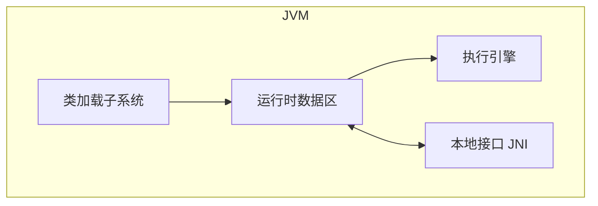
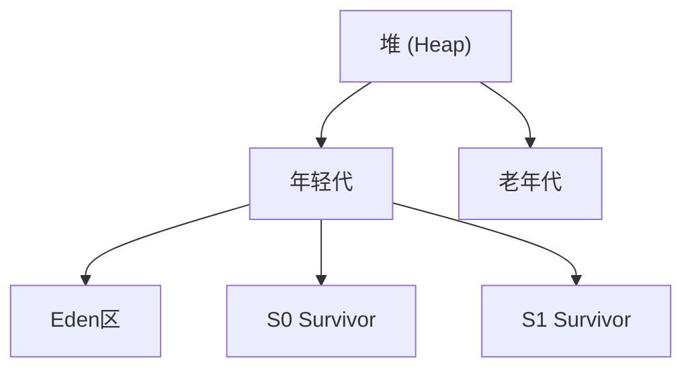
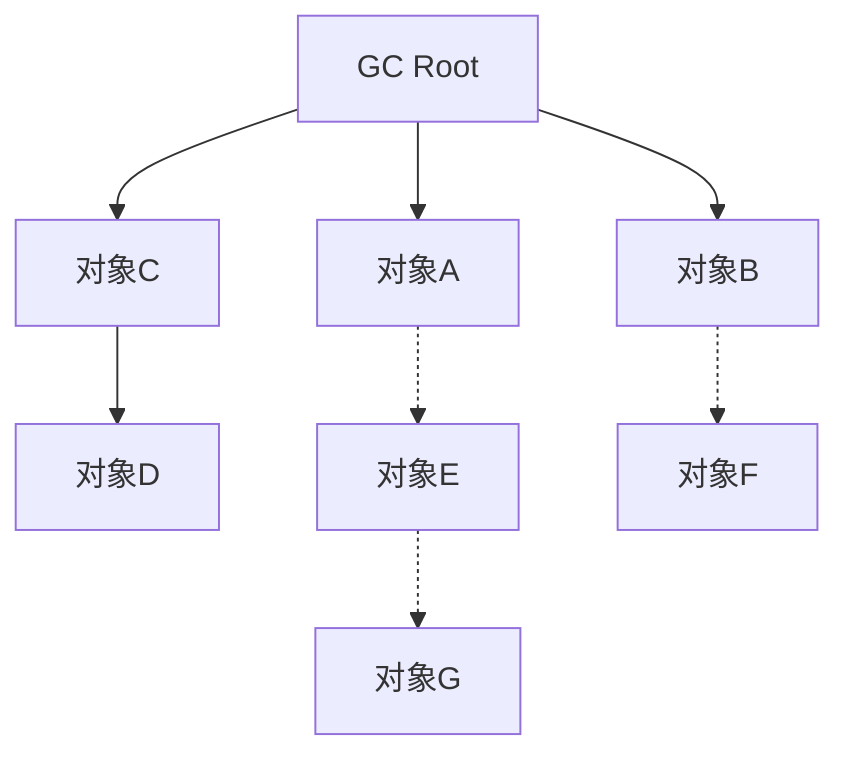
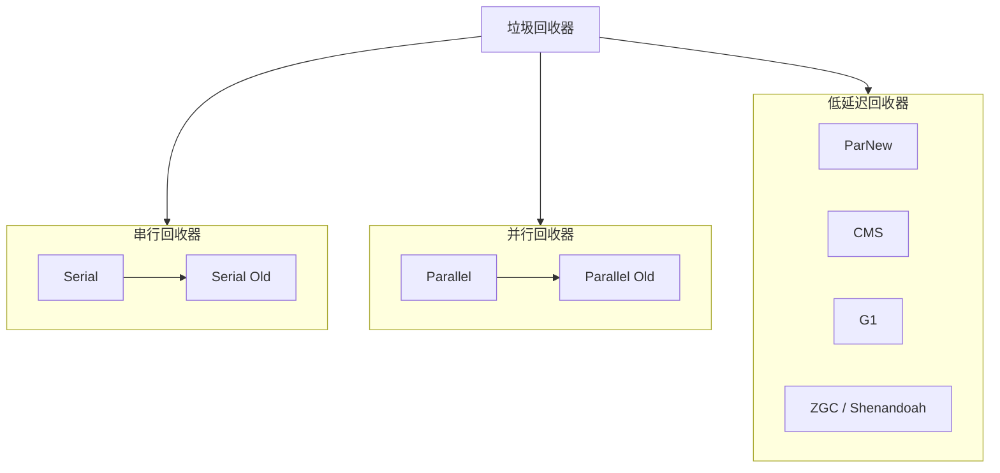

:::tip
JVM是Java运行时的核心支撑。理解它，才能写出更高效、更健壮的代码，才能在问题出现时快速定位、精准解决。
:::

## 第一章：开篇——为什么Java开发者必须懂JVM？

### 1.1 JVM到底是什么？

"Write Once, Run Anywhere"——一次编写，到处运行。这是Java的核心承诺，而JVM就是实现这个承诺的关键。

**JVM（Java Virtual Machine）**，即Java虚拟机，核心职责是**运行Java字节码文件（`.class`）**。

JVM就像是Java代码和操作系统之间的"翻译官"：

```
Java源代码 (.java)
      ↓ javac 编译
字节码文件 (.class)  ← 平台无关！
      ↓ JVM 解释/编译
机器码（Windows/Linux/macOS都能运行）
```

:::note
JVM不仅能运行Java语言，只要能编译成标准字节码的语言（Kotlin、Scala、Groovy等），都能在JVM上运行。这就是为什么JVM生态如此繁荣的原因之一。
:::

### 1.3 学习JVM的价值

很多人会问："我写业务代码又不需要了解JVM，学它有什么用？"

这个问题，我曾经也问过自己。直到我遇到了这些问题：

| 场景                       | 问题               | 答案在JVM            |
| ------------------------ | ---------------- | ----------------- |
| 线上OOM                    | 为什么内存占用越来越高？     | 堆内存管理、GC原理        |
| 接口超时                     | 为什么Minor GC也会卡顿？ | STW原理、GC调优        |
| 死循环创建对象                  | 为什么CPU飙升？        | 对象分配、垃圾回收         |
| 线上ClassNotFoundException | 为什么本地正常？         | 类加载器、双亲委派         |
| 分布式锁失效                   | 为什么Redis锁不安全？    | 线程、synchronized原理 |

:::important
理解JVM能让你写出更高效、更健壮的代码。比如，知道对象在堆中分配，就能避免创建不必要的对象；懂得GC原理，就能合理设置堆大小和垃圾回收器。
:::

### 1.2 JVM的整体架构

JVM主要由四大部分组成，各司其职：



| 组件         | 核心职责                      |
| ---------- | ------------------------- |
| **类加载子系统** | 负责把`.class`字节码文件加载到内存中    |
| **运行时数据区** | JVM的"内存模型"，存储程序运行时的数据     |
| **执行引擎**   | JVM的"CPU"，包含解释器、JIT编译器、GC |
| **本地接口**   | 用来调用本地（C/C++）写的方法         |

接下来，让我们从字节码开始，一步步深入JVM的内部世界。

***

## 第二章：跨平台的基石——字节码文件

### 2.1 从.java到.class：编译过程

当你写好一个Java文件，点击运行按钮时，发生了什么？

```java
// HelloWorld.java
public class HelloWorld {
    public static void main(String[] args) {
        System.out.println("Hello, JVM!");
    }
}
```

这个过程分为两步：

1. **编译阶段**：`javac` 把 `.java` 源码编译成 `.class` 字节码文件
2. **执行阶段**：JVM 把字节码解释或编译成机器码执行

:::note
字节码文件是平台无关的——无论你是在Windows、Linux还是macOS上编译，生成的`.class`文件都是一模一样的。这也是Java能够跨平台的核心原因。
:::

### 2.2 字节码文件的结构

`.class`文件是严格按照JVM规范定义的二进制格式，就像一本结构严谨的书，有着自己的"目录结构"：

| 模块       | 核心作用          | 包含内容           |
| -------- | ------------- | -------------- |
| **基本信息** | 文件头，定义文件类型、版本 | 魔数、版本号、访问标志    |
| **常量池**  | 字节码的"资源仓库"    | 字符串、类名、方法名、字面量 |
| **字段表**  | 类的所有成员变量      | 字段名、类型、访问修饰符   |
| **方法表**  | 类的所有方法        | 方法名、参数、字节码指令   |
| **属性表**  | 补充信息          | 源码文件名、调试信息     |

### 2.3 魔数：字节码的"身份证"

每个`.class`文件开头都有4个固定字节，值为`0xCAFEBABE`——这是Java的"咖啡宝贝"文化。

| 字节位置 | 值（十六进制）       | 含义            |
| ---- | ------------- | ------------- |
| 0-3  | `CA FE BA BE` | 魔数（文件标识）      |
| 4-5  | `00 00`       | 次版本号          |
| 6-7  | `00 34`       | 主版本号（52=JDK8） |

:::caution
JVM加载`.class`文件时，第一步就是读取魔数。如果不是`0xCAFEBABE`，直接报错`ClassFormatError`，拒绝加载。这是一种快速判断文件类型的方式。
:::

### 2.4 常量池：字节码的"资源仓库"

常量池是字节码中最复杂的部分，存储所有常量信息。同一个字符串在代码中出现多次，只会在常量池中存一份，其他地方用索引引用——这是一种空间优化策略。

### 2.5 用工具查看字节码

#### IDEA插件：jclasslib

在IDEA中安装`jclasslib Bytecode Viewer`插件，可以可视化查看字节码结构。

#### 命令行工具：javap

```bash
# 查看类的基本信息
javap HelloWorld.class

# 查看详细信息（包括字节码指令）
javap -v HelloWorld.class
```

```java
// 示例：javap -v 输出的字节码指令
public static void main(java.lang.String[]);
    descriptor: ([Ljava/lang/String;)V
    flags: ACC_PUBLIC, ACC_STATIC
    Code:
        stack=2, locals=1, args_size=1
        0: getstatic      #2    // 获取 System.out
        3: ldc            #3    // 加载常量 "Hello, JVM!"
        5: invokevirtual #4    // 调用 println 方法
        8: return
```

:::tip
学会看字节码指令是深入理解JVM的必备技能。比如`iconst_0`表示把常量0压入操作数栈，`iload_1`表示从局部变量表索引1处加载一个int值。
:::

***

## 第三章：内存的舞台——运行时数据区

### 3.1 运行时数据区全景图

JVM的内存结构是JVM最核心的部分。理解它，就理解了Java程序的"家"在哪里。

```
┌─────────────────────────────────────────────────────────────┐
│                        JVM 内存                            │
├─────────────────────────────────────────────────────────────┤
│  【线程私有】- 线程创建时分配，线程销毁时释放                    │
│  ┌───────────────┬───────────────┬───────────────┐        │
│  │  程序计数器    │  虚拟机栈      │  本地方法栈    │          │
│  │  (PC Register)│  (JVM Stack)  │(Native Stack) │        │
│  └───────────────┴───────────────┴───────────────┘        │
├─────────────────────────────────────────────────────────────┤
│  【线程共享】- JVM启动时创建，GC的主要战场                     │
│  ┌─────────────────────────┬───────────────────────┐     │
│  │        堆 (Heap)        │     方法区 (Method Area)│    │
│  │   对象实例、数组存储       │   类元信息、运行时常量池  │     │
│  └─────────────────────────┴───────────────────────┘     │
├─────────────────────────────────────────────────────────────┤
│  【直接内存】- 操作系统管理，NIO专用                            │
│  ┌───────────────────────────────────────────────────┐    │
│  │                   直接内存 (Direct Memory)         │    │
│  └───────────────────────────────────────────────────┘    │
└─────────────────────────────────────────────────────────────┘
```

### 3.2 程序计数器：线程的"书签"

程序计数器是每个线程私有的"指令行号指示器"，记录当前线程执行到哪条字节码指令。就像多个人同时读同一本书，每个人都用书签标记自己读到的位置。

**核心作用**：

- 控制程序流程：实现分支、循环、跳转、异常处理
- 多线程上下文恢复：CPU切换线程时，用它记录当前位置，确保下次能从断点继续

:::important
程序计数器是JVM中**唯一不会抛出`OutOfMemoryError`的区域**，因为它只存储指令地址，占用极小。
:::

### 3.3 Java虚拟机栈：方法的"工作台"

每个线程都有自己的虚拟机栈，采用\*\*栈（先进后出）\*\*结构管理方法调用。

```java
public class StackDemo {
    public static void main(String[] args) {    // main栈帧入栈
        methodA();                               // methodA栈帧入栈
    }

    public static void methodA() {
        methodB();                               // methodB栈帧入栈
    }

    public static void methodB() {
        int result = 1 + 2;                     // 执行计算
    }                                            // methodB栈帧出栈
}                                                 // methodA栈帧出栈
                                                // main栈帧出栈
```

栈帧包含三部分：

| 组成部分      | 作用                    |
| --------- | --------------------- |
| **局部变量表** | 存放方法参数和局部变量           |
| **操作数栈**  | 方法执行时的"临时工作台"，存放计算中间值 |
| **帧数据**   | 动态链接、方法出口、异常处理表       |

#### 常见异常

| 异常                   | 触发场景               |
| -------------------- | ------------------ |
| `StackOverflowError` | 递归调用过深，栈帧数量超过限制    |
| `OutOfMemoryError`   | 线程数过多，无法为每个线程分配栈内存 |

```java
// 递归调用导致 StackOverflowError
public class RecursiveDemo {
    public static void main(String[] args) {
        recursive();  // 没有终止条件的递归
    }

    public static void recursive() {
        recursive();  // 无限递归，栈帧不断入栈，最终溢出
    }
}
```

### 3.4 本地方法栈：为native方法服务

本地方法栈为JVM调用的`native`本地方法（C/C++实现）服务。

:::note
HotSpot虚拟机中，本地方法栈和Java虚拟机栈是**合二为一**的实现，只是在帧数据上有所区别。
:::

### 3.5 堆：对象的"大仓库"

堆是JVM中内存最大的区域，**所有对象实例和数组都存放在这里**，被所有线程共享。

```java
public class HeapDemo {
    public static void main(String[] args) {
        // new创建的对象存放在堆中
        String name = new String("Java");  // name变量在栈中，指向堆中的String对象
        int[] scores = new int[5];         // 数组也存放在堆中
    }
}
```

#### JDK8+ 的堆结构



| 区域               | 特点        | 垃圾回收频率 |
| ---------------- | --------- | ------ |
| Eden区            | 新对象优先分配   | 高频     |
| Survivor区（S0/S1） | 存放年轻代存活对象 | 中频     |
| 老年代              | 长期存活的对象   | 低频     |

:::tip
JVM默认参数下，新对象在Eden区分配。如果Eden区放不下，触发Minor GC。对象在Survivor区来回移动15次后，仍存活则进入老年代。
:::

### 3.6 元空间：方法区的新实现

方法区是JVM规范的"概念"，JDK8之后用\*\*元空间（Metaspace）\*\*来实现。

#### 永久代 vs 元空间

| 对比维度 | 永久代（PermGen）          | 元空间（Metaspace） |
| ---- | --------------------- | -------------- |
| 适用版本 | JDK7及之前               | JDK8及以后        |
| 内存位置 | JVM堆的一部分              | 操作系统本地内存       |
| 大小限制 | 固定（`-XX:MaxPermSize`） | 默认无上限          |
| GC触发 | 仅Full GC时触发           | 类加载器卸载时回收      |

```bash
# 元空间参数配置
-XX:MetaspaceSize=256m    # 初始阈值
-XX:MaxMetaspaceSize=512m # 最大上限（可设置防止元空间溢出）
```

:::warning
元空间使用的是操作系统本地内存，不受`-Xmx`堆大小限制。但如果不设置上限，加载类过多仍可能导致系统内存耗尽。
:::

### 3.7 直接内存：NIO的高效秘密

JDK1.4引入的NIO使用**直接内存**，它不属于JVM堆，由操作系统直接管理：

```java
ByteBuffer directBuffer = ByteBuffer.allocateDirect(size);
```

**为什么用直接内存？**

传统IO的数据流向：

```text
用户空间 ──拷贝──> 内核空间 ──拷贝──> 磁盘
   ↑
JVM堆
```

直接内存的数据流向：

```text
用户空间 ──零拷贝──> 内核空间 ──> 磁盘
   ↑
直接内存
```

| 特性        | 说明                      |
| --------- | ----------------------- |
| **零拷贝**   | 读写数据时无需在JVM堆和内核态之间拷贝    |
| **不受堆限制** | 不受`-Xmx`参数限制            |
| **需手动释放** | 不受GC管理，需调用`cleaner()`释放 |

:::important
Netty、Tomcat等高性能框架大量使用直接内存来提升IO效率。但如果不正确使用，会导致直接内存泄漏，引发`OutOfMemoryError: Direct buffer memory`。
:::

### 3.8 JDK6/7/8 内存结构变化

| 版本    | 堆                     | 字符串常量池 | 方法区           |
| ----- | --------------------- | ------ | ------------- |
| JDK6  | Eden + Survivor + Old | 永久代    | 永久代（固定大小）     |
| JDK7  | Eden + Survivor + Old | **堆中** | 永久代（逐步移除）     |
| JDK8+ | Eden + Survivor + Old | 堆中     | **元空间**（本地内存） |

字符串常量池移入堆中是JDK7的重要优化——堆的GC更高效，字符串常量的回收更及时。

***

## 第四章：性能的加速器——JIT即时编译器

### 4.1 解释执行 vs 编译执行

Java程序启动时，JVM有两种执行方式：

| 方式       | 原理           | 优点  | 缺点      |
| -------- | ------------ | --- | ------- |
| **解释执行** | 边翻译边执行，不保存结果 | 启动快 | 重复执行效率低 |
| **编译执行** | 预先编译成机器码     | 性能高 | 编译耗时    |

JVM采用的是**解释+编译混合模式**——启动时用解释器快速响应，运行一段时间后用JIT编译器优化热点代码。

### 4.2 JIT的核心原理

**JIT（即时编译）** 的核心思路：

```
启动阶段: 解释器逐条执行字节码（快速启动）
    ↓
运行采样: JVM监控代码执行频率
    ↓
热点探测: 识别"热点代码"（高频调用的方法、循环）
    ↓
JIT编译: 把热点代码编译成机器码缓存
    ↓
后续执行: 直接运行机器码，性能接近C++
```

### 4.3 热点代码探测

JVM通过**计数器**来识别热点代码：

| 计数器         | 作用         |
| ----------- | ---------- |
| **方法调用计数器** | 统计方法被调用的次数 |
| **回边计数器**   | 统计循环体执行的次数 |

```java
// 热点代码示例
for (int i = 0; i < 1000000; i++) {
    process(i);  // 这个循环体是热点代码
}
```

:::note
方法调用计数器的阈值默认是`1000`。一个方法被调用超过1000次，或者回边计数器超过`CompileThreshold`，就会触发JIT编译。
:::

### 4.4 分层编译策略

HotSpot采用**分层编译（Tiered Compilation）**，兼顾启动速度和峰值性能：

| 层级 | 编译器 | 优化程度 | 编译速度 |
| -- | -------- | ---- | ---- |
| 0层 | 纯解释 | 无 | 无 |
| 1层 | C1 | 低 | 快 |
| 2层 | C1（少量优化） | 中 | 快 |
| 3层 | C1（更多优化） | 高 | 中 |
| 4层 | C2 | 最高 | 慢 |

分层编译的流程：

```text
启动（纯解释）
    ↓
1层 C1（基础优化，快速编译）
    ↓
热点代码被识别
    ↓
4层 C2（极致性能优化）
```

### 4.5 JIT的核心优化手段

JIT编译器不仅"翻译"，还会对热点代码做深度优化：

| 优化手段     | 作用说明                    |
| -------- | ----------------------- |
| **方法内联** | 把被调用的方法直接嵌入调用者，减少方法调用开销 |
| **逃逸分析** | 分析对象是否只在方法内使用，决定是否栈上分配  |
| **锁消除**  | 如果锁对象没被多线程共享，直接去掉锁      |
| **循环优化** | 循环展开、循环不变式外提            |
| **去虚拟化** | 确定多态调用的具体实现，直接调用        |

```java
// 方法内联示例
// 优化前
public class InlineDemo {
    public static void main(String[] args) {
        int sum = 0;
        for (int i = 0; i < 1000; i++) {
            sum += add(i);  // 方法调用开销
        }
    }

    public static int add(int x) {
        return x + 1;  // JIT可能内联这个方法
    }
}

// 优化后（等价逻辑）
public static void main(String[] args) {
    int sum = 0;
    for (int i = 0; i < 1000; i++) {
        sum += i + 1;  // 内联后直接使用，消除方法调用开销
    }
}
```

:::caution
JIT优化依赖于运行时信息，所以相同的代码在不同运行环境下可能有不同的优化效果。这也是为什么"预热"对Java应用性能很重要的原因。
:::

***

## 第五章：类的加载与卸载——类的生命周期

### 5.1 类的生命周期全景

一个类从被加载到卸载，经历以下阶段：

```text
加载 → 连接（验证 → 准备 → 解析） → 初始化 → 使用 → 卸载
```

其中**连接阶段**包含三个子阶段：

| 子阶段 | 作用              |
| --- | --------------- |
| 验证  | 确保字节码符合JVM规范    |
| 准备  | 为静态变量分配内存并设置初始值 |
| 解析  | 将符号引用转换为直接引用    |

### 5.2 加载阶段：字节码到Class对象

加载阶段完成三件事：

1. **获取字节码**：通过类加载器以二进制流形式获取
2. **生成InstanceKlass**：在方法区生成类的元数据对象
3. **生成Class对象**：在堆中生成`java.lang.Class`对象（反射的入口）

```java
// 加载阶段生成的Class对象
Class<?> clazz = Class.forName("com.example.User");  // 获取Class对象
Object obj = clazz.getDeclaredConstructor().newInstance();  // 创建实例
```

### 5.3 连接阶段

#### 5.3.1 验证：确保字节码合规

检查魔数、版本号、字节码结构、访问权限等，防止恶意代码危害JVM。

#### 5.3.2 准备：为静态变量分配内存

```java
// 准备阶段的初始值
public class PrepareDemo {
    // 准备阶段：分配内存，初始值为0（不是10！）
    public static int value = 10;

    // 准备阶段：分配内存，引用类型初始值为null
    public static String name = "Java";
}
```

:::important
准备阶段设置的初始值是**数据类型的默认值**，不是代码中定义的值。`value`在这个阶段是`0`，执行`<clinit>`后才会变成`10`。
:::

#### 5.3.3 解析：符号引用转直接引用

```java
// 解析前：字节码中只存储符号引用（如"#3"）
invokevirtual #3  // #3是常量池中的方法符号引用

// 解析后：替换为内存中的实际地址
invokevirtual 0x00007f8a12345678  // 直接方法地址
```

### 5.4 初始化：执行\<clinit>方法

`<clinit>`（class init）方法是Java编译器自动生成的，包含：

- 静态变量赋值语句
- 静态代码块中的代码

```java
public class ClinitDemo {
    public static int a = 1;           // 按代码顺序执行
    public static int b = 2;

    static {
        a = 10;                         // 执行后 a=10
        b = 20;                         // 执行后 b=20
    }

    // 实际 <clinit> 等价于:
    // a = 1;
    // b = 2;
    // a = 10;
    // b = 20;
}
```

### 5.5 类加载器体系

#### JDK8 及之前的类加载器

```text
启动类加载器（Bootstrap ClassLoader）
        ↓
扩展类加载器（Extension ClassLoader）
        ↓
应用程序类加载器（Application ClassLoader）
```

| 类加载器     | 实现   | 加载范围                    |
| -------- | ---- | ----------------------- |
| 启动类加载器   | C++  | JDK核心类（java.lang.\*）    |
| 扩展类加载器   | Java | $JAVA\_HOME/jre/lib/ext |
| 应用程序类加载器 | Java | classpath               |

#### JDK9+ 的变化

| 变化                  | 说明          |
| ------------------- | ----------- |
| 启动类加载器              | 改为Java实现    |
| 扩展类加载器 → 平台类加载器     | 负责Java平台模块类 |
| 不再依赖`jre/lib/ext`目录 | 改为基于模块路径加载  |

### 5.6 双亲委派机制

双亲委派是JVM类加载器的核心协作规则：加载请求向上委托给父加载器处理，直到启动类加载器；父加载器无法处理时，才由子加载器自行加载。

:::tip
即使你自己写一个`java.lang.String`，也不会被加载，因为启动类加载器已经加载了真正的String类——这保证了Java核心类库的安全性。
:::

### 5.7 如何打破双亲委派？

打破双亲委派需要自定义类加载器重写`loadClass`方法：

```java
public class MyClassLoader extends ClassLoader {
    @Override
    public Class<?> loadClass(String name) throws ClassNotFoundException {
        // 打破双亲委派：不再委托父加载器，直接自己加载
        Class<?> clazz = findLoadedClass(name);
        if (clazz == null) {
            return findClass(name);  // 直接由自定义类加载器加载
        }
        return clazz;
    }

    @Override
    protected Class<?> findClass(String name) {
        // 从自定义来源（文件、网络、数据库）获取字节码
        byte[] classData = getClassBytes(name);
        return defineClass(name, classData, 0, classData.length);
    }
}
```

:::warning
打破双亲委派是高风险操作，可能导致类冲突、安全问题。仅在特定场景（如Tomcat热部署、OSGi模块化）下使用。
:::

### 5.8 类卸载的条件

类可以被卸载的条件非常严格，需要同时满足：

1. 堆中不存在该类的任何实例
2. 加载该类的类加载器已被回收
3. `Class`对象没有任何地方引用

:::note
只有用户自定义类加载器加载的类才可能被卸载。JDK核心类由启动类加载器加载，**永远不会卸载**。
:::

***

## 第六章：对象的生与死——垃圾回收机制

### 6.1 五种引用类型

Java根据引用强度，将对象引用分为五种：

| 引用类型      | 强度 | GC回收时机          | 典型场景                        |
| --------- | -- | --------------- | --------------------------- |
| **强引用**   | 最强 | 永不回收（即使OOM）     | `Object obj = new Object()` |
| **软引用**   | 较强 | 内存不足时回收         | 图片缓存                        |
| **弱引用**   | 较弱 | 发生GC时回收         | ThreadLocal、WeakHashMap     |
| **虚引用**   | 最弱 | 随时可能回收          | NIO直接内存管理                   |
| **终结器引用** | -  | finalize()执行后回收 | （已废弃）                       |

```java
// 强引用 - 只要引用链存在，对象永不被回收
Object strong = new Object();

// 软引用 - 内存不足时可能被回收
SoftReference<Object> soft = new SoftReference<>(new Object());

// 弱引用 - 发生GC就会被回收
WeakReference<Object> weak = new WeakReference<>(new Object());
```

### 6.2 可达性分析：判断对象存活

Java采用\*\*可达性分析算法（根搜索算法）\*\*判断对象存活：从GC Roots出发，沿着引用链向下遍历，能到达的对象存活，无法到达的对象可回收。



- **存活**：GC Root → A → B → C → D
- **可回收**：E → F → G（引用链断裂）

#### 常见的GC Roots对象

| 类型                | 示例              |
| ----------------- | --------------- |
| 虚拟机栈中的引用对象        | 方法内的局部变量        |
| 方法区中类静态属性引用       | `static`变量引用的对象 |
| 方法区中常量引用          | 字符串常量池的引用       |
| 本地方法栈中JNI引用       | native方法持有的对象   |
| synchronized持有的对象 | 被同步锁持有的对象       |

### 6.3 四大GC算法

#### 6.3.1 标记-清除算法

| 阶段 | 操作        |
| -- | --------- |
| 标记 | 标记所有存活对象  |
| 清除 | 删除所有未标记对象 |

**特点**：实现简单，但会产生内存碎片。

#### 6.3.2 复制算法

将内存分成两半（From和To），GC时把存活对象复制到To空间，然后交换From和To角色。**特点**：无碎片，分配快，但内存利用率只有50%。

:::tip
年轻代使用复制算法，因为大部分对象"朝生夕死"，需要复制的对象很少，效率很高。
:::

#### 6.3.3 标记-整理算法

| 阶段 | 操作        |
| -- | --------- |
| 标记 | 标记所有存活对象  |
| 整理 | 移动存活对象到一端 |
| 清除 | 删除边界外的垃圾  |

**特点**：无碎片，内存利用率高，但移动对象开销大，STW时间长。

#### 6.3.4 分代收集算法

现代JVM采用分代收集，结合多种算法的优点：

| 分代  | 算法       | 说明           |
| --- | -------- | ------------ |
| 年轻代 | 复制算法     | 对象存活率低，复制成本小 |
| 老年代 | 标记-清除/整理 | 对象存活率高，不适合复制 |

### 6.4 System.gc() 与内存溢出

```java
// 手动触发GC，但不保证立即回收
System.gc();  // 建议JVM执行GC，但JVM可以忽略

// 主动抛出OOM
byte[] huge = new byte[Integer.MAX_VALUE];  // OutOfMemoryError
```

:::caution
不要依赖`System.gc()`来"解决"内存问题。如果程序频繁需要GC，说明可能存在内存泄漏或其他问题，应该从根源解决。
:::

***

## 第七章：垃圾回收器——从传统到现代

### 7.1 回收器分类图



### 7.2 Serial GC：最基础的选择

- **算法**：年轻代复制，老年代标记-整理
- **特点**：单线程串行，Stop The World
- **适用**：单核环境、客户端程序

```bash
-XX:+UseSerialGC  # 启用Serial GC
```

### 7.3 Parallel GC：吞吐量优先

- **算法**：年轻代复制，老年代标记-整理
- **特点**：多线程并行，JDK8默认回收器
- **适用**：后台批处理，关注吞吐量

```bash
-XX:+UseParallelGC      # 年轻代并行
-XX:+UseParallelOldGC   # 老年代并行
-XX:MaxGCPauseMillis=200  # 最大GC停顿时间（目标）
-XX:GCTimeRatio=19      # 吞吐量目标（1/(1+19)=5%)
```

### 7.4 CMS GC：低延迟先驱

CMS（Concurrent Mark Sweep）是首款并发收集器，**用户线程和GC线程同时运行**：


| 阶段   | STW | 说明                |
| ---- | --- | ----------------- |
| 初始标记 | 是   | 标记GC Roots直接引用的对象 |
| 并发标记 | 否   | 遍历引用链标记存活对象       |
| 重新标记 | 是   | 修正并发期间的变动         |
| 并发清除 | 否   | 清除垃圾对象            |

:::important
CMS已被JDK14正式废弃。原因是标记-清除算法会产生内存碎片，长期运行后可能触发Full GC导致长时间停顿。
:::

### 7.5 G1 GC：分区式回收器

G1（Garbage-First）是JDK9+默认回收器，核心思想是**把堆划分为多个Region，优先回收垃圾最多的Region**：


| 特性        | 说明                               |
| --------- | -------------------------------- |
| **区域化**   | 把堆分成大小相等的Region（1MB\~32MB）       |
| **可预测停顿** | 通过`-XX:MaxGCPauseMillis`设置目标停顿时间 |
| **无内存碎片** | 使用标记-整理算法                        |

```bash
-XX:+UseG1GC                    # 启用G1
-XX:MaxGCPauseMillis=200       # 目标停顿时间
-XX:InitiatingHeapOccupancyPercent=45  # 老年代占比触发并发标记
```

### 7.6 ZGC：超低延迟的革命

ZGC（Z Garbage Collector）在JDK11引入，核心目标是**STW时间不超过10ms，且不随堆大小线性增长**：

| 特性           | 说明                  |
| ------------ | ------------------- |
| **染色指针**     | 在64位指针中嵌入元数据，记录对象状态 |
| **并发执行**     | 大部分GC操作与应用线程并行      |
| **超大堆支持**    | 支持TB级堆内存            |
| **STW<10ms** | 仅初始标记和最终标记短暂停顿      |

```bash
-XX:+UseZGC                     # JDK15+默认启用
-Xmx64g -Xms64g                # 大内存配置
-XX:ConcGCThreads=8            # 并发GC线程数
```

### 7.7 Shenandoah：开源的低延迟方案

Shenandoah与ZGC目标一致，采用不同技术路线：

| 对比         | ZGC        | Shenandoah     |
| ---------- | ---------- | -------------- |
| **核心技术**   | 染色指针       | Brooks指针（转发指针） |
| **JDK支持**  | Oracle JDK | OpenJDK        |
| **JDK15+** | 生产可用       | 生产可用           |

```bash
-XX:+UseShenandoahGC           # 启用Shenandoah
```

### 7.8 回收器选型指南

| 场景             | 推荐回收器          | 说明        |
| -------------- | -------------- | --------- |
| 单核/低内存         | Serial         | 简单高效      |
| 后台批处理          | Parallel       | 吞吐量优先     |
| 中等内存（4-64GB）   | G1             | 平衡吞吐和延迟   |
| 超大内存（64GB+）    | ZGC/Shenandoah | 极致低延迟     |
| 无法使用Oracle JDK | Shenandoah     | OpenJDK首选 |

:::tip
如果你的应用对延迟敏感（金融交易、实时计算），选择ZGC；如果内存超过64GB且需要低延迟，选择Shenandoah；其他场景G1是最稳妥的选择。
:::

***

## 第八章：内存泄漏——问题排查与实战

### 8.1 什么是内存泄漏？

内存泄漏指：**对象不再被业务逻辑使用，但仍然被GC Root引用链持有，导致无法被回收**。

| 情况 | 流程                           |
| -- | ---------------------------- |
| 正常 | 对象使用完 → 无引用 → GC回收           |
| 泄漏 | 对象使用完 → 仍被引用 → 无法回收 → 持续占用内存 |

### 8.2 常见泄漏场景

#### 8.2.1 静态集合持有对象

```java
public class StaticCollectionLeak {
    // 静态集合会持有对象引用，即使对象不再需要也无法回收
    private static List<Object> cache = new ArrayList<>();

    public void add(Object obj) {
        cache.add(obj);  // 对象被添加后永远不会移除
    }
}
```

#### 8.2.2 ThreadLocal未清理

```java
public class ThreadLocalLeak {
    // ThreadLocalMap的Entry使用弱引用持有ThreadLocal
    // 但Value是强引用，如果线程复用且不调用remove()
    // Value会一直持有对象，导致内存泄漏
    private static ThreadLocal<Object> threadLocal = new ThreadLocal<>();

    public void process() {
        threadLocal.set(new Object());
        // 如果不调用remove()，线程复用时会泄漏
    }
}
```

#### 8.2.3 数据库连接/流未关闭

```java
// 错误示例：连接未关闭
public void query() {
    Connection conn = null;
    try {
        conn = DriverManager.getConnection(url, user, pwd);
        // 如果这里抛出异常，conn永远不会关闭
    } finally {
        // 应该确保关闭
        if (conn != null) conn.close();
    }
}
```

### 8.3 排查工具清单

| 工具       | 用途           |
| -------- | ------------ |
| `jps`    | 查看Java进程ID   |
| `jmap`   | 生成堆快照、打印类直方图 |
| `jstat`  | 监控GC统计信息     |
| VisualVM | 开发环境实时监控     |
| Arthas   | 生产环境诊断       |
| MAT      | 离线分析堆快照      |

### 8.4 排查流程实战

#### 步骤1：发现异常

```bash
# 使用jstat监控GC
jstat -gcutil <pid> 1000

# 输出示例
S0     S1     E      O      M     YGC     YGCT    FGC    FGCT     GCT
0.00  65.00  45.00  78.00  95.00   123    1.234    56    5.678   6.912
# O(老年代)持续增长且无法下降 → 可能有内存泄漏
```

#### 步骤2：生成堆快照

```bash
# OOM时自动生成
-XX:+HeapDumpOnOutOfMemoryError
-XX:HeapDumpPath=/path/to/dump.hprof

# 手动生成
jmap -dump:live,format=b,file=dump.hprof <pid>
```

#### 步骤3：分析快照

使用Eclipse MAT打开`.hprof`文件：

1. 选择"Leak Suspects"自动分析
2. 查看"Histogram"查看对象数量
3. 使用"Path to GC Roots"定位泄漏点

### 8.5 优化建议

| 建议              | 说明                    |
| --------------- | --------------------- |
| 合理设置堆大小         | 根据业务负载调整`-Xms`和`-Xmx` |
| 选择合适的GC         | 根据延迟要求选择G1/ZGC        |
| 避免创建过多对象        | 对象复用、减少临时对象           |
| 及时释放资源          | 使用try-with-resources  |
| 定期检查ThreadLocal | 使用完调用`remove()`       |

---

## 尾声

### JVM知识全景回顾

| 层级 | 核心内容 | 关键问题 |
| --- | --- | --- |
| **编译层** | 字节码文件结构、常量池 | class文件是怎么组织的？ |
| **内存层** | 运行时数据区（堆、栈、方法区） | 对象存在哪里？ |
| **加载层** | 类加载器、双亲委派 | 类是如何被加载的？ |
| **执行层** | JIT编译器、热点探测 | 代码是怎么被优化的？ |
| **回收层** | GC算法、回收器 | 垃圾是如何被回收的？ |

### 实践建议

| 场景 | 推荐操作 |
| --- | --- |
| **日常开发** | 避免在循环中创建大对象、合理使用集合大小 |
| **性能调优** | 先用jstat观察GC频率，再针对性调整参数 |
| **问题排查** | OOM时生成堆快照，用MAT分析泄漏点 |
| **技术选型** | 低延迟场景用ZGC，大内存场景用G1 |

:::note
学完JVM，最大的收获不是记住了多少概念，而是对Java运行时有了"通透"的认知。当你在IDE里写下一行代码时，能想象它在字节码、类加载器、运行时数据区、GC之间的流转过程。
:::

