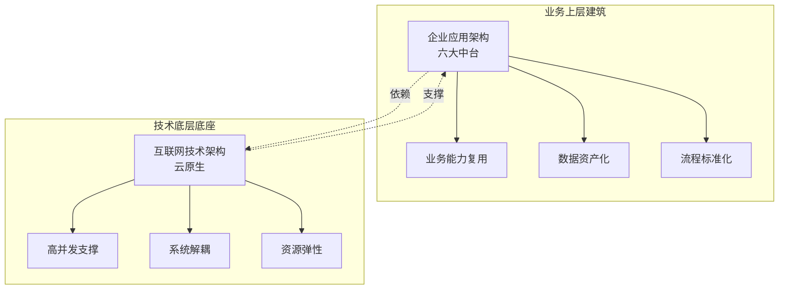

:::tip
架构演进从来不是技术堆砌史，而是一部伴随业务流量增长、不断解决系统瓶颈的迭代史。本文用双视角通史的方式，把企业应用架构（业务管理视角）和互联网技术架构（底层技术视角）两条演进线讲透——看似纷繁复杂的技术名词，本质都是在不同维度解决"扛不住、跑不快、管不好"的问题。
:::

## 开篇：为什么需要一篇"通史"

关于架构的文章，其实我已经写过不少了。

 [从单体到微服务](../编程生涯从单体到微服务/) 这篇文章讲的是 SpringCloud Alibaba 技术栈怎么落地——Nacos、OpenFeign、Gateway、Sentinel 这些组件怎么用。

后来又写了 [Docker 与容器化](../编程生涯docker与容器化/) 和 [Kubernetes](../编程生涯容器编排的艺术kubernetes/)，把云原生这块也补上了。

但这块架构拼图真的完整了吗？

关于架构的演进真的了解了吗？

**从最朴素的单机架构，到最复杂的云原生体系，中间经历了哪些阶段？每个阶段解决了什么问题？又引入了什么新问题？**

我想，这就是这篇"架构通史"要回答的。

更有意思的是，架构演进其实有两条平行的主线：

- **企业应用架构**：从夫妻店的 Excel，到集团化的六大中台，核心是**业务流程数字化、管理能力标准化、数据资产化**
- **互联网技术架构**：从单台服务器，到云原生微服务，核心是**高并发支撑、系统解耦、资源效率优化**

两条线底层逻辑高度一致——**业务驱动、问题导向、渐进演进**。把它们放在一起看，才能建立真正的架构全局视野。

---

## 第一章 架构演进的第一性原理

在展开两条演进线之前，先把架构演进的底层逻辑讲透。理解了这几条原理，后面所有阶段都是在反复印证它们。

### 1.1 业务驱动是唯一主线

所有架构升级的起点都是真实的业务瓶颈，而非技术潮流。**业务推着架构走，而非架构牵着业务跑。**

| 业务阶段 | 核心矛盾               | 架构升级                 |
| -------- | ---------------------- | ------------------------ |
| 初创期   | 业务体量小、需求变化快 | 单体架构就是最优解       |
| 成长期   | 流量暴涨、单机扛不住   | 加集群、加缓存、拆数据库 |
| 成熟期   | 业务复杂、团队协作冲突 | 拆微服务、上中台         |
| 集团化   | 多业务线、重复建设     | 平台化、服务化           |

初创期业务体量小、需求变化快，单体架构就是最优解，过早引入微服务只会徒增分布式复杂度，拖慢业务迭代速度。**每一个技术组件的引入，都必须对应明确的问题**：流量扛不住加集群，数据库读压力大加缓存，数据量太大拆分库分表，团队协作差拆微服务。

脱离业务需求的架构升级是无效投入，"为技术而技术"是架构设计的第一大忌。

### 1.2 演进是"问题导向"的持续迭代

架构演进不存在"一劳永逸"的终极方案，**每解决一个瓶颈，都会引入新的复杂度与新的问题**。

这个闭环可以用一张图概括：

```text
业务增长
   ↓
暴露核心瓶颈 ←─────┐
   ↓             │
引入新方案/新组件   │
   ↓             │
解决旧问题         │
   ↓             │
引入新复杂度/新问题 │
   ↓             │
业务继续增长   ────┘
```

举几个具体的例子：

- 拆分应用与数据库，解决了资源争抢，但**引入了网络调用**
- 加缓存解决了读性能，但**引入了数据一致性问题**
- 拆微服务解决了协作问题，但**引入了运维复杂度**
- 上容器解决了环境一致性，但**引入了编排难题**

优秀的架构师不会追求完美方案，而是在当前阶段，选择"**收益大于代价**"的最优解。

### 1.3 核心交换法则：空间换时间，复杂度换性能

架构演进的本质是持续的权衡与交换，**没有无代价的性能提升**：

- **以空间换时间**：缓存、CDN、集群都是用更多的存储、更多的机器资源，换取更低的响应延迟与更高的吞吐量，是性能优化的核心思路
- **以复杂度换性能/可用性**：读写分离、分库分表、微服务、云原生，每一次升级都让系统的复杂度上升，但换来了性能上限、可用性、扩展性、研发效率的提升

理解了这个法则，就能看懂架构演进背后所有的"交换"逻辑。

### 1.4 五大永恒目标

所有架构优化最终都指向五大核心目标：

| 目标       | 含义                                 | 衡量标准           |
| ---------- | ------------------------------------ | ------------------ |
| **高性能** | 低延迟、高吞吐量                     | 响应时间、QPS、TPS |
| **高可用** | 减少故障时长，单点故障不影响整体服务 | SLA（如 99.99%）   |
| **可伸缩** | 可通过增减机器灵活适配流量变化       | 水平扩展能力       |
| **可扩展** | 可低成本支撑新业务、新功能的接入     | 新功能上线周期     |
| **安全性** | 防护系统攻击，保障数据与服务安全     | 漏洞数、安全事件数 |

任何架构决策，本质上都是在**这五个目标之间做权衡**。比如加缓存提升了性能，但牺牲了一致性（可用性 vs 一致性）；拆微服务提升了可扩展性，但增加了运维复杂度（可扩展性 vs 简单性）。

### 1.5 两条演进线的宏观脉络

理解了上面四条原理，再来看两条演进线的宏观脉络，就会非常清晰。

**企业应用架构**的演进遵循"工具化→系统化→集成化→平台化"的脉络：

```text
工具化（Excel）→ 系统化（ERP/CRM）→ 集成化（ETL/ESB/MDM）→ 平台化（中台）
```

**互联网技术架构**的演进遵循"从一体到拆分、从单点到集群、从人工到自动"的脉络：

```text
单机 → 集群 → 缓存 → 分库分表 → 微服务 → 云原生
```

两条线背后，还有两条隐含的"价值释放"路径：

- **数据价值释放**：记录 → 流程 → 整合 → 统一 → 资产化
- **能力层级迁移**：工具层 → 系统层 → 集成层 → 平台层

越靠上层，对业务的支撑越从"执行支撑"转向"创新赋能"，IT 的价值定位也从**成本中心**逐步转向**价值中心**。

:::note
**成本中心 vs 价值中心**：成本中心意味着 IT 是花钱的部门，价值中心意味着 IT 是赚钱的部门。架构演进的终极目标之一，就是让 IT 从成本中心走向价值中心——从中台的"搭积木式创新"就能看出这一点。
:::

---

## 第二章 企业应用架构演进史（业务管理视角 · 6 阶段）

讲完了底层逻辑，我们进入第一条演进线——**企业应用架构**。

这条线以一个奶茶店的成长故事为主线，从夫妻店到集团化，每一步架构升级都对应真实的业务痛点。这种方式能让你直观感受到"业务驱动架构"的含义。

### 2.1 Excel 时代（1.0）：三张表格的微型管理系统雏形

**业务场景**：1 家门店，夫妻店模式，核心需求是基础业务数据记录。

**核心痛点**：无数字化工具，业务数据依赖人工记忆与纸质记录，账目混乱、盈利情况无法实时核算。

**架构方案**：以三张 Excel 表格构建微型管理系统

| 表名   | 存储内容                   | 用途         |
| ------ | -------------------------- | ------------ |
| 商品表 | 产品名称、成本、售价、配方 | 商品档案管理 |
| 采购表 | 每日原料采购量及成本       | 采购成本核算 |
| 销售表 | 每笔订单明细及收入         | 销售收入统计 |

每天打烊后，用数据透视表一键生成日报——哪款卖得最好、原料剩多少、本月利润多少，一目了然。

**核心价值**：实现业务数据从"无"到"有"的突破，通过数据透视表实现日报自动化，支撑单店盈利分析，完整覆盖软件系统"数据增删改查"的本质功能。

:::tip
别小看这三张 Excel 表，它其实就是一个微型管理系统的雏形。**所有软件系统的本质无非就是对数据的增删改查**——Excel 时代如此，云原生时代依然如此。
:::

**阶段局限**：协同能力为零，仅支持单人操作；数据准确性依赖人工，差错率高；无流程管控能力，完全不具备扩展性，门店数量一旦增长立刻遭遇能力瓶颈。

### 2.2 单 ERP 时代（2.0）：核心业务流程标准化

**业务场景**：3-5 家门店连锁经营，规模扩张导致手工+Excel 模式彻底失效。

**核心痛点**：多门店库存混乱、数据汇总滞后、采购效率低下，财务核算周期长、差错率高。经常出现这家店珍珠卖断货、那家店珍珠过期的情况。

**架构方案**：引入轻量化 ERP 系统

ERP（Enterprise Resource Planning，企业资源计划）可以理解成一个**全能大管家**，把企业的人财物全部管起来。核心模块包括：

| 模块       | 核心功能                             | 解决的问题     |
| ---------- | ------------------------------------ | -------------- |
| 进销存模块 | 统一管理多店库存、采购和销售         | 多店库存对不上 |
| 财务模块   | 自动生成凭证、算利润、报税           | 财务核算周期长 |
| 库存模块   | 实时同步各店库存，低于警戒线自动补货 | 库存断货/过期  |

上了 ERP 之后，效率瞬间提升：采购不用再挨家店问库存，系统自动生成采购单；财务不用再手工算账，报表一键生成；老板在家打开手机就能看到所有店的实时销售额。

**核心价值**：首次实现核心业务流程标准化与线上化，管理效率显著提升——采购订单自动生成、财务报表一键导出，解决了多门店资源统一管控的核心问题。

**阶段局限**：ERP 的核心定位是"后台资源管理系统"，**前端客户运营能力薄弱**；系统为标准化套件，灵活度不足，无法支撑精细化的客户营销与会员运营；整体为单体架构，新需求迭代效率低。

### 2.3 多系统时代（3.0）：客户运营专业化

**业务场景**：5-20 家门店规模扩张，客户存量增长，精细化运营需求凸显。

**核心痛点**：客户回头率低，ERP 内置的客户模块功能简陋，无法满足会员体系、精准营销等精细化运营需求。想做会员体系、搞积分兑换、做优惠活动，ERP 里的客户模块连客户爱喝什么、多久来一次都不知道。

**架构方案**：形成"ERP（后端底座）+ CRM（前端运营）+ 微信公众号（流量入口）"的多系统分工架构

CRM（Customer Relationship Management，客户关系管理）就是专门做**客户精细化运营**的系统。架构分工如下：

```text
微信公众号（流量入口）
    ↓ 对接
CRM 系统（前端运营）         ERP 系统（后端底座）
├─ 会员体系                  ├─ 进销存
├─ 积分体系                  ├─ 财务
├─ 精准营销引擎               └─ 库存
└─ 消费习惯分析
    ↓ 接口互通
各司其职，又通过接口互传数据
```

效果立竿见影：会员数量一个月就破了万，回头率涨了 30%。运营人员能在 CRM 里看客户的消费习惯——给爱喝芋泥的客户推送芋泥新品，给很久没来的客户发五元优惠券，精准营销效果拉满。

**核心成果**：会员规模快速增长，客户回头率显著提升；首次实现多系统并存与分工协作，架构完成第一次"**前后台解耦**"，专业系统承载专业能力。

:::note
**前后台解耦**是企业应用架构演进的关键一步。ERP 管后端的进销存财务和库存，CRM 管前端的客户和营销，微信公众号是客服的入口对接 CRM 系统——各司其职，又通过接口互通数据。这种"专业系统做专业事"的思路，贯穿了后续所有阶段的架构设计。
:::

**阶段局限**：系统数量开始增加，**数据孤岛初步形成**；接口为点对点碎片化对接，维护成本高；缺乏统一的流程与数据标准，为后续多系统协同埋下隐患。

### 2.4 数据整合时代（4.0）：管理决策数字化

**业务场景**：20+ 门店、200+ 员工的中型企业，组织复杂度大幅提升。

**核心痛点（管理困境）**：

| 问题          | 具体表现                                                          |
| ------------- | ----------------------------------------------------------------- |
| 审批流程混乱  | 请假、报销、采购申请全靠微信发消息审批，没记录                    |
| HR 事务全手工 | 员工入职离职转正靠 HR 手工处理档案                                |
| 数据孤岛      | 各部门数据不通，销售说卖了 100 万，财务说只收到 90 万，永远对不上 |
| 决策滞后      | 想知道公司经营情况，要等各个部门报报表，最快也要一周              |

**架构升级**：补充办公与人力系统，落地数据整合与可视化能力

- **OA 系统**（办公自动化）：实现请假、报销、采购申请等审批流程线上化
- **HRM 系统**（人力资源管理）：员工入离职、合同、社保、绩效、工资全流程线上管理
- **BI 系统**（商业智能）：通过 ETL 工具整合 ERP/CRM/OA/HRM 多源数据，构建可视化经营仪表盘

:::tip
**ETL（Extract-Transform-Load，抽取-转换-加载）** 是数据整合的核心工具。它的工作流程是：从多个源系统**抽取**数据，**转换**成统一格式，最后**加载**到数据仓库中。可以理解为"数据搬运工+翻译官"——把分散在各系统的方言数据，统一翻译成标准普通话，再搬到数据仓库这个"中央图书馆"。
:::

**核心价值**：经营数据实现实时可见（门店销量、爆款产品、利润进度），管理决策周期从一周缩短至实时；组织管理效率大幅提升，流程合规性得到保障。

**阶段局限**：属于"**被动式数据整合**"，仅解决了"数据看得到"的问题，未从根源统一数据标准；各系统主数据（客户、商品、组织）口径不一致，数据整合成本高、准确性差；业务流程仍处于系统割裂状态，线上线下业务不通。

### 2.5 主数据统一时代（5.0）：打破信息孤岛

**业务场景**：多业务线并行发展，线上渠道快速扩张，线上线下业务割裂。

**核心痛点（数字化危机）**：电商系统独立开发，没有和公司原来的 ERP/CRM 做任何打通，导致：

- 线下办的会员线上用不了，线上会员线下查不到——**同一个客户有两套账号、两套积分**
- 线上订单不同步到 ERP，仓库看不到单，经常发错漏发

:::caution
**信息孤岛**是企业信息化建设中最常见的噩梦——每个系统都只管自己的数据，互不连通。但信息孤岛本质上是**组织孤岛的技术投影**：不同部门各自建系统、各自维护数据，缺乏统一规划。组织不打破部门墙，系统再强也没用。
:::

**解决方案**：从"数据整合"升级为"数据治理+流程集成"

**第一步：主数据管理（MDM）**

主数据（Master Data）就是企业里最核心、最基础的数据——客户、商品、供应商等。这些数据应该在整个公司内是**唯一的、统一的**。

建立统一的客户主数据中心，线下 CRM、线上商城的客户信息都存这里，其他系统通过接口来调用。

**第二步：ESB 集成平台**

ESB（Enterprise Service Bus，企业服务总线）是一种系统集成中间件，所有系统之间的调用和数据流转都通过 ESB 进行统一调度，实现系统间的解耦与互联互通。

```text
线上订单 ──→ ESB ──→ ERP 扣减库存
                 ──→ CRM 加积分
                 ──→ 仓库发货
```

**关键突破**：实现全公司"**一个客户 ID、一套积分、一份资料**"，客服可查询完整消费记录；从技术层面打破组织与数据孤岛，主数据标准成为企业数字化的"通用语言"。

:::important
**主数据是企业数字化的"普通话"**。想象一个公司里，销售说"老王"，财务说"王先生"，客服说"王先生 ID12345"——同一个人，三个系统三个叫法，怎么整合？主数据管理就是规定全公司统一叫"客户 ID 12345 王某某"，标准统一越早，后续整合成本越低。
:::

**阶段局限**：架构仍面向现有业务的集成与治理，对新业务的支撑能力不足；新业务上线仍需重复对接开发通用能力（账号、支付、权限等），创新效率低。

### 2.6 平台化服务化时代（6.0）：六大中台与能力复用

**业务场景**：集团化企业，多元化业务快速扩张。除了奶茶业务，还开了咖啡店、烘焙店。

**核心挑战**：新业务系统重复开发，通用能力反复建设。以前开新业务，从头开发系统要半年到一年，跟不上业务节奏；而且会员、支付、消息、权限等功能每次都重复开发，浪费大量人力物力。

**架构转型**：构建六大基础服务中台，将通用能力沉淀为可复用的服务

| 中台名称 | 核心功能                             | 业务价值                       |
| -------- | ------------------------------------ | ------------------------------ |
| 账号中台 | 一套账号通所有 APP/小程序            | 提升用户体验，降低账号管理成本 |
| 支付中台 | 对接所有支付渠道，统一收付款         | 简化财务流程，支持多业务复用   |
| 客户中台 | 原 MDM 系统升级，统一管理客户数据    | 支撑全渠道客户运营             |
| 权限中台 | 权限一次分配，全系统通用             | 强化数据安全，简化权限管理     |
| 消息中台 | 管理短信、微信、APP 推送             | 提升营销触达效率               |
| 数据中台 | 统一存储处理数据，提供分析与 AI 能力 | 赋能业务决策与创新             |

这六大平台其实就是行业里常说的**业务中台**和**数据中台**的雏形——把分散在各系统里的通用能力全部下沉，为所有业务线提供共享服务。

平台建成之后，新业务的上线速度从半年缩短到了一个月。比如烘焙店只开发专属的商品、订单模块，其余会员、支付、账号、消息、权限全部复用集团的基础平台——**搭积木式创新**就此成为可能。

**核心成果**：新业务上线周期从半年缩短至 1 个月，新业务仅需开发专属业务模块；企业 IT 从"成本中心"向"能力中心"转型。

**阶段特征**：架构完成从"项目制交付"到"**能力产品化**"的质变，通用能力下沉为中台服务，前台业务灵活迭代，是当前集团型企业数字化的主流架构形态。

:::tip
**中台的本质**是把分散在各业务系统中的通用能力抽离出来，做成可复用的共享服务平台。和普通业务系统的区别在于：中台不直接面向终端用户，而是为上层各业务线（前台）提供底层支撑，避免重复开发。
:::

---

## 第三章 互联网技术架构演进史（底层技术视角 · 7 阶段）

讲完了企业应用架构，我们进入第二条演进线——**互联网技术架构**。

这条线以一个互联网创业故事为主线，从单机部署到云原生，每一步都对应真实的流量增长与性能瓶颈。

### 3.1 单机架构与基础拆分：朴素起点

**业务背景**：初创型小网站，访问量极低，核心目标是快速上线、验证业务。

**架构形态**：

- **初始形态**：单台服务器同时部署应用程序与数据库，一套技术栈快速完成搭建
- **第一次升级**：将应用服务器与数据库服务器物理拆分，应用层负责请求处理与业务逻辑，数据库层负责数据存储与 IO 操作

```text
初始形态：
┌─────────────────────┐
│  单台服务器          │
│  ├─ 应用程序         │
│  └─ 数据库           │
└─────────────────────┘

第一次升级：
┌──────────┐    ┌──────────┐
│ 应用服务器 │←──→│ 数据库服务器│
│ (请求处理) │    │ (数据存储)  │
└──────────┘    └──────────┘
```

**解决的核心问题**：单机模式下应用与数据库争抢 CPU、内存资源的瓶颈；实现基础的职责分层，两层可独立扩容与维护。

**阶段局限**：两层均为单点，存在故障风险，无高可用能力；单服务器性能存在物理上限，无法承接流量增长。

### 3.2 应用集群与负载均衡：突破高并发第一道门槛

**业务驱动背景**：用户流量持续暴涨，单台应用服务器性能触顶，无法承接并发请求。

单台应用服务器就算配置拉满也有上限——比如一秒只能扛 100 个请求，来了 500 个请求怎么办？500÷100=5，那就来五台服务器部署一模一样的代码。

**架构方案**：构建应用集群 + 负载均衡中间件

1. **应用集群**：部署多台运行相同代码的应用服务器，共同承接流量，实现水平扩展
2. **负载均衡**：作为流量入口，按照预设算法将请求均匀分发至后端应用节点，同时具备故障节点自动屏蔽能力

```text
         用户请求
            ↓
     ┌──────────────┐
     │  负载均衡器   │
     └──────┬───────┘
        ┌───┼───┐
        ↓   ↓   ↓
       ┌──┐┌──┐┌──┐
       │A1││A2││A3│  应用集群（相同代码）
       └──┘└──┘└──┘
```

**核心能力突破**：

- **水平扩展能力**：应用层性能不再受单机限制，可通过增加机器线性提升并发承接能力
- **基础高可用**：单台应用服务器宕机时，流量自动切换至健康节点，保障服务不中断

**阶段局限**：数据库仍为单点瓶颈，大量读请求持续下压至存储层；仅解决了应用层的并发问题，存储层与业务复杂度的矛盾尚未显现。

### 3.3 多级缓存体系：以空间换时间的读性能革命

**业务驱动背景**：海量读请求直接穿透至数据库，磁盘 IO 成为系统响应的核心瓶颈，数据库并发能力触顶。

**核心原理**：内存读写性能远超磁盘（千倍以上差距），将高频访问的热数据前置至内存层，拦截绝大多数读请求。

**三级缓存架构**（从前端到后端）：

```text
用户请求
   ↓
① 浏览器缓存 ──→ 命中则返回（最前置的流量拦截）
   ↓ 未命中
② 应用本地缓存 ──→ 命中则返回（无需跨网络调用）
   ↓ 未命中
③ 分布式缓存 ──→ 命中则返回（集群内应用节点共享）
   ↓ 未命中
   数据库（最后兜底）
```

| 缓存层级     | 位置             | 特点                                     |
| ------------ | ---------------- | ---------------------------------------- |
| 浏览器缓存   | 用户端本地       | 缓存静态资源与接口结果，最前置的流量拦截 |
| 应用本地缓存 | 应用服务器内存   | 无需跨网络调用，速度最快                 |
| 分布式缓存   | 集中式内存数据库 | 承载全量热点数据，集群内应用节点共享     |

:::note
**缓存 vs 数据库缓冲区**：数据库自身的内存缓冲区仅存储原始表数据，而多级缓存可灵活缓存**接口结果、页面片段、静态资源**等任意高频访问内容，优化范围更广。这是两者的核心区别。
:::

**核心价值**：

- 性能量级提升：查询延迟从毫秒级压缩至微秒级，绝大多数请求无需到达数据库
- 兜底容灾：数据库临时故障时，缓存可支撑核心读业务，提升系统可用性

**伴随的新挑战**：

- 缓存与数据库的**数据一致性问题**
- **缓存击穿**：单个热点 key 失效瞬间，大量请求穿透到数据库
- **缓存雪崩**：大量 key 同时失效，数据库瞬间压力暴增
- **缓存穿透**：查询不存在的数据，每次都穿透到数据库

:::caution
缓存引入的三大风险（击穿、雪崩、穿透）是高并发系统的常见坑。解决方案包括：加互斥锁防击穿、给 key 加随机过期时间防雪崩、布隆过滤器防穿透。这些在 [从 Redis 分布式锁到 Shell 与 Lua 脚本](../编程生涯从redis分布式锁到shell与lua脚本/) 里有更详细的讨论。
:::

### 3.4 数据库架构升级：读写分离与分库分表

**业务驱动背景**：写请求并发上升导致数据库锁竞争加剧，同时业务持续积累的数据量突破单库单表容量上限，数据库成为全链路核心瓶颈。

数据库有个特点：**写操作会锁行锁表**，并发一高就排队。而且互联网系统通常是"读多写少"，能不能给数据库分工？

#### 方案一：读写分离

主库负责写入操作，多台从库负责查询操作，通过主从同步机制保证数据最终一致。

```text
写请求 ──→ 主库（Master）
              ↓ 主从同步
         ┌───┴───┐
         ↓       ↓
       从库1   从库2（Slave）
         ↑       ↑
读请求1──┘  读请求2┘
```

- **价值**：适配互联网"读多写少"的流量特征，分摊读压力，解决读写相互阻塞的问题
- **代价**：存在主从数据同步延迟，无法满足强一致性读场景

#### 方案二：分库分表

**垂直分库**：按照业务边界拆分数据库，如用户库、商品库、订单库，不同业务库互不干扰，实现业务层面的存储隔离。

**水平分表**：针对单张超大表（如订单表、日志表），按照哈希或范围规则拆分为多张子表，分散存储压力。

```text
垂直分库：               水平分表：
┌──────────┐            订单表（原）
│ 单一数据库 │            ├─ order_0（UID % 4 = 0）
├──────────┤            ├─ order_1（UID % 4 = 1）
│ 用户数据   │            ├─ order_2（UID % 4 = 2）
│ 商品数据   │            └─ order_3（UID % 4 = 3）
│ 订单数据   │
└──────────┘            ┌──────────┐
   拆分为                │ 用户库    │
                        ├──────────┤
                        │ 商品库    │
                        ├──────────┤
                        │ 订单库    │
                        └──────────┘
```

配套组件：**数据库中间件**，对应用层提供透明路由能力，无需大量修改业务代码。

**核心价值**：数据库从单点走向分布式，存储容量与并发能力实现横向扩展，支撑海量数据场景。

**伴随的新挑战**：

- **分布式事务**：跨库操作如何保证原子性
- **跨库关联查询**复杂度飙升
- 数据运维、迁移、扩容成本大幅上升

### 3.5 访问加速与能力扩展：CDN、反向代理、NoSQL、搜索引擎

**业务驱动背景**：用户遍布全国导致地域访问延迟不均，应用直接暴露公网存在安全风险，同时复杂检索、非结构化数据存储需求凸显。

#### CDN：内容分发网络

在全国部署边缘节点，将静态资源提前缓存至离用户最近的节点。用户不用每次跑到中心机房，而是通过域名解析获取到最近节点 IP 去取数据，速度直接起飞。

:::tip
**CDN 就像你家门口的快递站**。没有 CDN 时，每次取快递都要跑到城市另一头的总仓；有了 CDN，快递提前放到你家门口的快递站，下楼就能取。这就是"就近访问"的威力。
:::

#### 反向代理

作为公网流量的统一入口，隐藏真实应用服务器 IP，同时承担流量清洗、权限校验、请求转发等能力，提升系统安全性。

#### 多元存储体系

- **NoSQL 数据库**：承载非结构化、半结构化数据，具备高并发、易扩展的特性，补充关系型数据库的能力短板
- **搜索引擎**：基于倒排索引实现秒级全文检索、多维统计，解决模糊查询、商品搜索等复杂查询场景

:::note
传统数据库遇到模糊查询、全文搜索、多维统计有点力不从心——比如电商搜商品、新闻热搜，用 SQL 的 `LIKE` 慢到死。搜索引擎利用**倒排索引**让搜索秒级响应，NoSQL 专门存非结构化半结构化数据且支持高并发易扩展。这部分在 [NoSQL 数据库理论入门](../编程生涯nosql数据库理论入门redis与mongodb/) 里有更深入的讨论。
:::

**阶段价值**：完善了系统的访问体验、安全防护与数据能力边界，架构从"能用"走向"好用"。

### 3.6 分布式与微服务架构：业务解耦与研发效能升级

**业务驱动背景**：业务功能持续膨胀，单体应用演变为"巨石应用"，代码耦合严重、发布风险高、团队协作冲突、资源扩容不精准等问题凸显。

以一个电商网站为例，从小电商长成集用户、商品、订单于一体的大平台，所有功能代码全挤在一个应用里——这就是常说的"**巨石应用**"。麻烦也跟着来了：

| 问题     | 巨石应用的表现                                 |
| -------- | ---------------------------------------------- |
| 发布风险 | 改一行用户相关的代码要全量发布整个应用         |
| 代码冲突 | 多个开发同时改代码，天天冲突不断               |
| 资源浪费 | 想给订单服务加机器抗流量，只能整个应用一起扩容 |

#### 演进路径：单体应用 → 分布式架构 → 微服务架构

**第一步：分布式架构**

按照业务边界把巨石应用一刀刀切开——用户相关的功能做成独立的用户系统，商品、订单也分成独立的小系统。每个系统单独部署、单独发布、单独扩容，谁也不影响谁。

**第二步：微服务架构**

在分布式基础上进一步极致拆分，遵循"**单一职责**"原则，每个微服务仅负责一项核心能力，支持独立开发、独立发布、独立扩容。

```text
单体应用              分布式架构              微服务架构
┌──────────┐        ┌──────────┐         ┌──────────┐
│  用户模块  │        │  用户系统  │         │ 登录服务  │
│  商品模块  │  →     ├──────────┤   →     │ 会员服务  │
│  订单模块  │        │  商品系统  │         │ 支付服务  │
│  支付模块  │        ├──────────┤         │ 订单服务  │
│  ...     │        │  订单系统  │         │ 商品服务  │
└──────────┘        └──────────┘         └──────────┘
```

#### 核心组件详解

**RPC 远程调用**：让跨机器的服务调用像调本地代码一样简单。在 [从单体到微服务](../编程生涯从单体到微服务/) 里详细讲过 OpenFeign 的用法，本质上就是 RPC 的一种实现。

**服务注册与发现中心**：管着所有服务的地址，新增的服务都来它这里注册，谁要调用谁直接来这找就行。可以理解成"物业管理处"——住户入住要登记，找人就查名单。

**消息队列（MQ）**：实现服务间的异步通信。服务之间不用死死等着对方立刻回复，把消息扔进"智能收件箱"就可以继续干自己的事，谁要谁到时自己来拿。核心价值有三个：

| 能力     | 说明                                                 |
| -------- | ---------------------------------------------------- |
| 解耦     | 服务间彻底解耦，互不拖累                             |
| 削峰填谷 | 流量突增时先把请求存起来，按系统能力慢慢消化         |
| 故障兜底 | 某个服务临时挂了，消息也不会丢，等它恢复了再慢慢处理 |

:::tip
消息队列的核心价值在于**解耦、削峰填谷、容错**。在 [消息队列之 RabbitMQ](../编程生涯消息队列之rabbitmq/) 里详细讲过 RabbitMQ 的实现原理。同步调用是"打电话必须立刻接"，异步消息是"发微信对方有空再回"——后者牺牲了强实时性，换来了系统的整体健壮性。
:::

#### 微服务治理体系

配套全链路追踪、限流熔断降级、统一监控日志、权限治理等能力，解决微服务拆分后的链路复杂、故障定位难、级联故障等问题。

| 治理能力     | 解决的问题                         | 对应文章                                                     |
| ------------ | ---------------------------------- | ------------------------------------------------------------ |
| 全链路追踪   | 调用关系像蜘蛛网，出问题找不到在哪 | [主流项目监控技术栈解析](../编程生涯主流项目监控技术栈解析/) |
| 限流熔断降级 | 流量太大怕被冲垮，怕连锁崩盘       | [从单体到微服务](../编程生涯从单体到微服务/)（Sentinel）     |
| 统一监控日志 | 服务太多不好管，需要统一视图       | [ELK 技术栈](../编程生涯elk技术栈日志处理的瑞士军刀/)        |

**核心价值**：

- **研发解耦**：多团队并行开发，互不干扰，大幅提升复杂业务的研发效率
- **精准扩容**：热点服务可独立扩容，资源利用率显著提升
- **故障隔离**：单服务故障仅影响对应功能，不会拖垮全站

**伴随的新挑战**：

- 分布式系统复杂度指数级上升，运维成本、排障难度大幅增加
- 服务数量膨胀后，部署、配置、治理的工作量剧增

### 3.7 云原生时代：容器化与自动化运维的终极形态

**业务驱动背景**：微服务数量从几十个增长到几百上千个，环境一致性问题突出，人工部署运维效率极低，大促扩容与日常缩容的资源浪费严重。

:::caution
微服务拆得越细，运维越崩溃。每个服务上线都要配环境、装依赖、调参数，稍微不一样就出现"我电脑能跑服务器跑不起来"的玄学 bug。大促前要紧急扩容几百台机器，一台台配环境根本赶不上；大促结束要缩容，还得一台台清理。效率低到离谱。
:::

#### 架构升级三部曲

**第一部：Docker 容器化**

把每个微服务的代码、依赖、配置、运行环境全部打包成一个镜像，**一次打包，到处运行**，彻底解决环境不一致的问题。

在 [Docker 与容器化](../编程生涯docker与容器化/) 里讲过，Docker 容器就像"标准化的快递箱"——你的应用连同它需要的环境一起装进箱子，放到哪台服务器都能直接跑，不用再操心环境问题。

**第二部：Kubernetes 容器编排**

几百上千个容器，谁能帮你管？于是请来个"全能大管家"——**Kubernetes**（简称 K8s）。它能安排容器资源和调度，实现：

| 能力           | 说明                                   |
| -------------- | -------------------------------------- |
| 自动化资源调度 | 把容器调度到合适的机器上               |
| 自动扩缩容     | 流量高了自动加容器，流量低了自动缩容器 |
| 故障自愈       | 容器挂了自动重启                       |
| 滚动发布       | 一批批替换，零停机更新                 |

这部分在 [Kubernetes](../编程生涯容器编排的艺术kubernetes/) 里有完整的实战讲解。

**第三部：云平台底座**

将系统整体迁移至公有云，依托云平台的弹性资源池，实现 CPU、内存、带宽等资源的**按需申请、按需付费**，免去自建机房的硬件成本与运维门槛。

```text
应用层      │  微服务 × N
           ↓
编排层      │  Kubernetes（自动调度、自愈、扩缩容）
           ↓
容器层      │  Docker 容器（一次打包到处运行）
           ↓
云平台底座  │  公有云弹性资源池（按需付费）
```

#### 阶段核心特征

- 运维模式从"人工运维"转向"**自动化、声明式治理**"
- 资源模式从"固定预留"转向"**弹性伸缩、按需付费**"
- 架构达成高性能、高可用、可伸缩、易运维的综合最优解，成为当前大型互联网平台的标准架构形态

:::important
云原生不是某一项技术，而是一整套架构方法论。它的核心是"**让基础设施消失**"——开发者只关心业务代码，环境、部署、扩缩容、容灾这些事情全部由容器+K8s+云平台自动处理。这和传统运维的"人肉操作"形成了鲜明对比。
:::

---

## 第四章 双视角对照：两条演进线的同与异

讲完了两条演进线，现在把它们放在一起对照，看看业务管理视角和底层技术视角的差异与共性。

### 4.1 核心差异

| 维度         | 企业应用架构                                             | 互联网技术架构                                 |
| ------------ | -------------------------------------------------------- | ---------------------------------------------- |
| **视角**     | 业务管理视角                                             | 底层技术视角                                   |
| **核心主线** | 业务流程数字化、管理能力标准化、数据资产化、业务能力复用 | 高并发支撑、系统解耦、资源效率优化、运维自动化 |
| **面向对象** | 企业内部管理与业务运营                                   | 流量承接与系统性能                             |
| **演进起点** | Excel 手工记录                                           | 单机部署                                       |
| **演进终点** | 六大中台                                                 | 云原生微服务                                   |
| **核心矛盾** | 现有架构能力与业务发展需求的不匹配                       | 流量增长与系统性能的不匹配                     |

### 4.2 底层逻辑的高度共性

- **均为业务驱动**：所有升级都对应业务规模与复杂度的提升，而非技术自嗨
- **均遵循渐进式演进**：从简单到复杂，从一体化到分层解耦，不追求一步到位
- **最终均走向服务化/平台化**：中台是业务能力的服务化，微服务是技术能力的服务化，本质都是**沉淀通用能力、支撑快速创新**

### 4.3 协同关系

企业应用架构是业务上层建筑，互联网技术架构是底层技术底座。二者不是割裂的，而是**相互支撑**的关系。



中台架构的落地，往往需要微服务、容器化、数据中间件等技术架构作为支撑；而技术架构的价值，最终要通过业务架构的效率提升来体现。

:::note
**一句话概括协同关系**：业务架构定义"做什么"，技术架构支撑"怎么做"。中台是业务能力的沉淀，微服务是技术能力的沉淀——两者都是"**把通用能力下沉为共享服务**"的思想，只是视角不同。
:::

---

## 第五章 核心技术组件体系化图谱

纷繁的技术名词可按照架构分层逻辑，划分为五大层级，各司其职、协同支撑整个高并发体系。

### 5.1 五层架构分层总览

| 架构层级   | 核心组件                                            | 核心定位与作用                                     | 通俗比喻              |
| ---------- | --------------------------------------------------- | -------------------------------------------------- | --------------------- |
| 流量接入层 | CDN、反向代理、负载均衡                             | 承接公网流量，实现就近访问、安全防护、流量分发     | 大楼门口的保安+快递站 |
| 服务治理层 | RPC、服务注册与发现、消息队列、全链路追踪、限流熔断 | 支撑服务间通信，实现服务解耦、链路管控与稳定性保障 | 小区的物业管理系统    |
| 应用服务层 | 单体应用、分布式服务、微服务                        | 承载业务逻辑，实现业务能力的拆分与复用             | 大楼里的各个办公室    |
| 数据存储层 | 多级缓存、读写分离、分库分表、NoSQL、搜索引擎       | 承接数据读写，实现性能优化、容量扩展与多元数据支撑 | 大楼的档案室+图书馆   |
| 基础设施层 | Docker 容器、K8S、云平台                            | 提供运行底座，实现环境标准化、运维自动化与资源弹性 | 大楼的地基+水电系统   |

### 5.2 每层核心组件详解

#### 流量接入层

- **CDN**：家门口的快递站，把静态资源提前放到离用户最近的节点
- **反向代理**：大楼门口的保安，所有访客必经的安检口，隐藏真实应用服务器 IP
- **负载均衡**：景区门口的排队系统，把请求均匀分发到后端服务器

#### 服务治理层

- **RPC**：业主委员会帮你联系隔壁小区物业办事，让跨机器调用像调本地代码
- **服务注册与发现**：物业管理处，住户入住要登记，找人就查名单
- **消息队列**：智能收件箱，服务间不用死等对方回复
- **全链路追踪**：快递物流追踪，一个请求经过哪些服务一目了然
- **限流熔断降级**：景区的限流措施，人太多时先限流、再熔断、最后降级保核心

#### 应用服务层

- **单体应用**：一栋大楼所有住户共享电梯管道
- **分布式服务**：按业务边界切成几栋独立大楼
- **微服务**：每户人家独立门牌独立水电表，但通过小区大门统一管理

#### 数据存储层

- **多级缓存**：大楼里的快捷便利店（缓存）vs 远郊大仓库（数据库）
- **读写分离**：主库写、从库读，分工明确
- **分库分表**：把一个大仓库拆成多个小仓库，按业务或规则分
- **NoSQL**：专门存非结构化数据的灵活仓库
- **搜索引擎**：带目录索引的图书馆，秒级定位

#### 基础设施层

- **Docker 容器**：标准化快递箱，一次打包到处运行
- **K8S**：调度全城快递的物流公司
- **云平台**：无限大的资源池，要多少申请多少，按需付费

---

## 第六章 关键架构决策的利弊权衡

架构设计永远是权衡的艺术。这一章把几个最常见的架构决策放在一起，看看它们的利弊边界。

### 6.1 单体 vs 微服务

| 维度         | 单体架构                         | 微服务架构                                   |
| ------------ | -------------------------------- | -------------------------------------------- |
| **适用场景** | 业务简单、团队规模小、初创验证期 | 业务复杂、多团队协作、流量差异大、中大型企业 |
| **开发效率** | 高，无分布式额外开销             | 初期低，治理完善后长期效率高                 |
| **运维成本** | 极低                             | 极高，需要完善的基础设施支撑                 |
| **扩展性**   | 差，只能整体扩容                 | 好，可按服务精准扩容                         |
| **故障影响** | 单点故障影响全站                 | 故障隔离，仅影响对应功能                     |

:::warning
**核心结论**：没有高低优劣，只有阶段适配。**初创团队切忌为了"技术先进"盲目上微服务**。微服务需要完善的基础设施（注册中心、配置中心、链路追踪、监控告警等）支撑，否则只会让系统从"巨石应用的混乱"变成"分布式的混乱"。
:::

### 6.2 同步 RPC vs 异步消息

| 维度         | 同步 RPC 调用                                        | 异步消息（MQ）                                           |
| ------------ | ---------------------------------------------------- | -------------------------------------------------------- |
| **适用场景** | 强依赖、需要实时返回结果                             | 非核心链路、可延迟处理                                   |
| **优势**     | 逻辑直观、一致性强                                   | 服务解耦、削峰填谷、容错能力强                           |
| **劣势**     | 服务耦合度高，下游故障会传导至上游，容易引发级联雪崩 | 牺牲强实时性，引入消息丢失、重复消费、顺序性等一致性问题 |

**选型原则**：

- 核心链路（如下单→扣库存→生成订单）用同步 RPC，保证强一致性
- 非核心链路（如下单后发短信通知、记日志）用异步消息，解耦+削峰

### 6.3 缓存引入的收益与代价

| 维度           | 收益             | 代价                         |
| -------------- | ---------------- | ---------------------------- |
| **性能**       | 读性能千倍级提升 | -                            |
| **数据库压力** | 大幅降低         | -                            |
| **容灾**       | 具备一定容灾能力 | -                            |
| **一致性**     | -                | 需处理缓存与数据库的一致性   |
| **稳定性**     | -                | 应对击穿、雪崩、穿透三大风险 |
| **复杂度**     | -                | 增加运维与开发复杂度         |

**选型原则**：优先缓存热点读数据，**避免为了缓存而缓存**——冷数据缓存反而会增加系统负担。

### 6.4 中台建设：何时该建，何时不该建

:::caution
中台不是数字化的"标准答案"，其本质是通过共享能力降低重复建设成本。**只有当企业多条业务线的通用能力重复建设成本，显著高于中台的建设与运营成本时，中台才具备经济价值**。中小企业盲目跟风上中台，只会陷入"为了中台而中台"的内耗。
:::

| 企业阶段     | 是否该建中台 | 原因                                       |
| ------------ | ------------ | ------------------------------------------ |
| 初创单店     | 不该         | 业务单一，无复用需求                       |
| 中小连锁     | 不该         | 业务线少，重复建设成本低于中台建设成本     |
| 中型多门店   | 谨慎         | 优先补全流程系统和主数据治理               |
| 集团化多业务 | 该建         | 多业务线通用能力重复建设，中台经济价值显现 |

**中台经济价值判断公式**：

```text
中台经济价值 = (N 条业务线 × 单线重复建设成本) - 中台建设成本 - 中台运营成本

当且仅当 中台经济价值 > 0 时，中台才值得建。
```

---

## 第七章 架构实践启示与避坑指南

### 7.1 拒绝技术崇拜，坚持场景优先

不存在"更高级"的架构，只存在更适配的架构。技术选型的核心判断标准是：**能否解决当前核心问题，带来的收益是否超过引入的成本与复杂度**。

### 7.2 小步快跑，渐进式演进

优秀的架构是演化出来的，不是设计出来的。不要试图一次性设计出"十年可用"的完美架构，而是基于当前业务痛点逐步迭代，每一步都解决实际问题，预留未来扩展空间。

:::important
**"好的架构是演化出来的，不是设计出来的"**——这句话值得每个架构师刻在脑子里。再厉害的架构师也不可能在第一天就设计出一套能用 10 年的架构。你走的每一步路、遇到的每一个坑，最终都会沉淀在你的架构里。
:::

### 7.3 基础设施先行，治理先于拆分

进行微服务、分库分表等拆分操作前，**必须先配套监控、日志、链路追踪、配置中心等基础设施**。没有治理能力的拆分，只会让系统从"巨石应用的混乱"变成"分布式的混乱"。

### 7.4 业务边界是拆分的核心依据

无论是微服务拆分还是分库分表，都要以**稳定的业务边界**为核心，而非基于技术层面随意拆分。不合理的边界拆分，反而会增加跨服务调用的成本与业务复杂度。

### 7.5 主数据治理需提前规划

当企业进入多系统阶段时，就应当着手规划主数据标准（客户、商品、组织等核心数据），**不要等到数据孤岛积重难返再回头治理**。主数据是企业数字化的"普通话"，标准统一越早，后续整合成本越低。

### 7.6 接受不完美，关注核心目标

架构设计永远是权衡的艺术，不存在同时满足所有目标的方案。需要明确当前阶段的**核心目标**（如性能优先、成本优先、迭代速度优先），围绕核心目标做取舍。

---

## 第八章 架构思维：三句核心心法

### 心法一：没有最好的架构，只有最适合业务的架构

初创公司别一上来就微服务，单机够用就好。**业务推着架构走**，而不是架构牵着业务跑。脱离业务谈架构就是空谈，永远不要为了技术而技术。

### 心法二：架构演进本质——用空间换时间，用复杂度换性能

加机器、加组件、加分层，都是为了抗住更大的流量、更高并发。**没有无代价的性能提升**，每一次升级都是在"空间 vs 时间"、"复杂度 vs 性能"之间做交换。

### 心法三：永远围绕五大目标

高性能、高可用、可伸缩、可扩展、安全——这五个目标是架构优化的永恒北极星。任何架构决策，本质上都是在**这五个目标之间做权衡**。

```text
                    架构的核心思维

        ┌─────────────────────────────────┐
        │                                 │
        │  ① 没有最好的架构                │
        │     只有最适合业务的架构          │
        │                                 │
        │  ② 用空间换时间                  │
        │     用复杂度换性能               │
        │                                 │
        │  ③ 围绕五大目标                  │
        │     高性能·高可用·可伸缩         │
        │     可扩展·安全                  │
        │                                 │
        └─────────────────────────────────┘
```

---

## 第九章 术语速查

#### 互联网架构术语

| 术语         | 全称                | 解释                                                                                                                                                                |
| ------------ | ------------------- | ------------------------------------------------------------------------------------------------------------------------------------------------------------------- |
| 负载均衡     | Load Balancing      | 部署在应用集群前端的流量调度组件，按照预设算法将海量并发请求均匀分发至多台后端服务器，从而突破单机性能天花板并实现故障节点的自动屏蔽与流量重定向                    |
| 多级缓存架构 | Multi-level Caching | 由前端浏览器缓存、应用服务器本地缓存及分布式内存数据库共同组成的读取加速层级，通过将高频热数据前置至内存，将响应延迟从磁盘读写的毫秒级压缩至微秒级                  |
| 分库分表     | Database Sharding   | 解决海量数据存储的核心方案，垂直分库按业务边界隔离数据源以互不干扰，水平分表通过哈希或范围规则打散单表数据，在应用端无感知的前提下实现并发与存储能力的无限扩展      |
| 云原生       | Cloud Native        | 基于容器镜像标准、Kubernetes 容器编排及公有云弹性基础设施构建的现代架构范式，旨在实现开发与运维彻底解耦、资源按需自动伸缩，最终达成极致的弹性交付与全自动化治理效率 |

#### 企业架构术语

| 术语     | 全称                             | 解释                                                                                                                     |
| -------- | -------------------------------- | ------------------------------------------------------------------------------------------------------------------------ |
| ERP      | Enterprise Resource Planning     | 一套覆盖企业进销存、财务、库存等核心业务流程的综合管理系统，相当于企业的"全能大管家"                                     |
| CRM      | Customer Relationship Management | 专注于客户信息管理和精细化营销运营的系统，帮助企业提升客户留存率和复购率                                                 |
| MDM      | Master Data Management           | 对企业最核心、最基础的数据（如客户、商品、供应商）进行统一管理，确保全公司数据唯一、一致，是打破信息孤岛的关键手段       |
| ESB      | Enterprise Service Bus           | 一种系统集成中间件，所有系统之间的调用和数据流转都通过 ESB 进行统一调度，实现系统间的解耦与互联互通                      |
| 数据中台 | Data Middle Platform             | 将企业各业务系统的数据统一汇聚、处理和分析，并对外提供数据服务和 AI 能力的共享平台，是支撑企业数据驱动决策的核心基础设施 |

---

## 结尾：架构是演化出来的

从一台服务器的单机架构，到支撑亿级并发的云原生微服务体系；从夫妻店的三张 Excel，到集团化的六大中台——架构的演进史，本质上是**技术跟随业务成长、持续解决问题的迭代史**。

缓存、微服务、云原生、中台这些概念从来不是架构的终点，而是解决特定阶段问题的工具。真正的架构能力，不在于掌握多少前沿技术，而在于能够**精准识别业务瓶颈，权衡利弊得失，选择最适配的技术方案，并在演进过程中把控系统复杂度**。

:::important
通史的意义，不在于记住每个阶段的名字，而在于**建立全局视野**。有了全局视野，你才能在面对具体业务问题时，知道当前处于演进历程的哪个位置，下一步该往哪里走，以及——更重要的是——**哪些路是弯路，不必再走一遍**。
:::

理解架构演进的底层逻辑，比记住单个技术名词更有价值。唯有坚持**业务驱动、问题导向、渐进迭代**，才能构建出既能支撑当前业务，又能适配未来发展的健壮架构。
